I’ve posted about my love for journals and planners in the past (see my posts here and here) but this was the first year I tried to make my own bullet journal. This is also the first time I’m incorporating a video into my blog post! Technically I had one in my Tuesday In Love review, but that one doesn’t really count. To watch a time-lapse of me setting up my journal, watch the video [here](https://www.instagram.com/tv/B8K7hpplf4X).

Scroll through this post and you’ll notice that the images shown below are not of the same journal as in the video! My first journal was a huge fail. No offense to Flying Tiger, but their stationery is not made to last. While this journal was cute and cheap, the binding was not strong enough to hold the pages. I found that the entire sheet would release from the glue almost every time I turned a page. For February and onwards, I’m using a different, better journal.

##### The Book

In the video, used a 5 by 8 inch lined journal that I got from Flying Tiger. A lot of people like using unlined journals to have more freedom with their layouts, but I really liked how this one has tan pages. I was really looking forward to being able to use white ink throughout the year. 

Since I had issues with the binding, I got a new journal where the pages are sewn in, instead of glued. This new journal is a 6in by 8in dot-grid notebook from Michael’s. In my opinion, this is a great affordable option. In my How to Make Journaling Not Suck post, I talked about how it’s important to get a journal that isn’t too expensive. You don’t want to feel like you’re “ruining” it, nor do you want to wonder if your writing is good enough for it.

##### Initial Setup

I don’t like having quotes on the cover because it gets boring fast, so I kept it simple with just the year and a big sticker. In my first journal, I chose one because it matched the coloring of the pages and I thought it looked really cool. I got this with a print from Crave More Brooklyn, which you can learn more about [here](http://www.cravemorebk.com/).
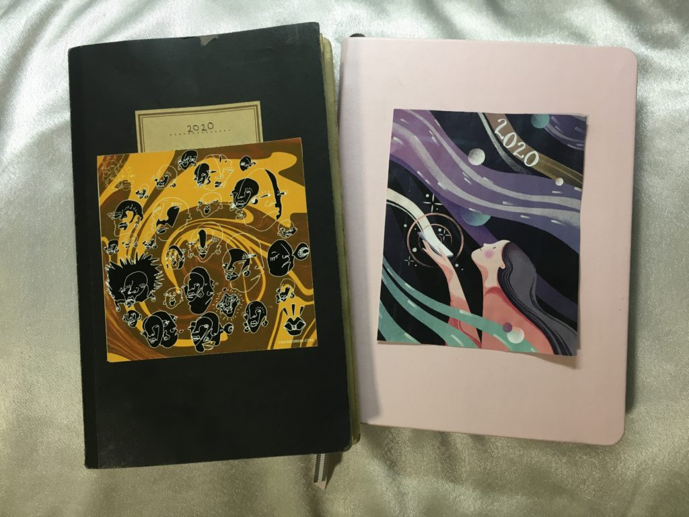
For my second journal, I used a part of an illustration by [Marina Muun](https://www.instagram.com/marinamuun/) and added “2020” to it in white ink. I cut and pasted everything else.

I like to decorate the first pages with some quotes and pictures that I can always look back to. The first thing I used is a still from a video created by Tom sachs. The first gallery I ever visited was a Tom Sachs exhibition at Sperone Westwater in 2017. This is what got me interested in learning more about modern and contemporary art, which is a genre I really knew nothing about.
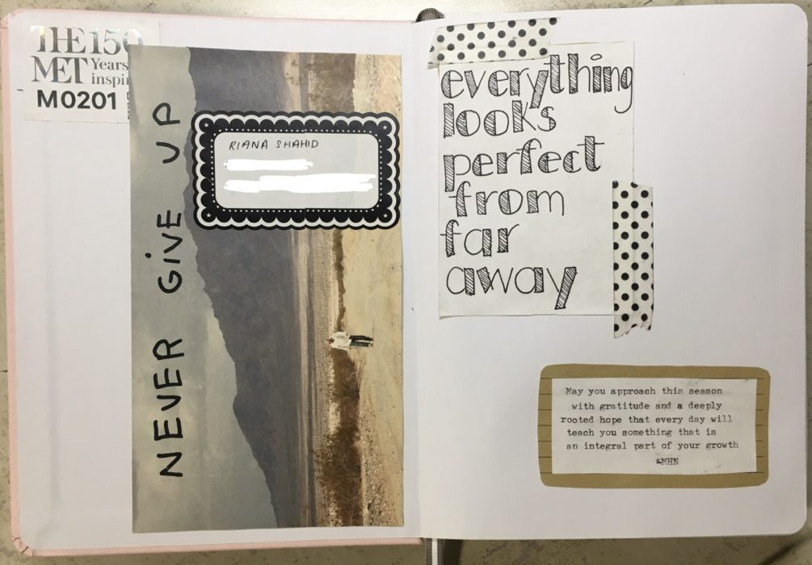
On the next page, I included a couple of quotes. The first one is “Everything looks perfect from far away.” I don’t remember where I saw this, but it fits so well for journaling. Many people see bullet journal spreads online and think they would never have the time to make everything look so artistic, but the truth is, the people who post their stuff are the ones who LIKE spending extra time on the aesthetics of their planner. 

It’s easy to feel discouraged or intimidated when it comes to bullet journaling, but your journal is never going to look as bad as you think it does. The most important part of a planner is whether it works, not how it looks. 

I was SO EXTRA for my next quote, but since it’s a longer one, I wanted to type it with my Underwood 255 portable typewriter. The quote I picked is by Morgan Harper Nichols. It says, “May you approach this season with gratitude and a deeply rooted hope that every day will teach you something that is an integral part of your growth.” 

On the next page, I included a yearly overview. This is where I’ll put events that are coming up in the distant future. My yearly spread in my first journal is made of little printed calendars that I cut out of an old planner, but you can also type these up yourself. Since I had to cut my quotes out, I lost some of my printed months (which were on the back of the quote-page), so I drew the calendar by hand in my second journal.  
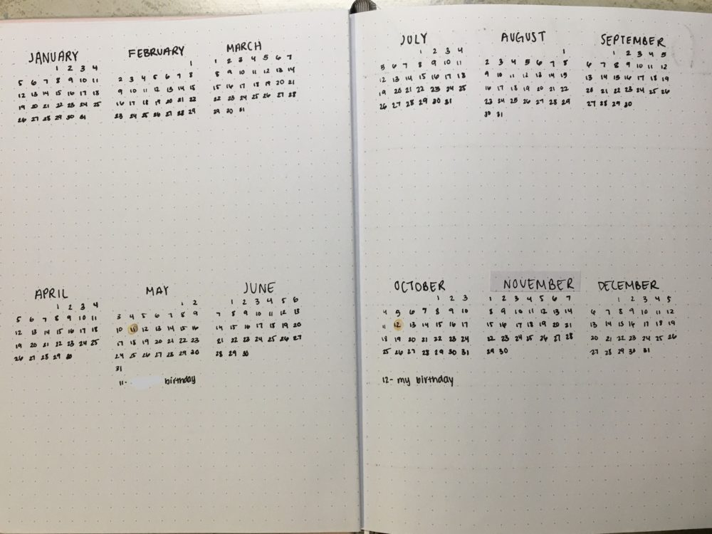
Here, I want to address the way a bullet journal is “supposed to” be used. A bullet journal usually has weekly pages or daily pages. This is because you’re meant to write out your to-do lists and places to go every day. By doing this, you become more aware of that day’s tasks and you take notice of the things you actually get done each day. If you have a task that you keep pushing to the next day, you should realize that you’re either not being realistic about how much you can get done in one day or you should re-evaluate how worthy that task is at all. If you need to keep rescheduling it, and you don’t have any consequences of not completing the task yet, then ask yourself if you really need to do it or if it’s something you can delegate. 

Click [here](https://bulletjournal.com/) for the official bujo guidelines from the creator. 

Next is one of my favorite pages: Books to Read. I’ve always included this in my past planners.
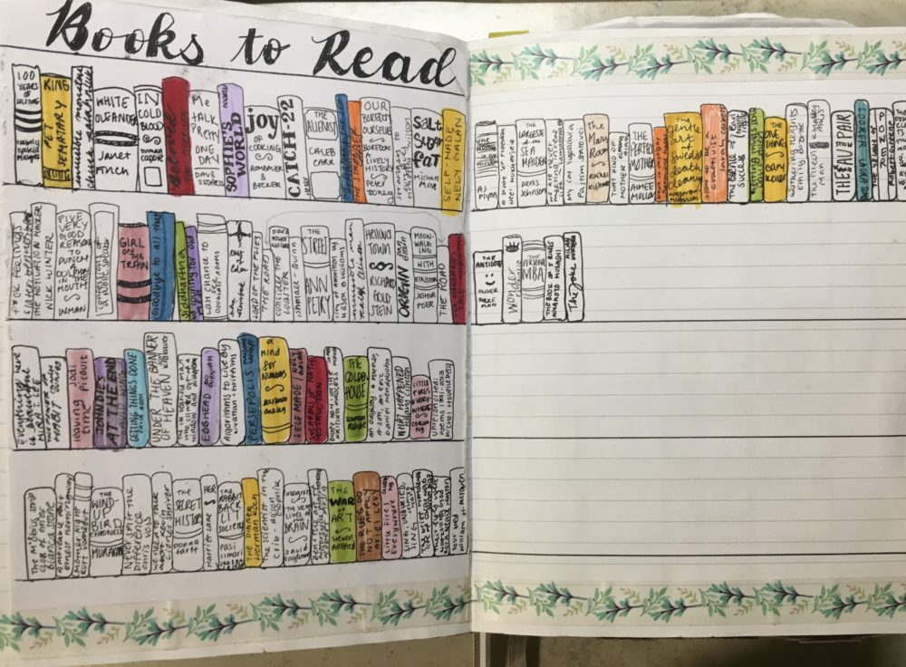
Basically, you draw a bookshelf with titles you want to read and once you read the book, you color it in. If you want to be really advanced, you can come up with a rating system with different colors and keep track of which books you liked best.

I used to make one for movies too but that never worked out for me. Whenever I did have time to watch a movie, I chose the movie based on what was available on Netflix, instead of hunting down something from my list.  
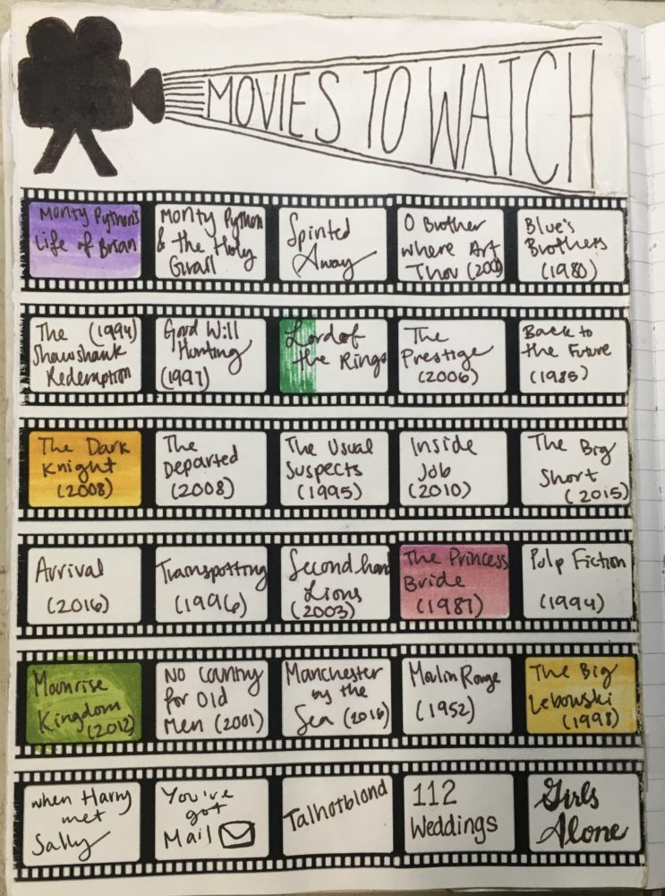
On the other side is my Creative Projects. If you saw my Fall Favorites post, you’d know that I have wire grids above my desk for random notes. One thing I always have up is a list of projects I’m working on; usually blog posts or picture ideas. I wanted to have a dedicated space for that kind of thing in my journal, so I left a page for that here. (This is also where I’m outlining this blog post after filming.)
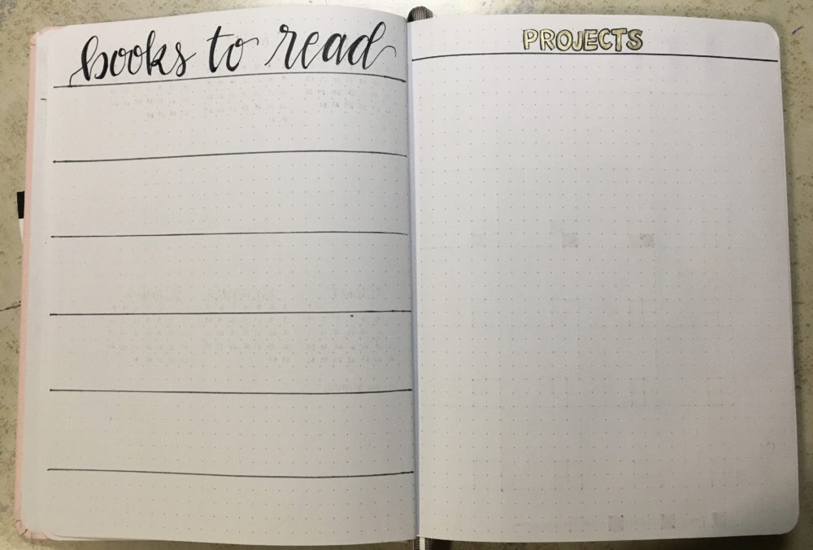
Next up is my monthly spread. This is a full calendar that I’ll make at the beginning of each month. Here, I would transfer over important dates from my yearly spread and add more information and details. I also glued in a quote and left space around the side for notes.
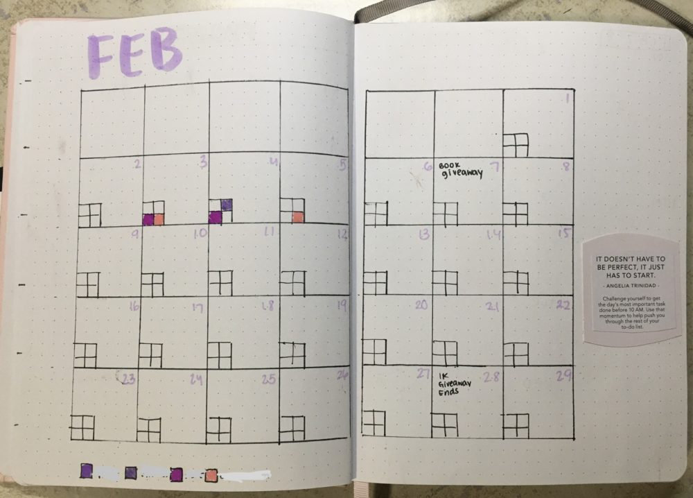
This space is also going to be my habit tracker. Search bullet journal habit trackers online; you’ll find tons of extremely creative ways people track their habits.  Whenever I tried anything like that, it was always harder to remember to fill in my tracker than it was to actually practice the habits. The only thing I was consistent at was forgetting to flip back to my habit pages, especially as I got deeper into my journal. It became more of a chore than a source of motivation. Because of that, I’m tracking my goals right on the calendar page. This way, it’ll always be just a few pages away from my current weekly spread and it’ll be a page I know I’m going to be turning to anyway. 

I’m using a modified version of the [5 habit tracker designed by Sean Wes](https://seanwes.com/2018/five-habit-tracker-free-printable-pdf/). For this tracker, you identify 5 habits that you want to practice every day and assign a color for each one. Then, you draw a small grid on each day of the calendar and for every day that you do your task, you color in the corresponding square. My version only tracks 4 habits because I wanted to simplify a little, but you can check out this link to read Sean Wes’s full blog post on this topic AND get a free printable calendar with habit grids already on them. For this public post, I’m not going to write in what my habits are, but you can write them in a key at the bottom.

##### Weekly Layouts

There are COUNTLESS examples of different layouts online, but here are four that I think are very easy to setup and look cute without compromising on function.

The first week is a two-page spread. I left space open to write my daily to do lists and put some pictures in the blank spaces. I chose some pictures that have similar colors and give off a kind of cozy and relaxed vibe. I also like to include at least one quote for each week. I have a bunch cut out from my old Passion planner, but you can easily write or print your own. 
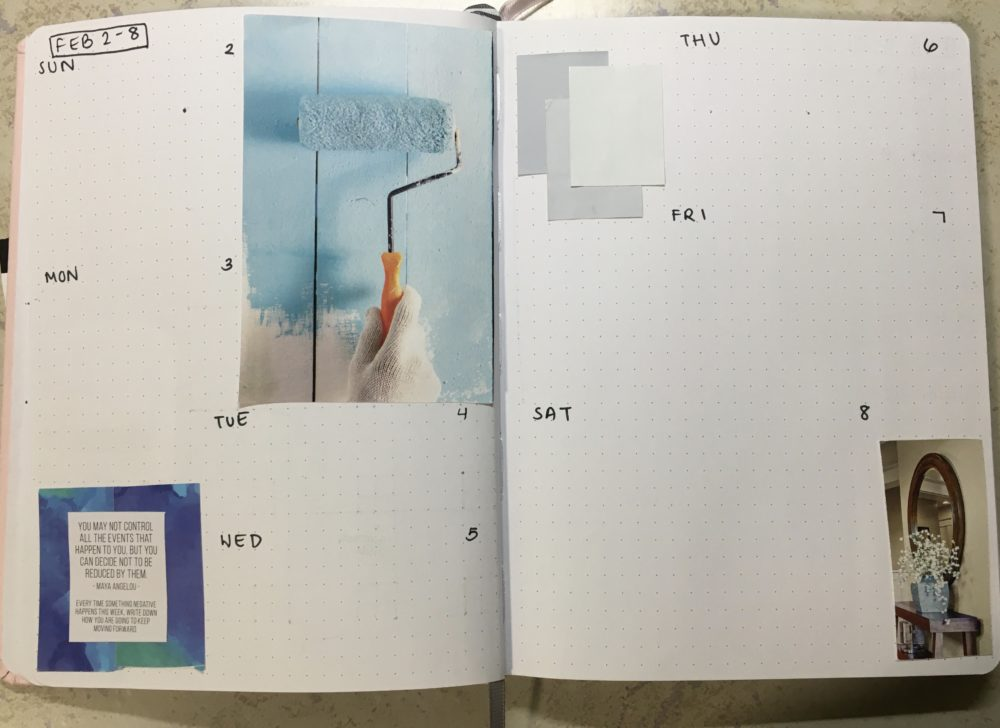
Next is another two-page spread that can easily be adapted to fit onto one page. On the left page, I wrote the days of the week, leaving some space to write my daily tasks. You can immediately tell that this layout will have less space per day than the first one, so keep that in mind when you’re deciding what to use for your journal. On the right page, I’m leaving big blank spaces for random notes and upcoming events. If you want to make this a one-page spread, you can skip this side completely and just use layout we have on the left. 
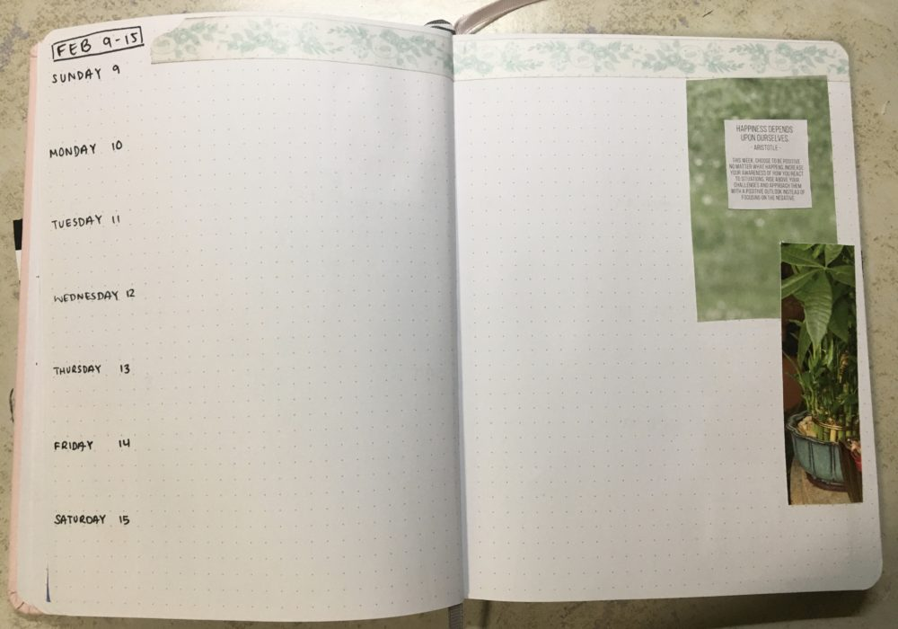
This next one in the video was probably my favorite spread because I like floral designs, but I wanted to show you that you can find nice images pretty much anywhere. Whenever I have magazines or store circulars, I like to cut out cool pictures and textures that I feel like I would use. Here’s a tip: If you take several cut-outs from the same picture, they’ll look good together in your journal because they’ll have the same lighting.  
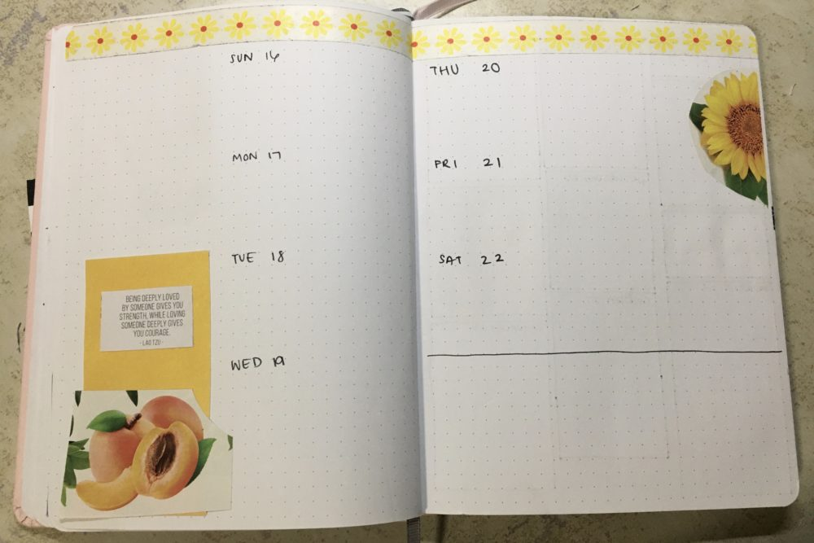
Finally, we have another 1-page spread. This is probably the most visually interesting one out of the four. For this spread, you’ll want to divide your page into three columns and then cut each column into random sized rectangles. Use seven of the rectangles for the days of the week, and the rest is up to you. You can put pictures in the other spaces or just leave them blank for random notes. I’m still going to leave the next page for notes, so I’m using my blank spaces for pictures and for my quote of the week. 
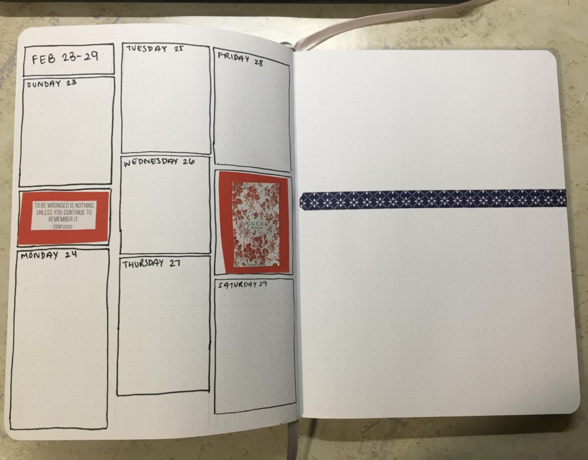
So that’s it for my 2020 bullet journal! At the end of February, I’m going to answer some reflection questions to wrap up the month and then repeat the monthly-followed by weekly layout. I hope you all can find something to take away from this, even if you don’t start your own journal. If you do, be sure to tag me if you post it online; I’d love to see it 😊