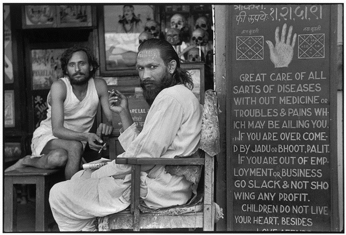
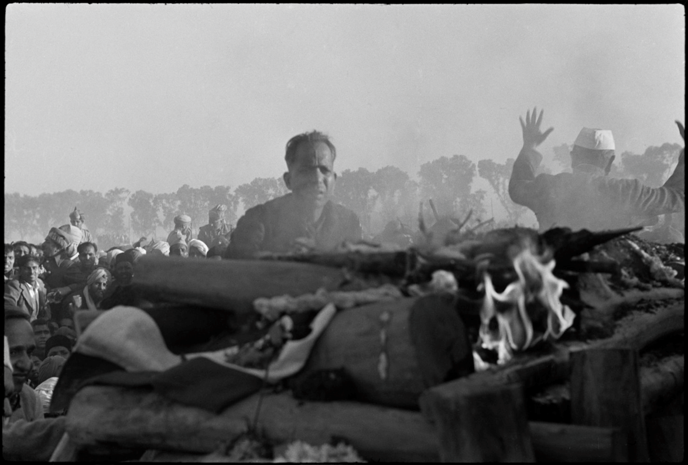
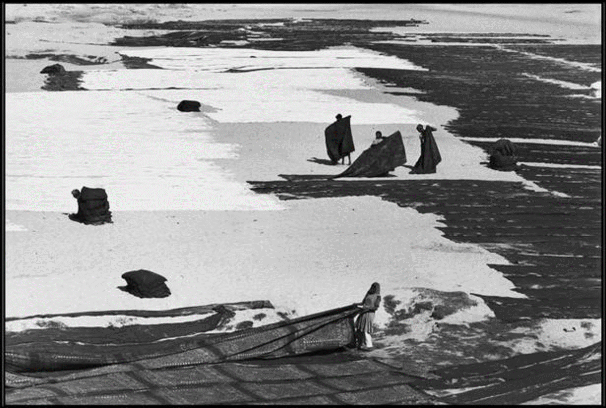
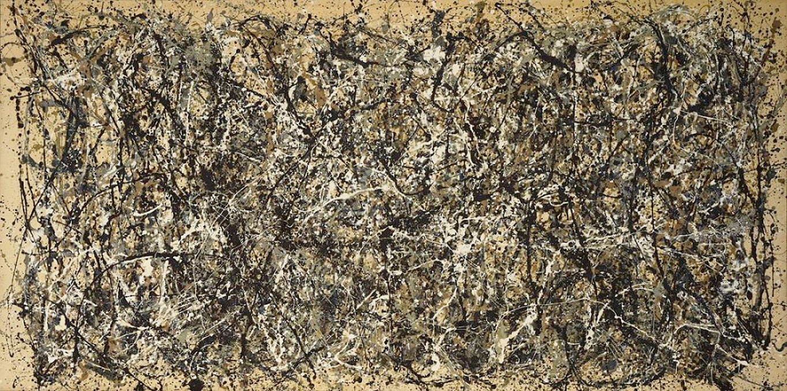
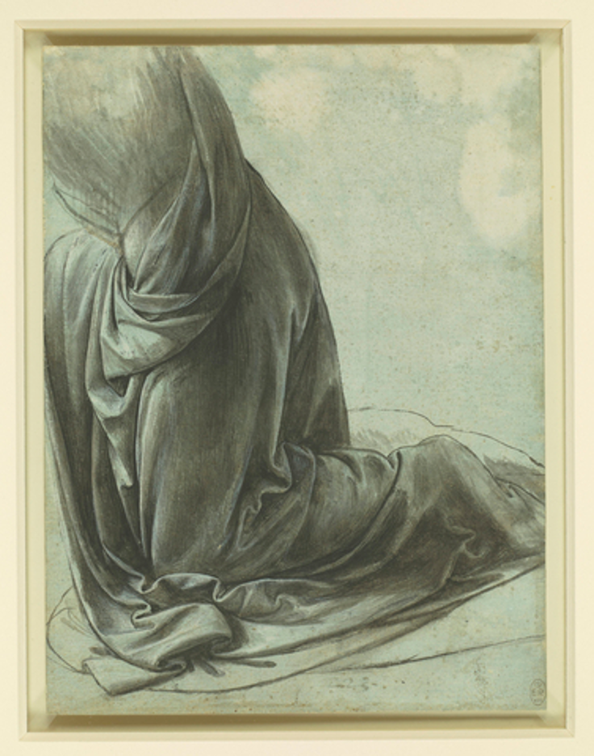
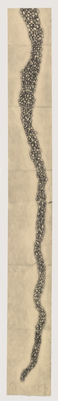
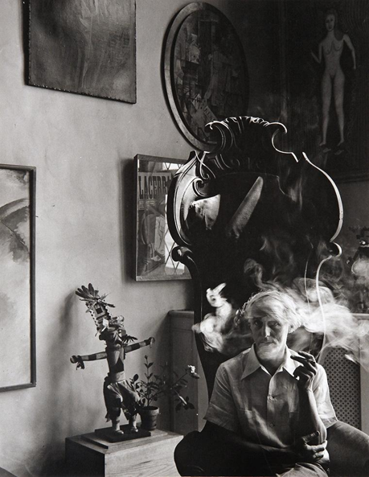

It is my belief that black and white art can be just as expressive as more colorful art. When an artist chooses to use only black and white, it forces the viewers to look at other elements of the work. It takes away color as a point on judgement. I feel strongly about this concept because in terms of clothing, I am not adventurous with color. I don’t care enough about clothes to always dress in the most trendy and fashion-forward ways, but I do like to look put-together and presentable (so if I see anyone important during the day, I won’t regret what I’m wearing). Because of this, it is easier for me to stick to a lot of the same colors. Most of my wardrobe is comprised of neutral shades (grey, beige, etc.) and blacks, with some brighter colors scattered throughout. I think part of this comes from the fact that I wear a hijab, so I have to consider the material and color of my scarf when picking an outfit. But overall, I feel safer in my color range because I know that the colors I wear won’t clash or look too “out-there”. I thought it would be interesting to examine my own relationship with color in the scope of the art found in the Rubin Museum and the MoMA.

### Some Examples

At the Rubin, I looked at photographs taken by Henri Cartier-Bresson. Cartier-Bresson admitted to hating color photography because in his time, it was harder to get consistent colors once a photograph was developed. It was one matter for Cartier-Bresson to shoot a scene with his camera but he had no control over the rest of the development and distribution process, with all the different inks and printing companies involved. So Cartier-Bresson chose to stick with black and white photography. Instead of relying on color to bring the image to life, he plays with the subject and the placement of the subject (or more appropriately, capturing the subject in a moment where the placement is good).

The first of Cartier-Bresson’s images that caught my eye was An Astrologer’s Shop in the Mill Workers Quarter of Parel. I really liked this one because in one picture, he was able to tell a fairly detailed story of the people in it. This is a picture that has many layers where each layer symbolizes something. I can get an idea of the two men’s beliefs and what they might do in their leisure time as well as a little bit about the languages they speak. From the sign in the front, I can tell that they believe in astrology and palm-reading. The poster of the Hindu deity in the background is another clue revealing their beliefs. Also, the neatly-arranged skulls tell me that either the man in the foreground or someone else in their community is skilled at preservation and that there is a market for these types of goods in Parel. The two men are smoking, indicating a time for relaxing, but even in that, we learn about their personalities. The pose of the man in the back is very casual while the man in the front is more at attention, as he aims his stark gaze into the camera. By finding scenes such as this one, Cartier-Bresson is able to capture images that create interest and tell a story.

Another powerful image is The First Flame: The Cremation of Gandhi on the Banks of the Jumna River. In this picture, Gandhi’s secretary is grieving as he looks at Gandhi’s funeral pyre. Right behind him, Gandhi’s doctor is trying to get the crowd to settle down (as much as they can settle down right after Gandhi’s death). Even further, we see part of the crowd that came to watch Gandhi’s cremation. It is no surprise that many people had an emotional connection to Gandhi but in playing with the distance of the elements in this picture, Cartier-Bresson puts the focus on this intensely emotional moment, with no colors needed.

In Women spreading Out Their Saris Before the Sun, the viewer recognizes that saris are a very important textile item in this region just based on how many saris there are. In this almost-abstract picture, they appear to become part of the landscape in the way they are spread out across the flat ground. It also makes me think that they are such an integral part of what women wear in the region that they seem to “become” the very ground they are spread on. I think this is a very cool effect that might not have looked as convincing if this photo was in color.

I selected the rest of my works from various exhibits in the MoMA. To my frustration, I found fewer works that were done completely in black and white so some of my selections have small elements of color but are still fairly monochrome.

The first of these works is Jackson Pollock’s One: Number 31, 1950. This caught my eye firstly because of its massive size but also because of how deceiving it can be. At first glance, all the viewer sees is a bunch of random paint splatters. Many people would say that it’s something that they themselves could have created. The viewer asks the question of whether something like this would even be considered art if it wasn’t a Pollock.

But after looking at it more and trying to take in all the little lines and their varying directions, it becomes a piece that makes the viewer think. When I look at this, I think of outer space. All the clusters of random lines, which vary in thickness and intensity, make me think of different galaxies, each with their own celestial systems. What makes this work really special is that it can take on a different meaning for each person. I thought of space because I took an astronomy class a few semesters ago at NYU, so sometimes I remember little tidbits of information I learned then. But for someone who hasn’t studied astronomy, they might think of something completely different. The mostly black and white design creates that space for variation. The viewer fills in the colors in a way.

The next work of art I chose is Leonardo Da Vinci’s The drapery of a kneeling figure. I have no doubts of Da Vinci’s talent as an artist but if someone were to see this image without knowing it was Da Vinci’s, even they would agree that this artist is talented. This picture has some color in the form of the light blue background but besides that, it is done in black ink with white highlights. Without the use of color, Da Vinci represents a kneeling body covered in fabric. The viewer can see the various folds of the fabric and can pick out where it hangs loosely while still imagining the body under the fabric. Da Vinci creates the perfect balance of light and shadows across this body and in doing so, creates an image where the viewer can imagine the rest of the scene. I imagine a person kneeling in front of something, where the light source is to the left of the painting. Though this painting doesn’t show a face, I imagine that this person might have a peaceful, calm face, as if he or she is waiting for something or someone.

The third work from the MoMA is Louise Bourgeois’s Look Up! I was drawn to this one because of how simple it seemed. It’s a soft ground etching made of repetitive curved shapes. They lump together to form a strange braid-like shape that stretches toward the ceiling. This work encourages the viewer to move their body as they stretch their neck to see the top of the piece. Bourgeois says that pieces like this, with repeating simple shapes, help her relax and release anxiety. The height of Look Up! is meant to fill an emotional need. The movement of the viewer’s eyes, as they go from bottom to top, is representative of the shift from passive emotion to active; from fear and violence (which I would argue can actually be active) to bliss.

The final component of my collection is another photograph.

Arnold Newman photographed Max Ernst sitting in a big, regal chair, surrounded by strange pieces of art. I really like this picture because it gives off a dream-like quality. The smoke around Ernst’s face creates a sense of movement in an otherwise still image. The smoke also serves to disguise what is really there. When I first saw this, I thought Max Ernst was an old man in this photograph. The smoke near his chin looked like a white beard. In the same way that trying to remember a dream makes you forget the details, the smoke blurs the truth. And just like how dreams can have random elements that don’t make sense, the art around Ernst creates a source of oddity, since they are unexplained to the viewer.

While color can be key in drawing certain emotions out from people, these various artists are able to do the same without it. They successfully tell a story that not only represents their art but leaves room for the viewer to make it more personal and more applicable to their own experiences.