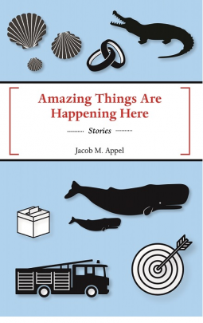

To say that Appel’s writing evokes a strong emotional response would be an understatement. In fact, Jacob Appel writes his characters so well, that I still seethe with rage thinking about his most unlikeable characters (like Donald the ex you can’t get rid of and the scheming nurse whose name escapes me at this moment).

In each story, Appel creates a complete world, each different from the next. I’m very impressed with how unique each universe is from the others. I also appreciated how he doesn’t devote much time to describing characters’ physical appearance in great detail. It’s a minor pet peeve of mine when there is a lot of physical description. If it is not absolutely necessary to the plot, then I’d prefer little to no physical descriptions. I like to imagine my own characters’ appearances however I see fit. (This was a major reason why I didn’t like ‘Salem’s Lot. Read the full review here.)

I rated this book 4 stars out of 5 (where 5 is “This is the best book — I’ll never forget this book”), but I feel that 3.5 would be more appropriate. Certain parts felt corny and cliche, especially the endings of some of the stories. I also don’t like his approach to romantic themes. I almost gave up on this book completely after reading the story called Canvassing. The way Josh interacts with and talks about Vanessa screams stereotypical “man writing about women romantically”. You know, the kind of writing that makes you want to simultaneously cringe and dry heave. Luckily, this is a collection of SHORT stories. I would not have been able to take an entire book’s worth of Canvassing. If you can make it through Canvassing, I assure you, the stories get better.

My favorite story is The Bigamist’s Accomplice. In this story, a couple in a nursing home wants to get married. The trouble is, that both of them are already married, but neither of them remember the fact. Their spouses have no choice but to let the lovers marry, since they are each others’ only source of joy in their lives in the nursing home. Though it also involves romance, the focus is more on the “married” couple’s spouses, Arlene and a man who takes this ordeal entirely too well. Together, they put the artificial wedding ceremony together. It’s sad, yet sweet. I can’t imagine what I would do if my life partner wanted to marry someone else and I had to be the one to allow it. It raises questions of giving up pieces of your own happiness for the sake of someone you love; doing the things you SHOULD do over what you want to do. When I put myself in Arlene’s place, I feel absolutely crushed at the thought that the person I spent my entire life with is moving on without the mental capacity to even miss me. But at the same time, it’s nice how the new wife is “the other Arlene”.

To learn more about Jacob M. Appel, visit his website [here](https://www.jacobmappel.com/). This book will be available for purchase in April 2019.