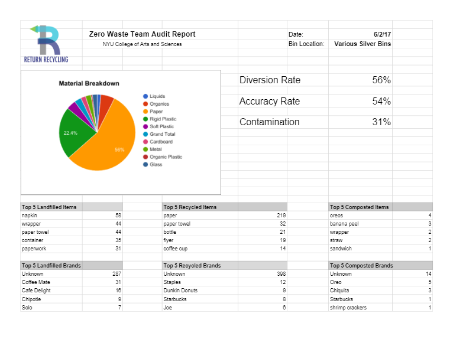
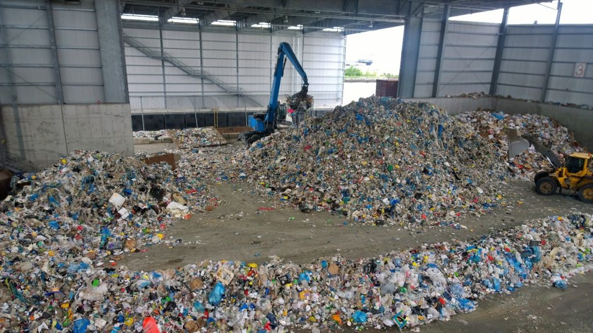
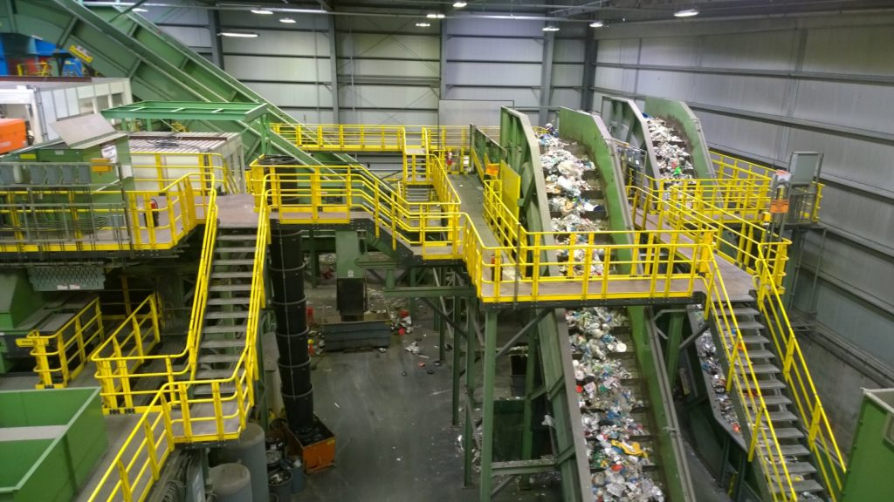
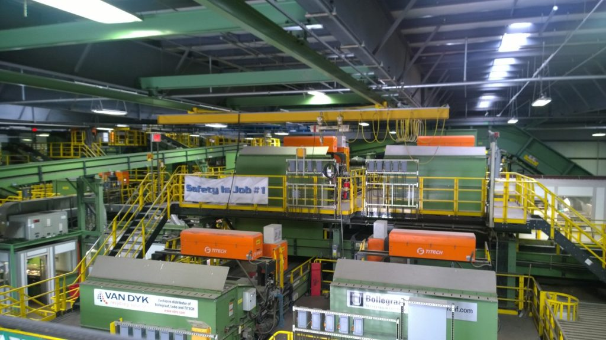

This summer I was a part of Arts & Science in Action and got the chance to take part in many hands-on experiences and field excursions. Here, I have detailed the majority of them. Click [here](https://rianashahid.com/sustainability-nyu/) to read about ASA in general.

### Central Park Conservatory Garden

The first field excursion I went on was to the Conservatory Garden in Central Park. I only had time to explore only a small part of the Garden but I hope to see the rest of it someday! When I went, there was a team of volunteers who were getting ready to plant new flowers throughout the garden. There was a lot of empty space around the hedges. I assumed that this is where all the new plants were going to go. I noticed that there was a black hose that formed two rows along this empty space. At first, I thought it might be some sort of mechanism to help water the plants but it looked like it had been laid down too flat to be effective. It might have been there to help guide the volunteers in placing the plants. It would be interesting to be able to ask someone more about the systems in place that work to maintain the garden.

### Tour of the Silver Center at NYU

The next field excursion was a tour of Silver. Even though I had been in Silver countless times before, it was really interesting to walk through it with a focus on waste. We talked about who handles the waste after it goes into the trash cans. I learned a lot about the different kinds of waste collected on each floor as well as complexities within topics as seemingly simple as the shape of the trash can. Currently, most of the trash cans in the Silver building are rectangular open containers, with separate bins for landfill waste and recyclable waste. This seemed straightforward enough; the big open top made it easy for people to put their trash into the bin and staff members could remove the bags when they got full. However, this could potentially become a fire hazard depending on how much waste is typically found in each bin. A lit match dropped into a conveniently open recycling bin full of paper could lead to disastrous consequences. Luckily, we have reliable staff at NYU ( NYU Facilities and Construction Management – aka NYUFCM and Collins-Building Services, contracted by NYU) who work hard to make sure the bins are regularly emptied and a safe environment is maintained.

Interesting side note: NYU has a mixed-recycling, or single-stream, system, where all recyclable waste is collected in the same trash can. The trash is picked up by Action Carting and then taken to their facility, where the recyclables are sorted through a series of optical scanners. New York City on the other hand, has a multi-stream system, where people are instructed to separate their recycling.

### Waste Audit in the Silver Center at NYU

The next field excursion was a waste audit in Silver. Our goal was to learn about what kinds of waste was created by students in the Silver Center with The Collective, a really neat tool created by the people behind Return Recycling. With The Collective, we logged each piece of trash and let the system analyze the data to tell us more about how well NYU’s waste management system was working.

This was the most hands-on out of all the excursions and it taught me that people are too dumb to throw their trash in the right bin a lot about what people are throwing away and how they’re doing it. We looked through bags from different waste bins (recycling, compost, landfill) and found that many of the bags contained a mix of all three regardless of that kind of waste they were supposed to contain. One of the most striking things was when we compared the compost bags from the ninth floor (where one of the class professor’s office was) and the first floor student lounge. The ninth floor’s bag was perfect. It contained only organic waste. All we had to do was sort through it to take note of what exactly was in there. My professor told us that in the beginning, people asked a lot of questions about what could be composted before putting it in the compost bin. Also, since her office was right there, she was physically present to monitor whether people were only throwing organic waste into the compost bin and guide people when they made a mistake. Students should be given the same opportunity. There should be a resource for them to learn more about what can be thrown out where so that they are informed enough to do it correctly. Many people come from a place where they have never had to separate organic wastes, so a compost bin is an extremely new concept. The first floor’s compost bag was a mess in terms of the kinds of waste that were in it (it was also much more moldy). This makes me think that it probably gets emptied less frequently and might add to why people are reluctant to have a compost bin in the first place. There has to be a system of maintenance that works to make people want to keep composting.

Here is the result of our waste audit. Throughout the various waste bins in the Silver Center, we had a diversion rate of 56%. This is the percentage of waste that was composted or recycled instead of going to a landfill. The accuracy rate is how much of the waste was in the correct bin. The contamination rate refers to waste that was contaminated by something that should have been in a different bin. For example, paper that becomes wet with coffee (or other foods) is considered contaminated.

### Sims Municipal Recycling Facility

Sunset Park, Brooklyn is home to Sims Municipal Recycling Facility, the largest commingled recycling plant in the United States. Here, New York City’s curbside recyclable waste is brought on trucks and barges to be sorted and processed.

The facility was opened a few years ago in an effort to get people more involved in the recycling process. The facility provides people the opportunity to see for themselves what happens to their recyclable waste after they dispose of it. Many recycling facilities exist in the nation, but not all of them are safe for people to visit. Sims is different in that they happily welcome visitors. Guests at Sims can take staff-led tours where they learn more about recycling in the city and get to see the sorting process from a safe distance.

My class’s tour was led by Sam Silver, who taught us a lot about Sims’ role in the city. Sims currently has a contract with DSNY to process its curbside recyclable waste. After being weighed, trucks dump their entire load onto the tipping floor.

In an indescribably graceful motion, a crane picks up waste from barges while trucks dump waste directly onto the floor. After the tipping floor, waste is pushed onto a conveyor belt (far left; not pictured) to begin the processing.

From there, bags are shredded open and the waste is separated onto two conveyor belts. These two belts take the waste through the same processes. Each belt serves as a backup for the other, in case one belt has to be stopped due to issues with the machines. That way, all waste can be diverted onto one belt instead of stopping the conveyors all together.

These two conveyor belts bring the waste to a process that uses a magnet to separate some of the recyclable material. After this, the waste makes it way through the rest of the system. Sims uses a series of 16 optical sorters to separate different types of plastic.

Each of the orange “boxes” is an optical sorter.
It was really amazing to see all of this in person. I never thought I would see what happens to our trash once it is picked up off the sidewalk but I’m glad I got to go on this trip to find out. I would highly recommend that you visit Sims Municipal Recycling Facility for an insightful experience.
