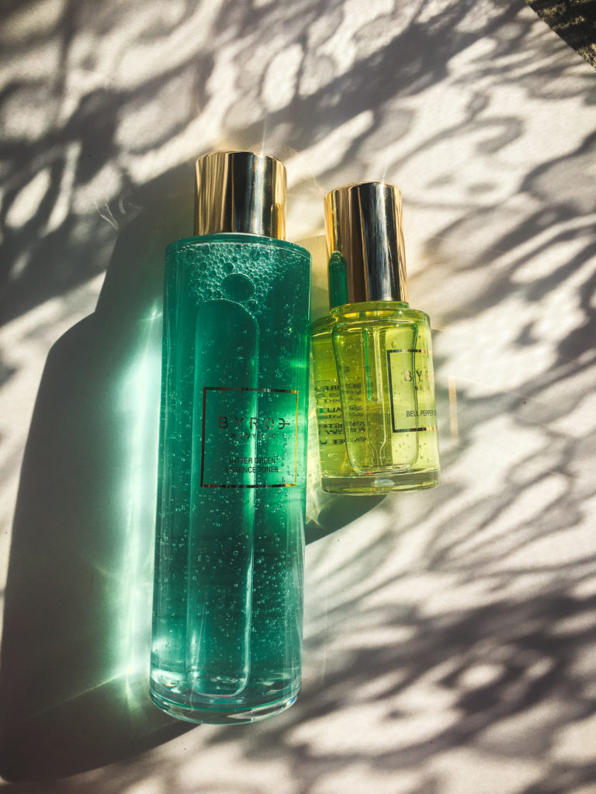
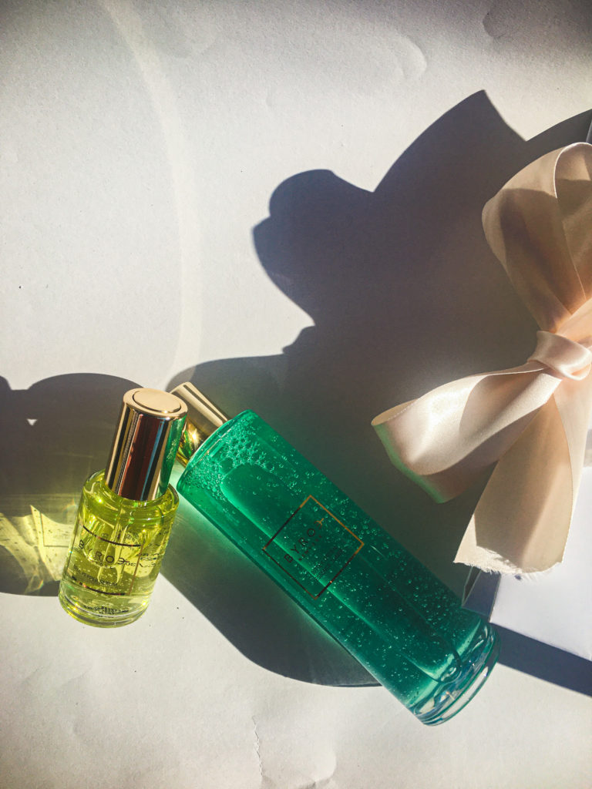
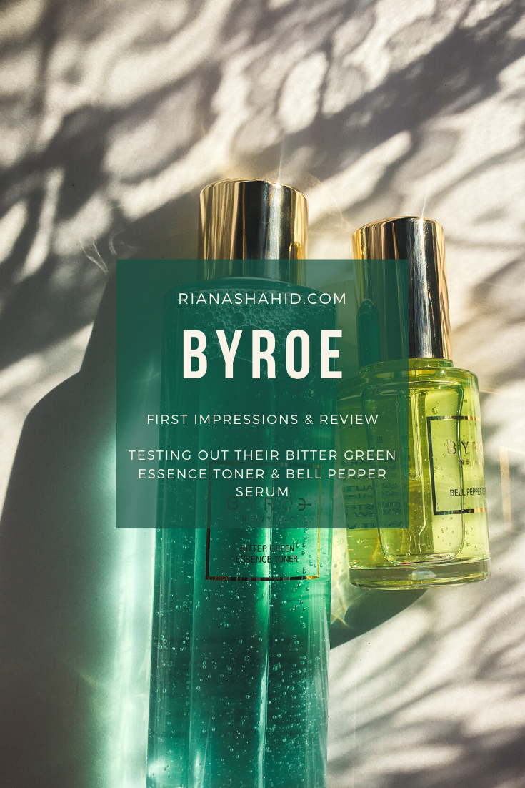

Recently, the kind team at Byroe sent me their Bitter Green Essence Toner and the Bell Pepper Serum to try out. These are just two products out of an entire line based around food. Byroe’s philosophy is that certain foods contain so many helpful nutrients for the body, so why not use them in skincare products? Click [here](https://byroe.com/) to read more about Byroe.

The bitter green essence toner is based on salad greens. This contains hyaluronic acid for hydration, centella asiatica extract to soothe redness, and a whopping 33 green vegetable extracts! Is that an excessive amount? Possibly, but together they are supposed to provide a huge dose of antioxidants to the skin. There’s a full list of ingredients [on their website](https://byroe.com/products/bitter-green-essence-toner), which reflects their philosophy on transparency.

To use this product, you have to pour it out into your palm and pat it all over the face. I’ll be honest, when I first got this, I was a little nervous about spillage/product waste but luckily I didn’t have any issues. The consistency of the toner is thick and the opening is small enough to only let out a few drops at a time. Despite the toner’s consistency, it didn’t feel heavy at all on the skin. It’s very light and refreshing which I really appreciated. I have combination skin but it’s on the oilier side in my t-zone. Because of this, I avoid wearing heavy products — especially when it comes to toner, which is meant to be layered under other moisturizers. Speaking of toner, the name of this product may be a little confusing. It’s called the Bitter Green _Essence Toner_ and if you have learned anything about multistep skin care routines, then you might know that toner and essence are two different steps. Toners, in my experience, have the consistency of water and they’re not really supposed to moisturize the skin well enough on their own. Usually, toners may contain an active ingredient to help with acne or exfoliation or just have a mild hydrating factor. Essences on the other hand are a little bit thicker and almost like a serum. These will usually contain ingredients to target a skin concern of yours and would be applied after toner and before a heavier moisturizer. I reached out to Byroe and they told me it’s named this way because “[they] consider it a concentrated essence and toner all in one.” I can see why, since this product looks thick in the bottle and behaves like a thick liquid, but once you put it on the skin it feels really, really light. I know I keep emphasizing this, but it seriously feels as if I just splashed water on my face. The fresh scent also adds to this effect. 

Hats off to whoever wrote copy for Byroe’s website because describing bell pepper as “more than just a salad topper” actually made me laugh out loud**. As an ingredient, bell pepper naturally contains vitamin C, antioxidants, and other phytochemicals (aka compounds found in plants). Additionally, the Bell Pepper Serum contains ascorbic acid (pure vitamin C) to help fade dark spots, ceramides for moisture, and centella asiatica, which is also known as cica. (Full ingredients list [here](https://byroe.com/products/bell-pepper-serum)).

This serum has a self-filling dropper that fills the applicator when you twist the top open. It works perfectly and makes the application process feel very luxurious. I use three drops to cover my entire face.  

_**The two meanings here are that you can put bell peppers on your actual salad and you apply the bell pepper serum on top of the salad-based toner._

I’ve been using these products for about two weeks now, and I have no complaints so far. In the morning, I apply the toner, serum, my La Roche Posay sunscreen, and then makeup. At night, I usually use just the toner, serum and nothing else, but if I’m feeling extra dry, then I layer my Cerave Moisturizing Cream on top. 

I can’t end this review without mentioning the prices of these products. The Bitter Green Essence Toner is $95 for 150 mL and the Bell Pepper Serum is $110 for a 30 mL. These are pricier than other products I’ve used, so I have high expectations for their performance. Because of that, I will make another post once I use these up, so that I can give my full opinion on how well they serve my skin. Also, my main skin concern is hyperpigmentation, which takes time to fix. The Bell Pepper Serum contains ingredients that address this, but there’s no way I can review its effectiveness in just two weeks. I think it’s fair to expect a difference by the time I use up an entire bottle, so that’s when I’ll give my full review. 

Another thing I want to test is how well these products hold up over time. Clean beauty is a huge trend right now (and for good reason!), but one issue I’ve had with paraben-free products is that they go bad before I can finish it. I bought an eye cream from a mid-range clean brand at Sephora and the smell changed after just two weeks. It was fragrance-free to begin with, but it turned into something so bad, I couldn’t even stand to open the jar. As bad as I felt about wasting product, I returned it and got my money back because a two-week shelf life for an eye cream is just ridiculous. I noticed that the Bitter Green Essence Toner and Bell Pepper Serum both contain tocopherol, which is a form of vitamin E but can also act as a preservative, so I’m hoping this will be enough to maintain usability.  

Click [here](https://byroe.com/) to check out Byroe’s website. Learn about their philosophies, other products in their line, and how they’re changing the skincare game one ingredient at a time. 
