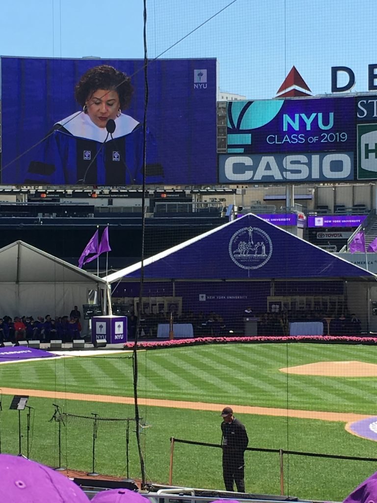
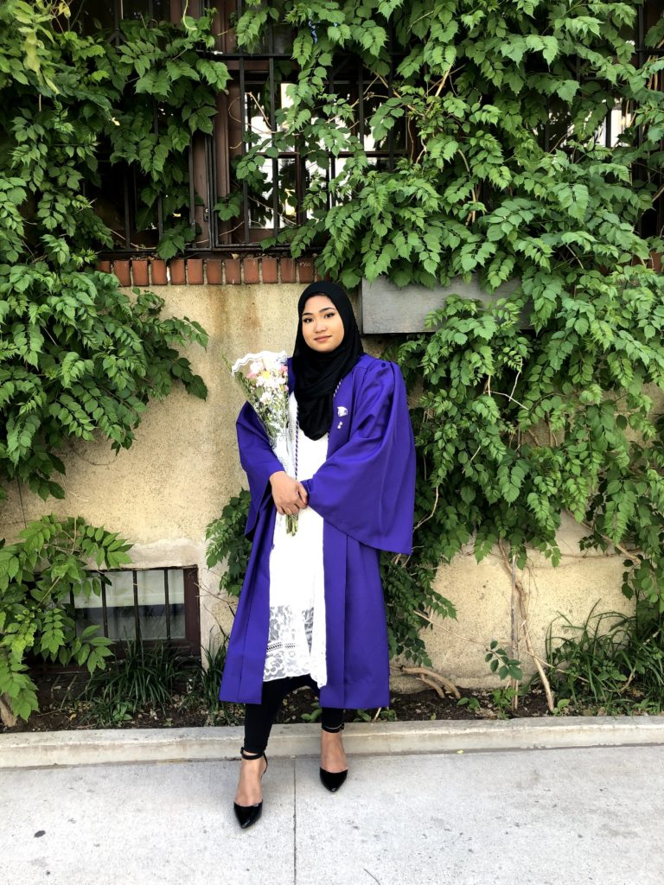

Last month, I graduated from New York University with a bachelor’s degree in mathematics and a minor in Teacher’s Education. Since I was in the College of Arts and Sciences, my first ceremony was at Radio City Music Hall with my fellow CAS graduates.

The next day was Commencement at Yankee Stadium. I’m not a huge sports fan, so I had never been to Yankee Stadium (or any stadium, let’s be honest). It was so surreal to be in that space, surrounded by purple robes. (Interestingly, my high school graduation was the first and only time I went to Barclays Center.) I know NYU is a big school, but to actually see my graduating class almost fill the entire lower level of the stadium made me feel like I was a part of something big.

I’m normally not a crier at these kinds of events, but I found myself getting emotional at the thought of finally being DONE with this chapter of my life. College is a time of change and trying new things for many people. But what I struggled with the most was coming to terms with the fact that I could not coast through my classes anymore. I always got good grades in school without having to put in much effort. When it became necessary to study in order to do well, I found that I didn’t know how to study. It was hard for me to admit to myself that I needed a kind of help I never needed before. My degree took five years of hard work. It took many all-nighters, caffeine, and sometimes tears. But no matter what I faced, I got through it.

So I’m writing this blog post to say congratulations, Class of 2019! You earned it!
