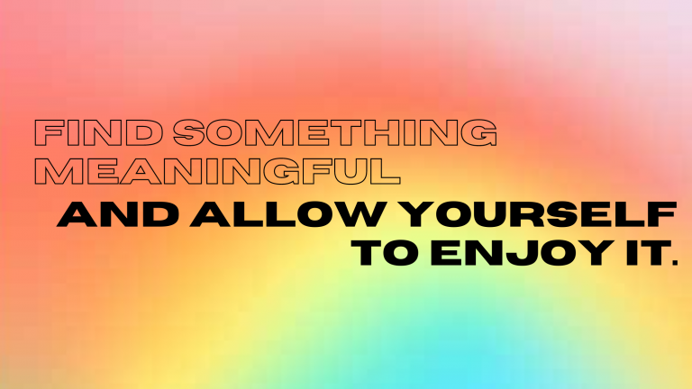

### Hello again!

So….. I’ve been gone for a little while. Part of that was because I didn’t feel as motivated to post, but the main reason is that I was working toward a career change! I just graduated from a 12-week coding bootcamp, so I wanted to share my experience and advice for anyone curious about going down a similar path.

First of all, I want to talk about what inspired me to do this. I always had an interest in web development – it’s one of the reasons why I first started this blog. I love using this as a creative outlet, so naturally, I wanted to know more about what goes on in order to make my blog functional. I was lucky enough to be able to work from home during lockdown, but I wasn’t working in the field I wanted to stay in, so I knew I was due for a change. I had some experience in web design through a class I took in college, but there was still so much I would have to know before being able to work in web development. I knew I didn’t want to go back to school for it and the thought of teaching myself everything I would need to know felt nothing short of daunting.

_Enter the bootcamp._

Bootcamps are intensive courses lasting a few weeks to a few months. They don’t promise to teach you everything you’d learn through a 4-year program at a college, but the workload is INTENSE. I knew I needed a highly structured setting, so this was the best option for me.

### What I learned at my Bootcamp

There are different kinds of bootcamps out there, but mine focused on full stack development. Here are some of the topics covered by my instructors:

* Some basic HTML/CSS
* Flexbox & CSS Grid

    
    
Click the image to check out my portfolio!

* JavaScript
* jQuery/AJAX 
* React 
* Express
* Mongo
* Ruby
* PostgreSQL
* Rails

We also touched on how to use CSS frameworks (like Bootstrap), mobile-first design, front-end frameworks (like Gatsby and Angular) and many, many other topics. If this list seems like a lot, that’s because it is. Web development is a MASSIVE field, so to be ready to enter the workforce, you have to be familiar with many different technologies. But more important than that, you have to be able to **learn** whichever one you might need at work or for your own projects. Being introduced to all of these over such a short period showed me that I am capable of not only grasping new and unfamiliar concepts, but becoming fluent in them as well.

Disclaimer: The exact languages and technologies you will learn can depend on your bootcamp and your instructors. I took General Assembly’s Software Engineering Immersive course. It was a great program, but it’s worth noting that the curriculum is decided by the instructors. Other students taking General Assembly’s SEI course run by different instructors learned different technologies. That’s not a bad thing but it should be taken into account when choosing what kind of course is right for you.

### Advice & Tips

##### Be prepared for A LOT of work

It shouldn’t be surprising that trying to prepare someone to enter a brand new field in just 12 weeks entails a lot of hard work. There is so much material to learn and become proficient in. You also have to get used to _thinking_ in code. My class ran from Monday to Friday from 10am to 6pm. Then we had a few hours of homework each night. Just having to be at my computer, actively working, for so long was a huge shift on it’s own. This, plus the mental strain of understanding every new topic left me feeling exhausted sometimes. 

##### Be realistic
While you will learn a lot of new material, you won’t be the next Elon Musk or Steve Jobs by the time you graduate. You also won’t know everything you might have learned had you studied computer science for four years in college. You might not even come close unless you ….

##### Keep practicing

Even though I spent so long in class every day, I still had to study and practice new concepts on my own. I don’t think I had a single day over those 12 weeks where I didn’t study anything. We learned something brand new almost every single class day, so there’s no way to fully grasp or at least have a handle on things without dedicating time on your own. It takes an incredible amount of discipline to make it through the 12 weeks. It takes even more discipline to make sure you practice old topics once the class has moved on. You’d be surprised at how quickly you start to forget something, so it’s important to refresh yourself on it every now and then. This is something that I’m personally still working on. Now that I’ve graduated, I can dedicate more of my daytime hours to not losing what I learned in the first weeks of bootcamp. 

##### It’s normal to feel lost

I think the point where all of my classmates collectively had to take a pause was when we started React. It was a brand new thing for all of us, so we were all struggling. You might have many moments like this, where it feels like nothing makes sense. My advice here would be to just keep pushing through with it. Refer to examples of code that work when doing your homework and projects, and eventually it will click. Take full advantage of instructors and office hours to get extra help, but also look for resources outside of bootcamp to supplement your understanding. I found that reading blog posts and documentation was not the most productive, so I usually looked for YouTube videos to learn new concepts. The important thing is to find what works for you!

##### Don’t compare yourself to others

Every single person you meet at bootcamp will come from a unique background, with varying levels of experience. Everyone has different responsibilities outside of class, so they might be able to spend more time studying than you can. They might even have family members to help them. It would be easy to see other people doing better than you and feel discouraged, but you have to remember that there’s no such thing as a “typical” bootcamp experience, especially in web development. 

##### Make friends!

Besides your instructors and TAs, your classmates should be a source of support too! They might be in the exact same boat as you or they might be able to say the very thing that clears up a hard topic. In either case, there’s no downside to getting to know your peers. You can support each other with homework help during bootcamp and when you graduate, you’ll have a robust network of individuals who can vouch for you. 

##### Take care of your body

A typical bootcamp schedule is intense, so you HAVE to make sure you get plenty of sleep and eat nutritious food. I always tried to make sure I was in bed by midnight, so I could wake up around 8am, eat breakfast, shower, and _maybe_ even finish up some homework last minute. Meal planning is a big help too. With an hour-long lunch break and lots of work to do after each class, I never had time to think about what I was in the mood to eat. I spent a couple hours every Sunday prepping my meals for the rest of the week. I would highly recommend doing the same if you can. (It also helps that I **LOVE** soup and it’s easy to make enough for a week all at once.)

##### Take breaks and reward yourself

If you get stuck on a topic, the best thing you can do is get up and do something else for a little while. Give your mind a break every now and again so that you can think clearly. You can get so worked up while coding that you might not notice the simplest errors. And when you finish a big project (or 12 weeks of bootcamp), reward yourself with a night (or two) off. My bootcamp end-date coincided with Black Friday, so I definitely got myself a few presents. Find something meaningful and allow yourself to enjoy it. 

Those are all the tips I have right now, but if you have any questions about something I didn’t cover, feel free to leave a comment below or reach out to me online! You can email me at [info@rianashahid.com](mailto:info@rianashahid.com) or find me on [Instagram](https://instagram.com/rianashahid) and [Twitter](https://twitter.com/rianashahid) @rianashahid. 

