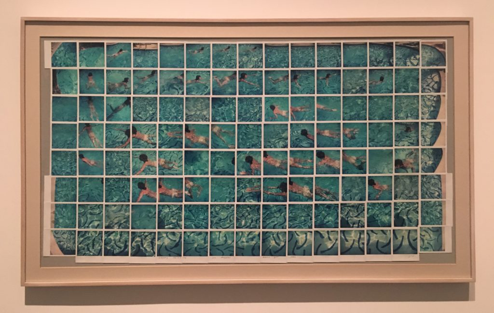
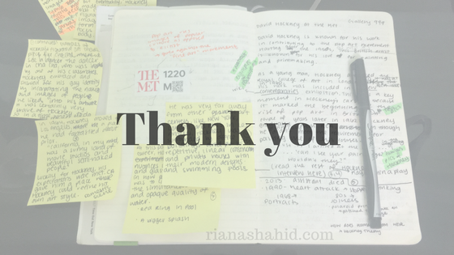

David Hockney is known for his work in contributing to the pop art movement starting after the 1950s, as well as for his love of painting and printmaking.

As a young man, Hockney attended the Royal College of Art in London. During this time, Hockney took inspiration from artists like Jean Dubuffet and Jackson Pollock, since abstract art was “in”. But over the course of a year, Hockney made the shift to art that is more figurative.

Figurative art invokes images of the real world with a focus on the human body. Examples of Hockney’s figurative art include the dancer in _The Cha Cha That Was Danced in the Early Hours of 24th March_, which was inspired by one of his classmates.

The Cha Cha That Was Danced in the Early Hours of 24th March — While at the Royal College of Art, Hockney attended a party where one of his fellow students danced the cha-cha. According to the artist, the dance was for him, “because although I didn’t know him very well, he knew I thought he was stunningly beautiful.” The student was Peter crutch, whose name Hockney inscribed on the dancer’s left flank. Words from the hit single “Poetry in Motion” run above the floor: “I love every moment.” Cheekily adding to the sense of exquisite pleasure in watching this object of affection move to the music are the words that appear behind the dancer’s left shoulder, taken from a tube of ointment: “penetrates deep down.” *

Hockney embraced and showed off his gay identity by incorporating the names and images of men he liked into his artwork. It was certainly very brave of him to do so in a time when this was not as accepted.

In 1960, Hockney’s work was included in a [New Contemporaries](https://en.wikipedia.org/wiki/New_Contemporaries) exhibition. This was a key moment in his career because it marked the beginning of the rise of pop art in Britain. Works like Tea Painting in an Illusionistic Style lines up with the work of other pop artists outside of Britain, since they were also using images of popular products. Hockney chose to create a box of Typhoo tea because this was his mother’s favorite brand. He stretched and manipulated multiple canvases to create the “box”.

Tea Painting In An Illusionistic Style — What’s interesting here is that Hockney depicts the box in a way that respects it’s three dimensions but he paints a person on the box as if it was completely flat.

A couple of years later, in 1962, Hockney graduated from the Royal College of London, even though he technically didn’t meet the requirements for passing one of his courses:

>Just as I arrived at the RCA they were changing the whole system and abandoning the teaching of drawing for this general studies course. I objected to this: I’d been working in a hospital for two years and I expected to draw. They said that the Minister of Education had complained that people were leaving art school ignorant, so I replied that there was no such thing as an ignorant artist – they were all interesting – and told them off, saying, “You are a professor of painting: you have to profess painting.” They didn’t like that I was cheeky and confident enough to criticise them and that I didn’t even bother signing in to these lectures, so they said, “You’ve failed this course.” I didn’t care. Who’s going to ask a painter to see a diploma? They’d say, “Can I see your paintings?”, wouldn’t they?

Read the rest of this interview [here](https://www.timeout.com/london/art/interview-david-hockney).

Play Within a Play — By the spring of 1963, Hockney had begun to experiment with the illlusionistic space of the canvas, as well as with the device of a curtain. In the National Gallery, London, he came across a room of recently acquired and conserved Baroque frescoes, then attrivuted to Domenichino, from the Villa Aldobrandini just outside Rome. They were painted to look like tapestries hanging on the wall — already for Hockney a “double level of reality” — and one included a figure who pulled a drapery back. This trompe l’oeil inspired Hockney to paint a semi-real stage set of his own, wherein his art dealer, John Kasmin, in pinned between the shallow illusionistic space of a theatrical backdrop and a close-in pane of Plexiglas.*

In 1964, Hockney moved to Los Angeles, a place he had fantasized about prior:

>California, in my mind, was a sunny land of movie studios and beautiful semi-naked people.

Luckily for Hockney, his expectations were met. California gave him a place where Hockney could refine his own art style without being influenced heavily by others. He was very far away from other art centers, like New York, London, and Paris. In Los Angeles, Hockney was surrounded by office buildings with repetitive, linear construction and private houses with their modern designs and swimming pools.

At this point in his artistic career, Hockney continued to explore the nuances in painting water and glass. He took pleasure in how difficult it was to capture in paint the simultaneous transparent quality of a splash of water and the opaque nature of an entire body of water.

Rubber Ring Floating In a Swimming Pool

A Bigger Splash — What stands out here is the contrast between the flat background and the disruptive splash of water. 

Between 1968 and 1977, Hockney painted a series of portraits in extremely detailed scenes. As opposed to the simplicity in works like Rubber Ring Floating in a Swimming Pool (which borders on abstract), these portraits are very intricate. Each one forces the viewer to ask what is going on in the image. They plant the seed of a story, leaving the details to the viewer.

Portrait of an Artist Pool with Two Figures

My favorite set of works in this exhibition were Hockney’s collages. He called these “joiners”, which were made by taking a series of pictures of a scene and by patching them together to create one cohesive image. I liked these because they go against what I typically think of when I hear “collage”. To me, a collage uses various images/papers/etc. to create a new picture that is usually unrelated to the sources of the materials. But the joiners are collages made from other pictures of the very thing they are meant to represent. That being said, Hockney adds interest to his photocollages by taking each image from a different perspective. this gives the appearance of “disruption” within the picture even though we still see one comprehensible image at the end.

Pearlblossom Hwy., 11-18th April 1986, #1

Celia, Los Angeles, April 10th 1982

My Mother, Bolton Abbey, Yorkshire, Nov. 1982

Gregory Swimming Los Angeles March 31st 1982 — What I really like here is that even though Gregory is only in one place at a time, in this picture, he is everywhere at once.

The David Hockney exhibition will be on view at the Met Fifth Avenue until February 25, 2018. Learn more about the exhibition [here](https://www.metmuseum.org/exhibitions/listings/2017/david-hockney).

_Note: Descriptions marked with an asterisk are taken directly from the museum’s plaques._

