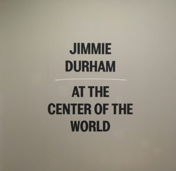
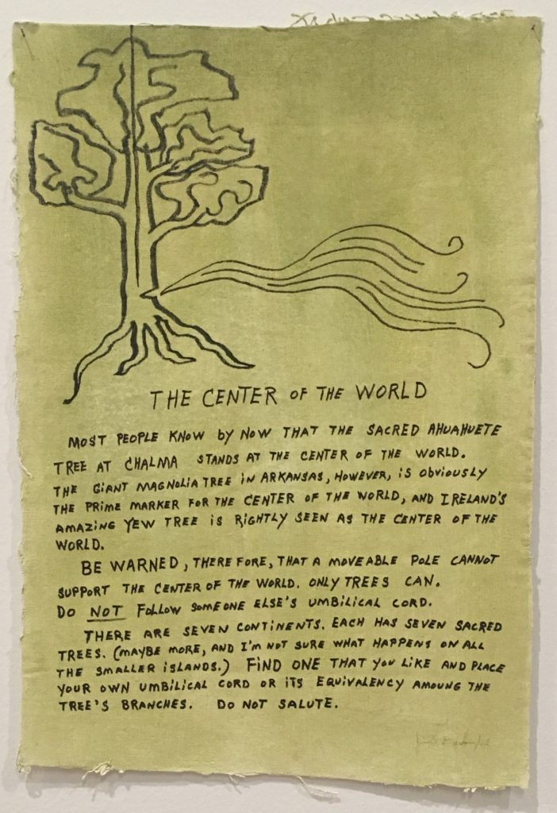
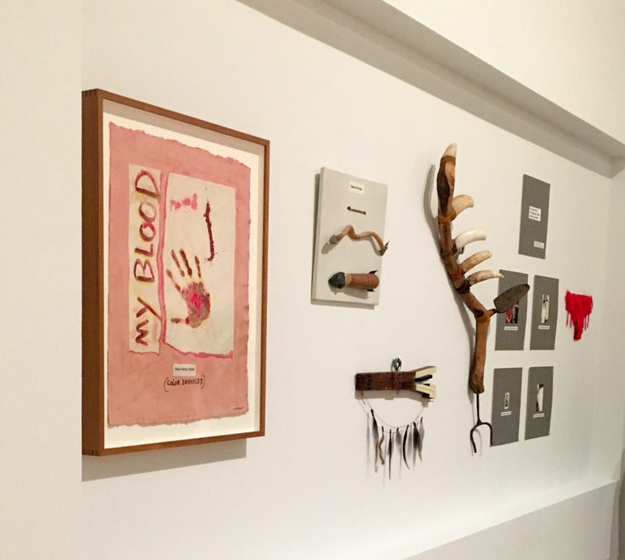
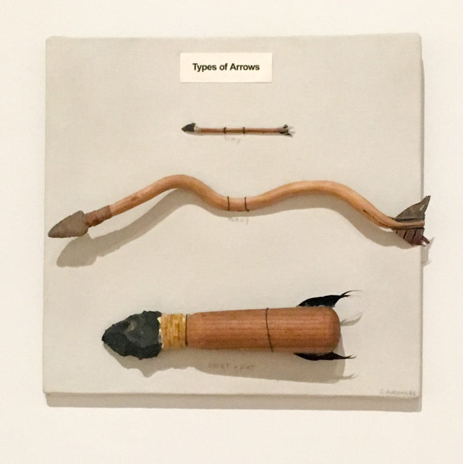
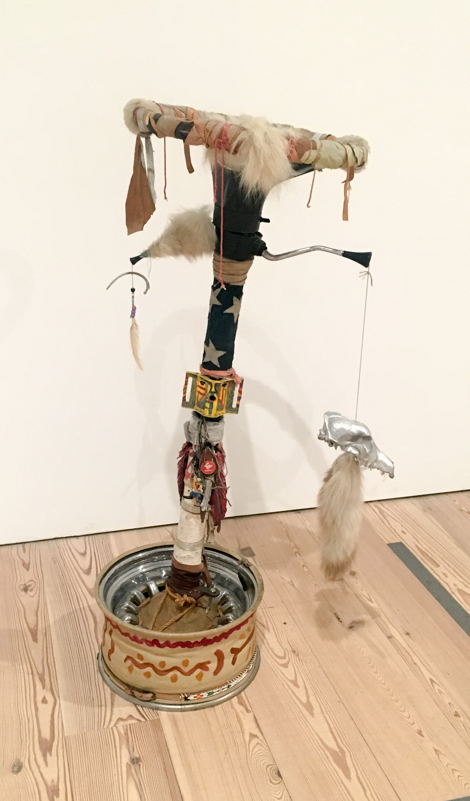
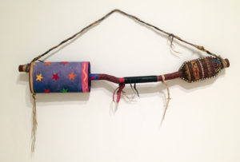
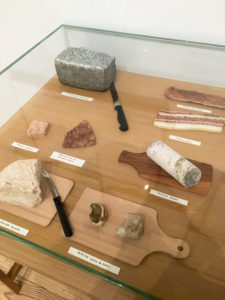
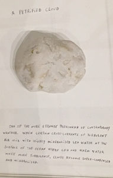

Jimmie Durham is an American artist and activist. He claims to be 1/4 Cherokee but lacks the documentation to register with any tribe. Even though tribal representatives have outright denied the possibility of Durham’s Cherokee ties, he remained a strong member of the American Indian Movement, working to expose stereotypes set on Native Americans.

In this exhibition, Durham takes a satirical position on the presentation of Native American life to non-Native audiences. The title of this exhibition is “At the Center of the World.” Reference to this phrase is made in Durham’s Anti Flag; a small canvas that warns its viewers against tying themselves down to something they don’t believe in. But this goes beyond one piece of art. Throughout his travels, Durham would declare wherever he is to be the “center of the world”. Is this an act of egocentrism on his part? I’m not sure. It doesn’t really make sense. The Anti Flag says that the center of the world should be a tree, which is not moveable or transient. But Durham does emphasize the importance of choosing your own place for the center. It reminds me of how people used to think the Earth was at the center of the universe. To the ancient Greeks, it was common sense to think that the Earth was static and central in the universe. This is due to a combination of the belief of a geocentric system and their understanding of gravity; that all objects were drawn to the center of the universe. In reality, the universe doesn’t have a center but it is constantly expanding in all directions. So maybe it’s not too far off to consider wherever you are to be the center of the observable world; the center of your world.

Anti Flag, 1992 – acrylic, unstretched canvas

Durham’s world revolves around protecting the sanctity of Native American heritage. When the Smithsonian announced their plans to open a Native American exhibit, Durham responded with Fake Artifacts. He really didn’t like the idea of putting Native American artifacts on display, experiencing them in the same way we visit the zoo to look at animals. Putting Native American artifacts on display at all is tricky because focusing too much on the artistic elements undermines the sad history of assimilation and colonization. But cultural artifacts deserve to be preserved for future generations. Fake Artifacts pokes fun at the ways people comment on Native American culture as well as the ways that museums label artifacts.

Fake Artifacts, 1985

My Blood features a handprint made with Durham’s own blood. The canvas is labelled as “color enhanced”, as if it were an image or a photograph instead of something made though the pain of an actual person. Putting My Blood in a museum serves to dehumanize the artist in this way. Types of Arrows was inspired by old western movies where a cowboy would find an arrow and somehow immediately indentify the group it came from. Durham wants people to see the Tiny, Wavy, and Short & Fat arrows and laugh at how silly they are. All that you can truly discern from picking up any of these arrows is simply what they look like: tiny, wavy, or short and fat. The idea that every tribe has a “signature” arrowhead is a result of a poor grasp of Native American culture and is still as problematic today as it was in 1985.

Types of Arrows, 1985

Pocahontas’s Underwear is a little more serious. (There’s a sentence you didn’t see coming.) This feathery pair of panties was inspired by a performer’s costume and serves to underline Durham’s displeasure at the portrayal of Native Americans in popular media. Many Native Americans, especially women, are fetishized by the majority group. People of color are reduced to a sexual figure, erasing all histories of their struggle. Instead of highlighting the impact of a historical figure as significant as Pocahontas, her story is simplified; it’s revised to fit into the story of a colonizer.

With that lovely thought in mind, let’s change gears a litte: Imagine you’re in the future. People are examining our possessions the same way we did (and continue to do) with Native American artifacts. That’s the scenario Durham imagines with Bedia. Inspired by Cuban artist José Bedia, Durham’s Bedia is a character created to portray an archaeologist from the future. Durham imagines him trying to make sense of all the preserved junk we left behind. These are some of the things Bedia found on the island of Manhattanas.

Bedia’s Stirring Wheel, 1985 — Car steering wheel with shifter, metal car wheel, cotton flag scraps, cow leather, fur, sheepskin, pigeon feather, dog skull, beads, plastic doll, acrylic paint

Bedia’s Muffler, 1985- metal muffler, acrylic paint on cottom stars from American flag, leather — decorated in stereotypical Native American fashion

Another way Durham pokes fun at museum culture is with his various “petrified” objects.

<!--   -->

    

        
    

    

        
    

Under this glass is a collection of rocks that future archaeologists have misidentified as food. There’s petrified salami, petrified bacon, and the best one: petrified cloud, which even includes an explanation for how clouds become stone. It really makes you think about how museum curators, archaeologists, and anthropologists try to piece together an entire culture just by what can be unearthed.

It leads me to question the story that is told through an exhibition. The way an exhibition is curated shapes the viewers’s understanding of the subject. It is influential in deciding what the main take-aways will be. This doesn’t just apply to historical exhibitions. In reflecting on my own visits to art galleries and museums, I’ve definitely come across exhibitions that were either really enjoyable or not too great based on how the artwork was placed. One of my most memorable experienes was the [David Hockney exhibition](https://rianashahid.com/blog/arts/do-not-salute-jimmie-durham/rianashahid.com/blog/arts/david-hockney/) at the Metropolitan Museum of Art. I felt that the curator did a great job of showing the different types of work Hockney created and the different “periods” in his art career. The New Museum’s [“Trigger: Gender as a Tool and Weapon”](https://www.newmuseum.org/exhibitions/view/trigger-gender-as-a-tool-and-as-a-weapon) was not as fun. In theory, an exhibition aimed at the fluidity and multi-faceted nature of gender is compelling. But in practice, this exhibition was absolutely filled to the brim with artists, whose work is just as different as they are. The overcrowding kept me from really appreciating any specific artists well. But my experience could have been drastically better if the curator had made different choices.

