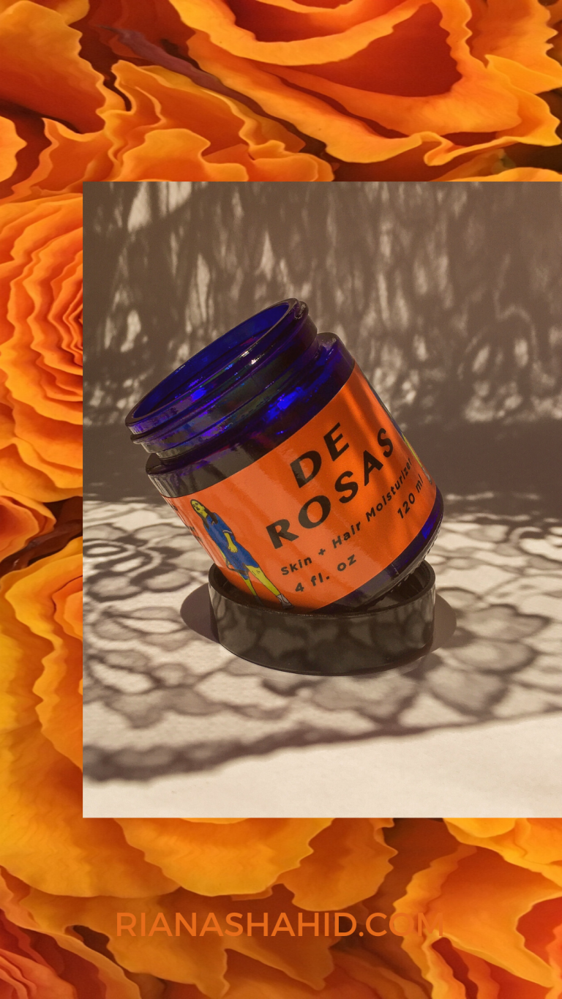

In this post, I wanted to highlight an indie skincare brand I’ve been using lately. A few weeks ago, Vanessa from Dragon Fruit Skin Care sent me a few of their products to try out.

Dragon Fruit Skin Care is a POC/woman-owned brand centered on the belief that plants have a lot to offer when it comes to taking care of our skin. All of the products are things the owner uses herself. Each item is hand-made in small batches, so you know what you’re getting is fresh, too. 

I first found out about Dragon Fruit Skin Care when I saw one of their ads on my Instagram feed. I was drawn by their aesthetic, which is bold, vivid colors with hints of Y2K, vaporwave, and what I think is a little bit of e-girl. 

This brand’s tagline is “Plant Based Ancestral Knowledge.” They embody this in their products by using 100% vegan and natural ingredients and never testing on animals. Synthetic ingredients are not inherently bad, but if you want to go the all-natural route, more power to ya! I do want to point out that DFSC products do not contain parabens or any other preservatives, so you have to be mindful about using up what you have in a timely manner, before they expire. I know I won’t have an issue with that because everything I’ve tried has been a win!

### LUNA SERUM

Despite the name, this is a face oil. I have combination/oily skin, so for a long time I avoided oily products. I didn’t believe that the oils themselves were bad, I just didn’t like how they felt on my skin. Turns out, I was using the wrong oils! [Luna Serum](https://www.dragonfruitskincare.com/product-page/luna-serum) has a base of jojoba oil, which is well-known for having very similar properties to the sebum naturally produced by our skin. It absorbs easily and does not irritate most people’s skin. I apply just three drops to my whole face at night, after a light serum. My skin feels soft right after applying and stays moisturized until morning. This contains tea tree oil to help heal acne, but my skin just doesn’t respond to it. I still like the herbal scent of tea tree though, so it’s not a loss at all. 

##### INGREDIENTS

* JOJOBA OIL – an emollient oil (technically, a wax on a chemical level) that locks in moisture. Also a rich source of fatty acids that work to soothe the skin. Feels less greasy than other oils because of how quickly/easily it absorbs into the skin

* ROSEHIP SEED OIL – an emollient that contains antioxidants like vitamin A and C. This will help with cell regeneration, which is amazing if you have hyperpigmentation or uneven skin. 

* PRICKLY PEAR SEED OIL – contains high amounts of vitamin E (more than argan oil!) and linoleic acid, which is good for hyperpigmentation and moisturizing the skin. Also includes vitamin K, which has brightening properties, and zinc to reduce redness. 

* TEA TREE OIL – an antioxidant with soothing, anti inflammatory properties. It’s also antimicrobial, so it can help fight acne

### DE ROSAS

This shea butter-based balm can be used in place of body lotion or leave-in conditioner. Shea butter is solid at room temperature, but warms up and melts quite easily. I like to use [De Rosas](https://www.dragonfruitskincare.com/product-page/de-rosas-body-butter) after showering, on damp skin, as opposed to dry. The formula spreads easily and locks in a lot of moisture. I also like how this feels as a hair product, but I have to warn you that it’s easy to over-do it. I use a pea-sized amount from mid-shaft to ends to help tame frizz and add moisture to the ends of my hair. 

##### Ingredients:

SHEA BUTTER – an emollient that keeps moisture in and has anti-inflammatory properties to soothe irritated, dry skin. Fatty acids (palmitic, stearic, oleic, linoleic, and arachidic) found in shea butter are great for nourishing the skin.

* COCONUT OIL – another moisturizing emollient with antimicrobial properties; also a source of natural fragrance. Coconut oil is a good source of saturated fatty acids. 

* ROSEHIP SEED OIL – see above

* ROSEMARY EXTRACT – a fragrance oil. If you’re into aromatherapy, rosemary can help [lower coritsol levels and reduce stress](https://pubmed.ncbi.nlm.nih.gov/17291597/). Rosemary can also help [prevent the breakdown of acetylcholine](http://www.alzheimersweekly.com/2017/03/rosemary-emulates-aricept-donepezil.html#:~:text=Duke.,help%20people%20suffering%20from%20Alzheimer's.%22), strengthening your memory.

* ROSE GERANIUM OIL – a fragrance with antioxidant properties that can [reduce signs of aging and hyperpigmentation](https://www.healthline.com/health/rose-geranium-oil#benefits) and can [inhibit inflammation](https://www.ncbi.nlm.nih.gov/pmc/articles/PMC3793238/).

##### CACAO MASQUE

This is probably my favorite product of the three! I usually don’t bother with hydrating masks because I feel like I can get similar results with a good moisturizer, but I was pleasantly surprised by this mask. Full of nourishing ingredients, [Cacao Masque](https://www.dragonfruitskincare.com/product-page/cacao-masque-1) claims to fight acne and wrinkles while leaving you with glowing skin. My acne is too stubborn to be eradicated without chemical exfoliants, so I can’t speak on how well it works for that, but my skin felt SO SOFT after washing this off. This is the perfect mask to keep on during a Self Care Bath™ or your nightly Netflix binge. You can even refrigerate this mask for a soothing, cooling effect. The label indicates that you should leave this on for 25 to 30 minutes, but because the ingredients are so nourishing, I had no issues leaving this on for longer (up to an hour).

### INGREDIENTS

* BLUE AGAVE NECTAR – honey’s vegan cousin. Moisturizes the skin and reduces the appearance of wrinkles by making your skin appear more plump and supple.

* CACAO POWDER – contains high levels of antioxidants, which repair and protect the skin. Also has anti-inflammatory properties to fight redness and irritation.

* ROSEHIP SEED OIL – see above

* ROSEMARY – see above

* ROSE GERANIUM – see above

Overall, I was very impressed with Dragon Fruit Skin Care’s products. I definitely will be repurchasing once I use up what I have. If you’re thinking about trying this brand, remember that everyone’s skin is different and just because something worked for me, does not mean it will work for you. Similarly, just because you might know someone who had a bad experience with any of the ingredients listed here, does not mean the same will happen to you. Some people are sensitive to essential oils and fragrances of any kind. But for many others, a fragrance is just that. My point is that only you know your skin. When considering new products, compare its ingredients to those of products you’ve tried before, especially if it’s something that broke you out in the past.

Aside from the products themselves, I also really like their packaging. Everything comes in glass packaging, which is not only easier to recycle but can be more easily reused at home! 

I also want to comment on the brand’s active role in giving back to their communities. In response to the murder of George Floyd, DFSC pledged to donate all proceeds during the month of June to Reclaim the Block, an organization working to defund Minnesota’s police department. In fact, a lot of brands have spoken up and pledged funds to similar organizations. But what I love about Dragon Fruit Skin Care is that this is not new for them! In the past, they have donated to causes working to prevent domestic violence, Dig Deep, an organization providing running water to Americans without, and Las Jefas Veganas, an outreach group providing vegan food and essentials to the homeless on Skid Row.

I’m very excited to see where Dragon Fruit Skin Care goes in the future 🙂 If you want to try any of these products or see what else they offer, click [here](https://www.dragonfruitskincare.com/shop). 

