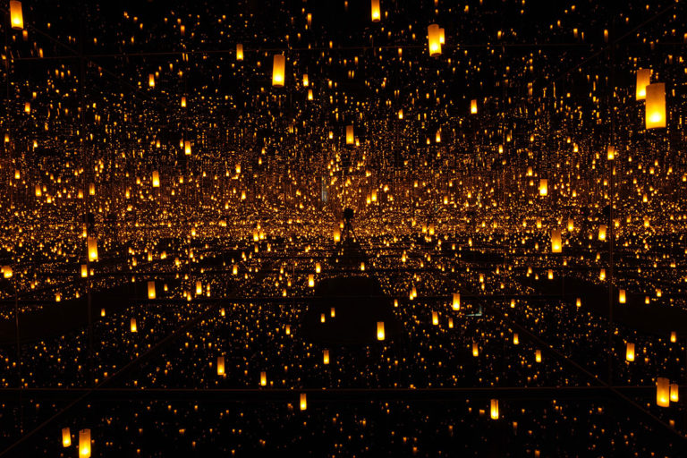
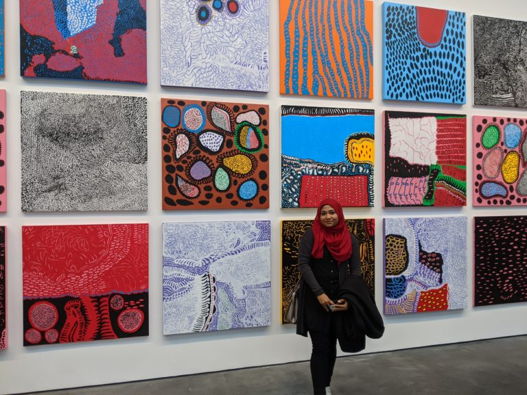
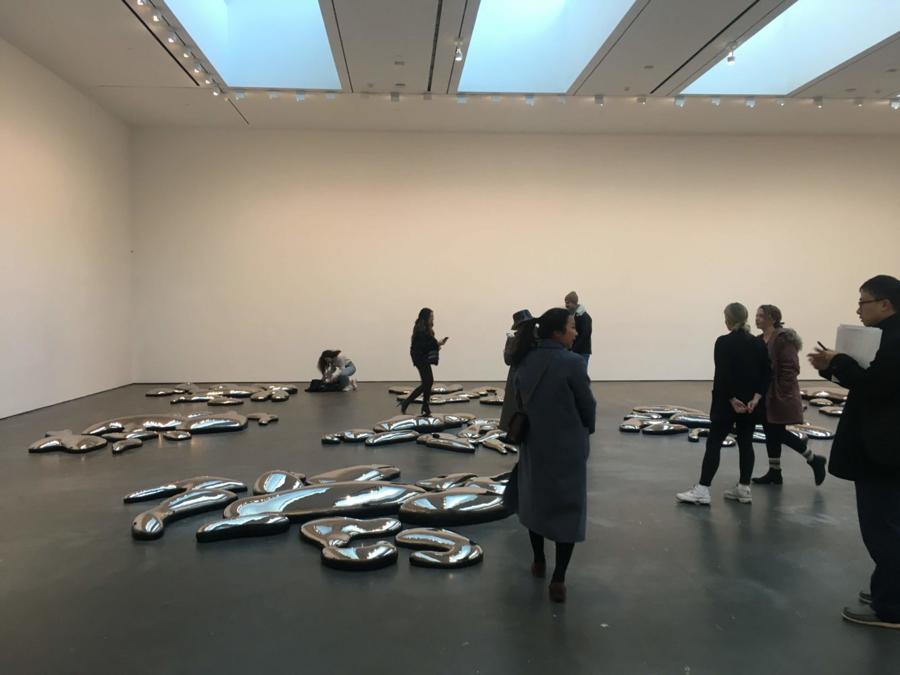
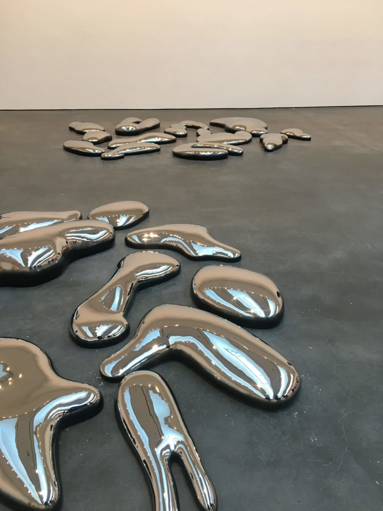
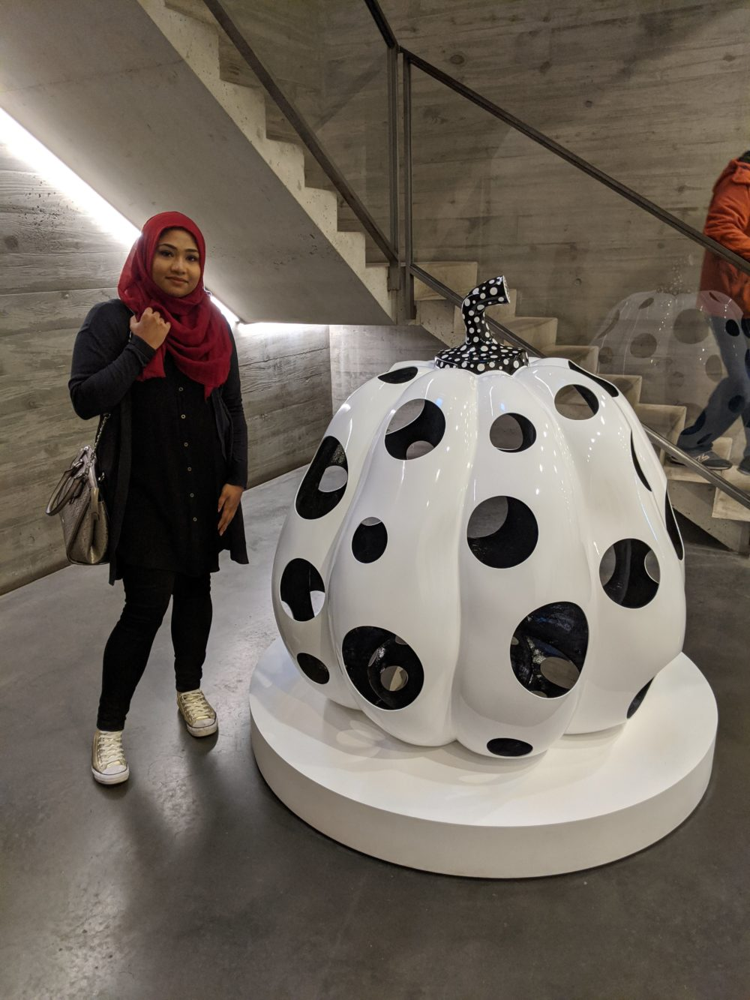
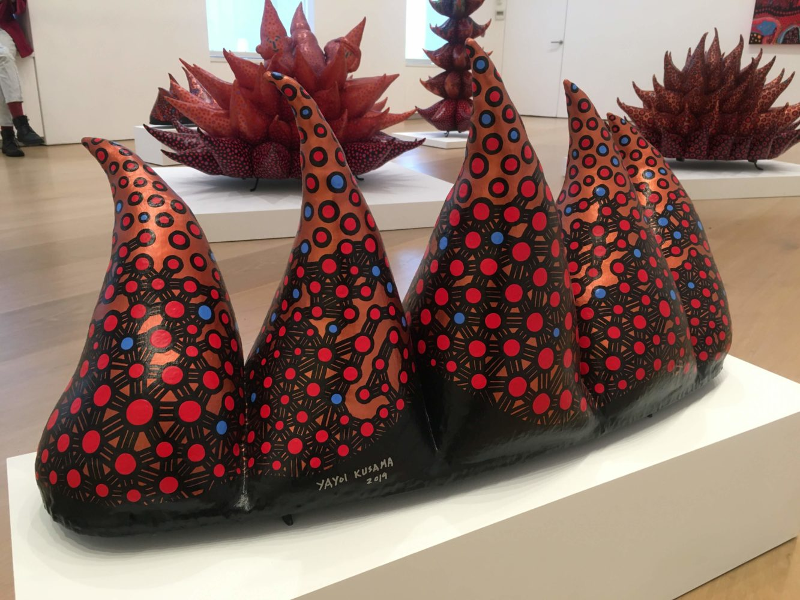

If you’ve been keeping track, I haven’t had an art post in a while. To be honest, I’ve had trouble getting back into a blogging schedule since coming back from my vacation. That being said, what better way to mark the return of my art posts than with the legendary Yayoi Kusama??

In case you aren’t familiar, Yayoi Kusama is famous for her eccentric style, her love of polka dots, and her infinity rooms. 

Infinity rooms have mirrors on all four walls, so that to the viewer inside the enclosed space, the room appears boundless. Using the power of lights and mirrors, infinity rooms create an illusionary experience that I think everyone should feel at least once. 

Yayoi Kusama was born in Japan in 1929 and since then established herself in the pop art/avant-garde sphere. After her first solo show in Japan in 1952, Kusama staged a number of groundbreaking exhibitions internationally. Kusama’s work is easily recognizable through her repetitive designs (usually dots) and bold colors. Unlike other artists who I will not name in this post, she still does her paintings herself, besides ground color!

While Kusama lives in Japan, she has been represented by David Zwirner since 2013. This year, the David Zwirner gallery on West 20th Street was home to EVERY DAY I PRAY FOR LOVE, the main attraction of which was the debut of INFINITY MIRRORED ROOM – DANCING LIGHTS THAT FLEW UP TO THE UNIVERSE. While I’ve mentioned the role of lights in her infinity rooms, I want to also bring up the absense of these lights. Every now and then, the flickering lights sync up so that they are all off at the same time. Enveloping the viewer in almost complete darkness, the sense of infinite space is juxtaposed with the reality of “nothingness”. 

This exhibition also introduces new works in Kusama’s My Eternal Soul series. These bold and colorful paintings are presented in rows that reach up toward the ceiling, driving a sense of inaccessibility. Only one row of paintings hangs at eye-level, making viewers crouch to examine details on those in the bottom row. Paintings higher up cannot be examined at all, forcing viewers to appreciate them from afar. 

In contrast to the distant paintings is a floor-mounted “constellation” of stainless-steel forms. Viewers can walk all around and through these shiny blobs, some even choosing to lie down among them. 

I missed Kusama’s last exhibition in NYC (in 2017), so I did not want to miss EVERY DAY I PRAY FOR LOVE, which was only on view from November 9 to December 14. Perhaps theses short windows are part of the reason why people go crazy for Kusama’s polka-dot-pumpkin-filled-exhibitions — hence the multi-hour wait to enter — but it is well worth it to experience the work of such an iconic artist. 
<html>
    

        

            
        

        

            
        

    

</html>

If you missed this exhibition, then don’t worry! Yayoi Kusama will be back in NYC with another exhibition at the New York Botanical Garden in 2021. Visitors can take in the beauty of the Garden alongside the intrigue of Kusama’s work. 

>Across NYBG’s 250-acre landmark landscape and buildings, Kusama’s lifelong fascination with the natural world will be revealed in depth with multiple installations, including her signature mirrored environments and organic forms, colossal polka-dotted sculptures of flora, mesmerizing nature-based paintings, biomorphic collages, works on paper, botanical sketches, as well as a spectacular horticultural showcase in the Enid A. Haupt Conservatory. The exhibition will also debut new works created by the legendary artist, including a monumental pumpkin sculpture and her first-ever participatory greenhouse installation that will be transformed over the course of the exhibition.
>
> from NYBG; click [here](https://www.nybg.org/event/kusama/) for more information

While this won’t have free admission like gallery exhibitions do, I would say it’s still worth it to see in person. 

