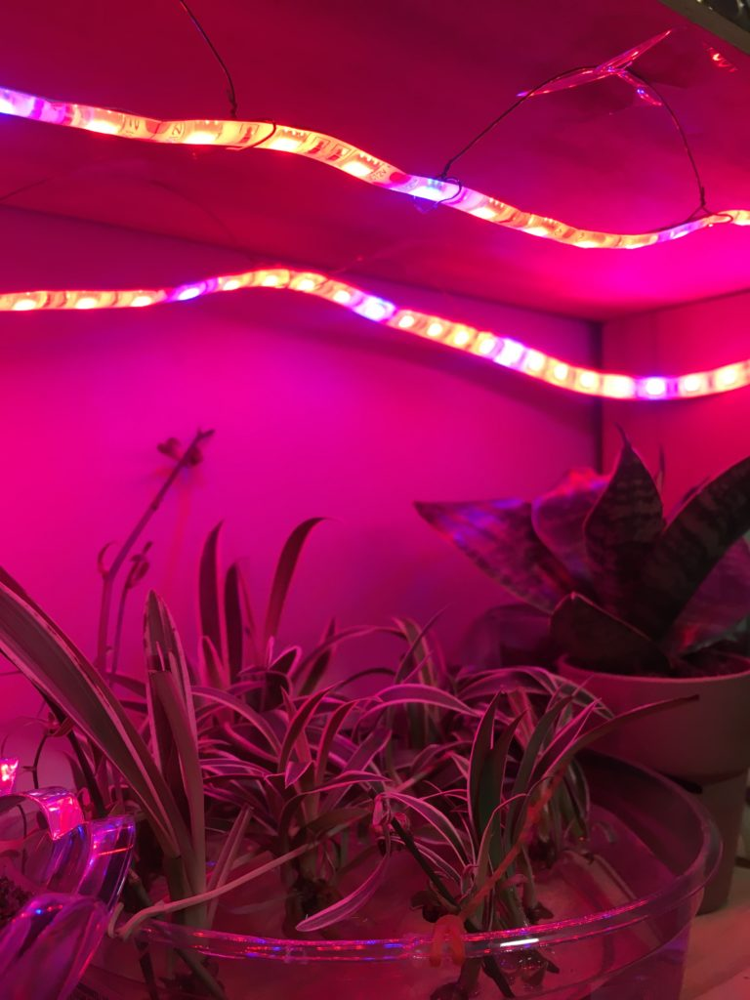
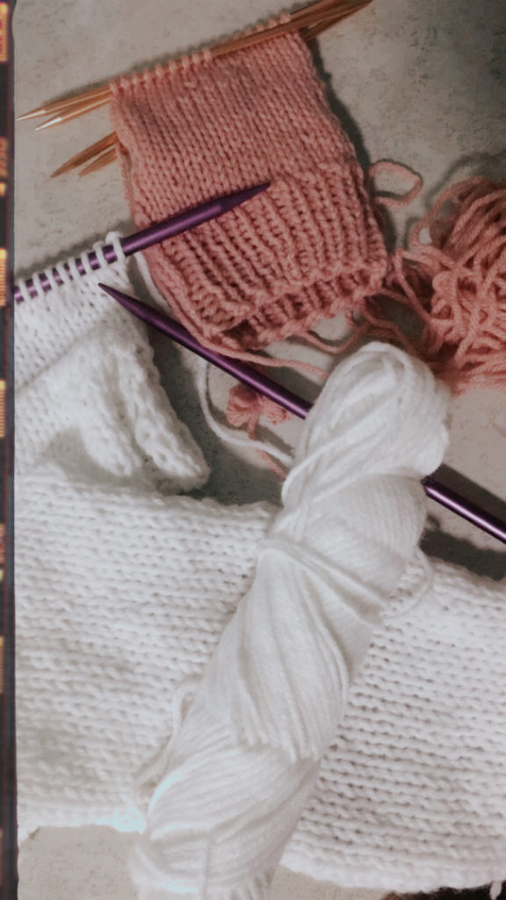
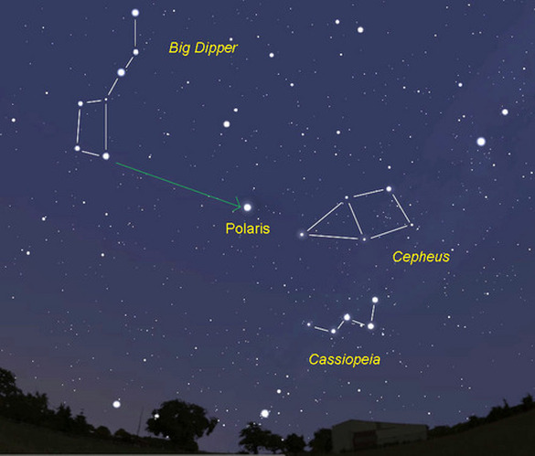

Now that we’re well into fall, that is, now that it actually feels like fall, I wanted to share some of my favorite things, from home decor to activities. These are not all specific to only this season, but they definitely improve my quality of life in these chilly, autumn days.

My absolute favorite thing on this list is my growlight. My bedroom doesn’t have the ideal light conditions to grow anything, but I still want to have plants in my room. That’s where my growlight comes in. There’s a lot of research on what color lights are most beneficial to plants, but red and blue (i.e. purple) are fine to give your indoor plants some extra help. Plants naturally get light from the entire visible spectrum, so you can also get growlights that emit white light (which is a mix of all the colors), but I like the purple/pink glow this gives my entire room. 

[My growlight](https://amzn.to/373h67X) is in the form of a flexible strip, which makes it easy to “install” anywhere. It has a sticky backing but also comes with mounting tape for an even stronger, semi-permanent hold. I like being able to move my plants around my room, so I skip the tape completely. For my current setup, I used 20-guage craft wire ([like this](https://amzn.to/2CICTnk)) and built a set of arcs to hold up the strip. Then, I used regular packing tape to attach the arcs to the bottom of the shelf above. [This is the exact growlight that I use](https://amzn.to/373h67X). I have the soft strip, which doesn’t come with a built-in timer, but I like the flexibility this gives me, both literally and figuritively. It’s easy enough to add your own plug-in timer. I’m using one that I already had at home, but it’s very similar to [this one](https://amzn.to/37r9Jr9).

My second favorite item is [this set of grid panels](https://amzn.to/2CJbOAp). I spend SO MUCH time at my desk, so it only makes sense to invest in desk decor. I think everyone should use grid panels to hang up notes, reminders, and pictures. I used to use tape directly on the wall, but now I don’t have to worry about lifting up the paint (which has happened before, as you can see above). These grids come with trace-less hooks that truly live up to their name. I recently moved my desk and was surprised to see that the holes were barely visible. You could also use [Command hooks](https://amzn.to/2pD3M9m), if you’re renting. (Also, funny story, this came with a tiny little hammer, which now lives in my pen/pencil cup.)

Next up, another desk item: This is the [wall-mounted LED lamp](https://amzn.to/2KJ7mpR) in the center, between the grids. It has three brightness levels, which makes it great for working at night. Also, it’s easier to install than anything else on this list. The back of this light is magnetic, so all you need to do is attach two pieces of L-shaped metal to your wall with mounting tape. Everything you need is included! This even comes with flat metal disks, if you wanted to install this under a shelf or cabinet. My favorite part about this light is that it has a USB plug, so I can power it from my laptop instead of running an extension cord to my desk. (BONUS: you could also attach this light directly onto the metal grids linked above!)

two works in progress: a scarf and a sock!

Moving onto the activities!

I love to knit and crochet year-round, but everyting I feel for the fiber arts is amplified when the weather cools down. Every year, I make a new scarf or pair of gloves. This year, I made my first pair of socks and I’m looking forward to trying sweaters too. 

I had to save the best for last: My all-time favorite fall activity is stargazing! Obviously, you can do this any time of year, but the fact that the sun goes down at 4pm now makes it much more convenient. You can use websites like [this one](https://www.timeanddate.com/astronomy/night/) to see which constellations are going to be visible. In New York at this time of year, Ursa Minor and Ursa Major can be spotted at night easily. If you’re out in the early morning, you can try to spot Cassiopea and Cepheus. 

My stargazing notebook is from The Unemployed Philosophers Guild. It includes an astrolabe and a chart to identify 15 constellations. Available [here](https://philosophersguild.com/products/stargazing-notebook?_pos=747&_sid=edbf45e71&_ss=r) (I have the full size).

Ursa Minor and Ursa Major are also known as the Little Dipper and Big Dipper and the Lesser Bear and the Great Bear

Cepheus and Cassiopeia are named after the king and his wife, from Greek mythology.
