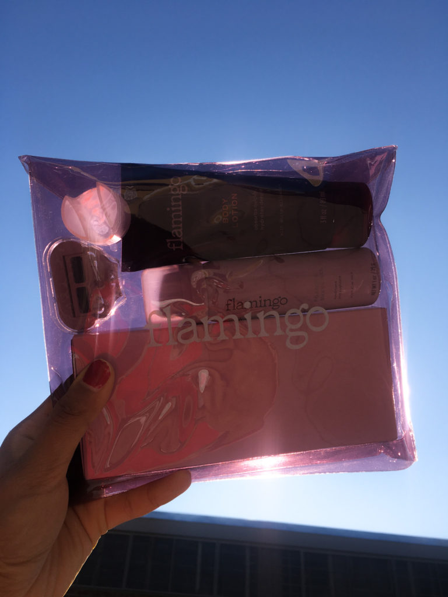
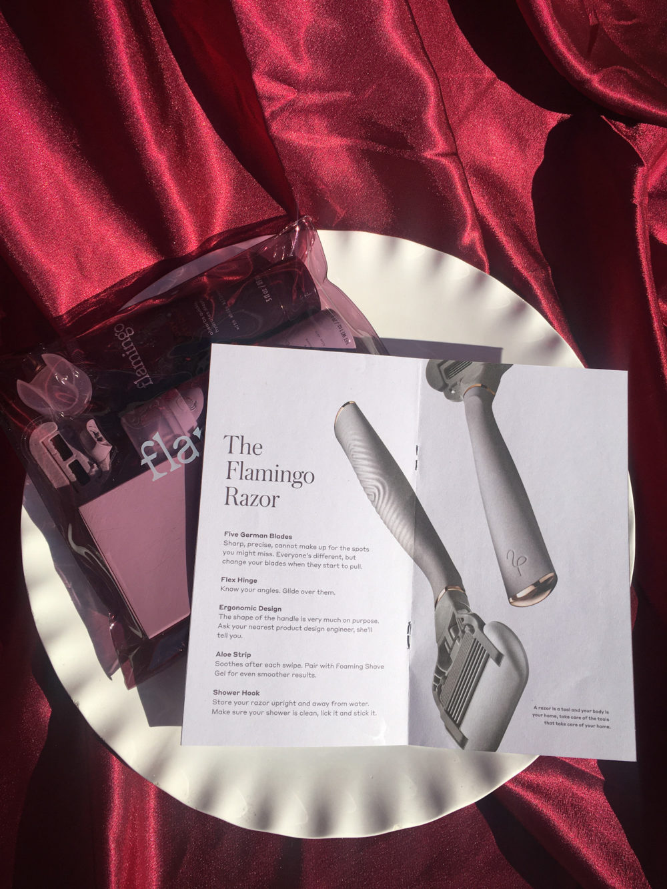
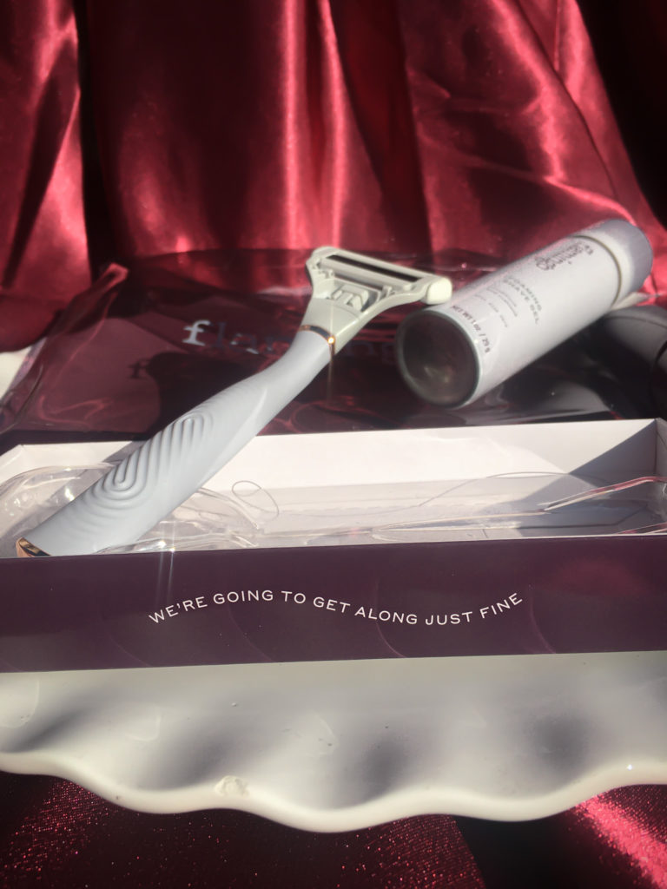

*My set was kindly gifted for review, but all opinions are my own. 

When I first got my package, the first thing I noticed was how compact the box was. I am not perfect at reducing waste, but it makes me really happy to see brands use conscious packaging for their products. Once I opened up my box, I saw that everything was packed into a translucent envelope-style pouch. Not only is this a cute bag, it’s smart marketing. You can be sure that I’ll be reusing this bag (which photographs beautifully in sunlight, by the way) and every time I do, I’ll be calling attention to the brand that made it. 

What I like about Flamingo is that, unlike razor ads you see on TV, Flamingo embraces body hair. Their tagline on Instagram is “**We’re grow-choice, and our products are too.**” You don’t have to remove your body hair, but if you do, Flamingo is going to be there with their shaving and wax kits. 

>We believe a positive relationship to body care starts with quality products—and that when we show up for ourselves in private, we’re able to show up as ourselves in public.
>
>– Flamingo 

##### Flamingo Razor Handle with Two German-Engineered Five-Blade Cartridges

As soon as I picked up this razor, I could tell that it would be a huge improvement from what I was accustomed to using. The razor handle is shaped to fit comfortably in your hand (no matter what angle you’re holding it 👀) and has a weighty feel to it that screams high quality. The rubber handle provides a no-slip grip and the rose gold details add a cute touch. Compared to other razors I’ve used, the moisturizing aloe strip is much bigger and feels great on the skin. 

##### Foaming Shave Gel

I’m partially of the belief that shaving cream is shaving cream and that it’s hard to “mess it up” but I was really impressed with this one. It has a thick consistency that actually stays on the skin — wherever you put it — without sliding away. More and more brands are doing this now, but this can is rust-free, so you won’t have to worry about dirtying your counter or tub. 

##### Body Lotion

This contains squalane, y’all! Squalane is literally one of my favorite ingredients to use on my face and scalp. I’m so excited to incorporate it into my body care as well. This also has papaya extract, which is supposed to help exfoliate the skin. If I’m being honest, I don’t know how effective it will be to actually exfoliate rough, dry skin, but I’m sure it’ll be nice for softening the skin after use. If you have KP or need something more heavy duty, look for moisturizers with lactic acid, or apply a lactic acid serum before moisturizing — the one from The Ordinary is my favorite!

The shave gel and body lotion both have floral scents, which are not exactly my favorite. Despite that, they aren’t irritating at all and I don’t mind using these products. 

This set also came with a suction cup to hang your razor in the shower. I don’t see myself using this because I keep my razors out of the shower (moist blades are more prone to rust), but I’m sure I’ll find another use for it. 

Have you ever tried Flamingo razors? Do you think you’ll use them in the future?

