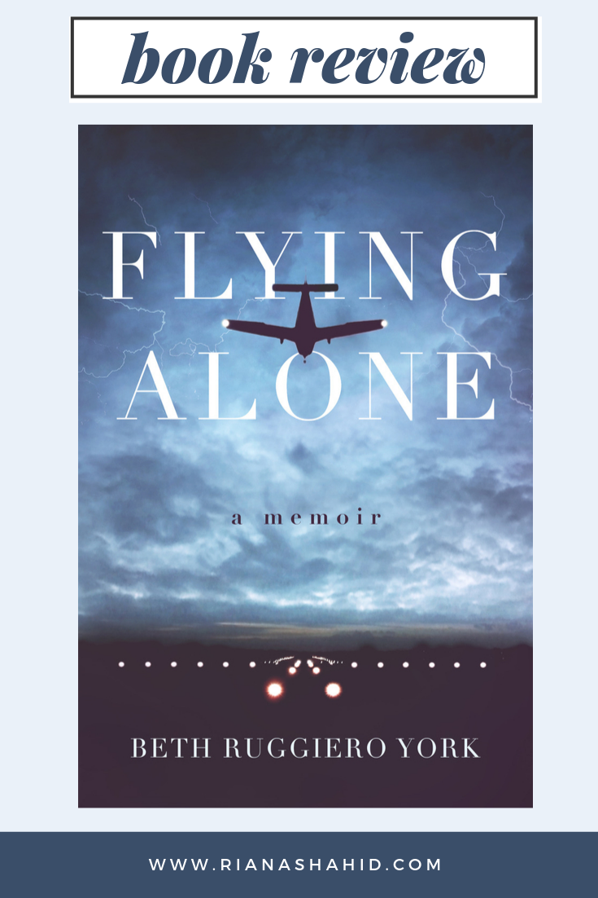

Flying Alone by Beth Ruggiero York recounts her turbulent (pun intended) journey through the male-dominated world that is aviation. We follow her through her jobs at shady airports to eventually reaching her goal of flying for a major airline. While this is a memoir, it is written with so much attention to the art of storytelling, that I completely forgot that this isn’t a work of fiction. The writing is so raw, honest, and suspenseful that I read this entire book in less than 24 hours — I seriously could NOT put it down. 

Beth knew she wanted to be a pilot from a very young age. But when a probable diagnosis of multiple sclerosis threw a wrench into her plans, she still doesn’t give up. She works and continues to learn at a small local airport to earn her license. But this is where everything gets a little messy. 

Young and blinded by love (or maybe just a desire for male approval), she falls into a relationship with her flight instructor, Steve. Let’s just say that Steve is not the most wholesome person for Beth to be around. He is a much more experienced pilot and doesn’t let anyone forget it. When they work at the same airport, Beth is always kept in Steve’s shadow. And when she tries to advance her career by taking better jobs elsewhere, Steve is quick to apply for the same jobs, wowing everyone with his experience and charisma. Steve reads as the kind of grimy character upon whom you wish nothing but failure. He repeatedly dismisses Beth’s accomplishments and belittles her, which only makes the ending all the more satisfying.

>Beth is a former airline pilot for Trans World Airlines. She entered the world of civil aviation in 1984 shortly after graduating from college and, for the next five years, climbed the ladder to her ultimate goal of flying for a major airline. Beth originally wrote Flying Alone in the early 1990s, shortly after her career as a pilot ended and the memories were fresh. 
>
>She now has dual careers–Chinese translation and professional photography. She teaches photography workshops for Arizona Highways PhotoScapes and her own company, Ruggiero Images LLC. Beth has published a popular instructional book on night photography, Fun in the Dark: A Guide to Successful Night Photography, which has worldwide sales, and she has co-written a book entitled, Everglades National Park: A Photographic Destination. She and her husband live in Fountain Hills, AZ.

To learn more about Beth Ruggiero York, visit her [website](https://bethruggieroyork.com/). Click [here](https://bethruggieroyork.com/product/flying-alone) to read more about Flying Alone. 

