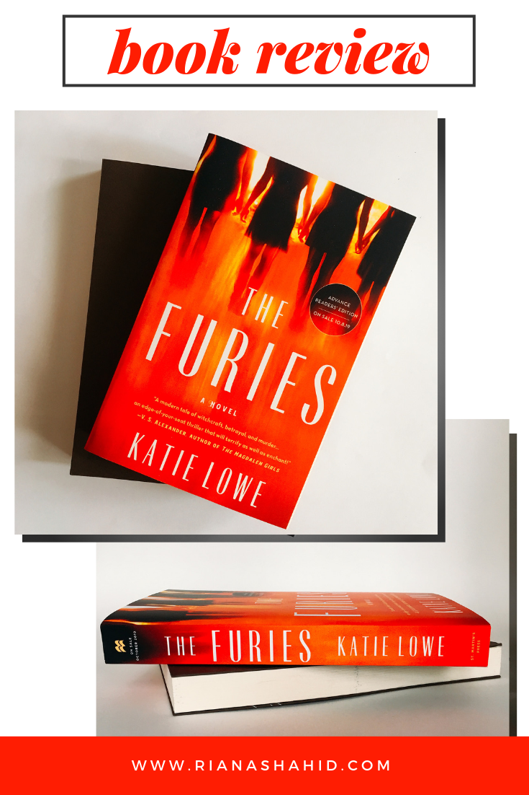

Fall is in the air! The weather in NYC is starting to get cooler, which means it’s the perfect time to indulge in cozy fall activities — like settling in with a blanket, a cup of tea, and a good book. The Furies by Katie Lowe is a great choice to envelop yourself in spooky fall vibes. 

>In 1998, a sixteen-year old girl is found dead on her boarding school’s property, dressed in white and posed on a swing, with no known cause of death. What happened to her? And what do her friends know? To find out, it is necessary to go back to the beginning.

That is just the beginning of what this story is about. Through the book, we follow the journey of a group of friends as they juggle typical high school issues as well as some more unorthodox. It all starts with Violet, who loses her father and younger sister in a car accident. Understandably, her mother is depressed and becomes a shell of the person she once was. This leads to Violet yearning for the feeling of “belonging”, which she fulfills through a new group of friends at Elm Hollow Academy. Not only is this an all-girl’s school (which can be overwhelming on it’s own), but it was also the place where suspected witches were burned at the stake. 

As Violet navigates through school with her new friends, she learns that the school’s witchy past never really left. In fact, when she is invited to join an advanced study group, she learns more about the school’s history and the truths about the supposed mythology. Together, the girls are pulled into the ancient rituals that caused so much trouble before, and they realize the power they hold in using them again. 

By the end, this becomes a book about the transformative power of friendships (especially female friendships), how deep certain secrets can run, and how knowing too much information can kill you. 

Overall, I found this book to be a pleasant and engaging read. What I liked most is that you are thrown right into the action from the beginning. This thriller doesn’t have a long and boring set up. You find yourself wondering what Violet could possibly uncover next, and when she does, it’s just as unexpected as the last. I can honestly say that this book was not predictable, which is exactly how a good thriller should be. 

I usually don’t like when authors give too many details of the characters’ appearance (I’m sure you’ve all seen screenshots of hilariously bad examples of this). I like to imagine each person how ever it comes naturally in my head. You won’t find flowery descriptions in this book; instead Lowe compares them to specific works of art. I felt that this was more tasteful and engaging because I could go look up each image to see what Lowe wanted me to see (or choose not to).

This book was sent to me for review, but of course, all opinions are my own. Do you think you would read this book? Are you reading anything else this fall?