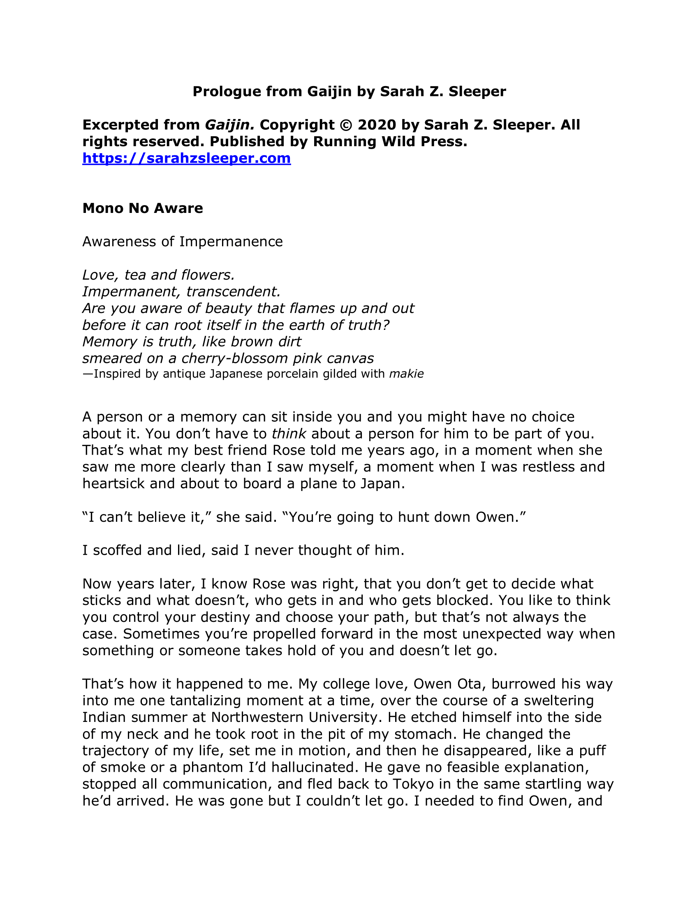
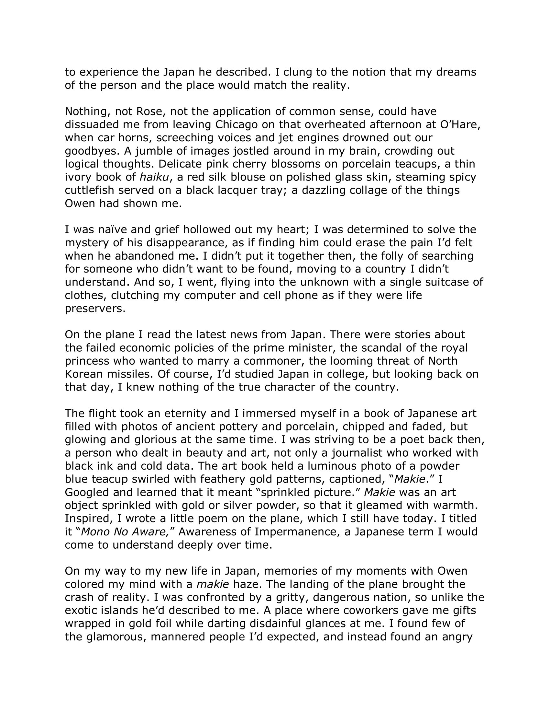
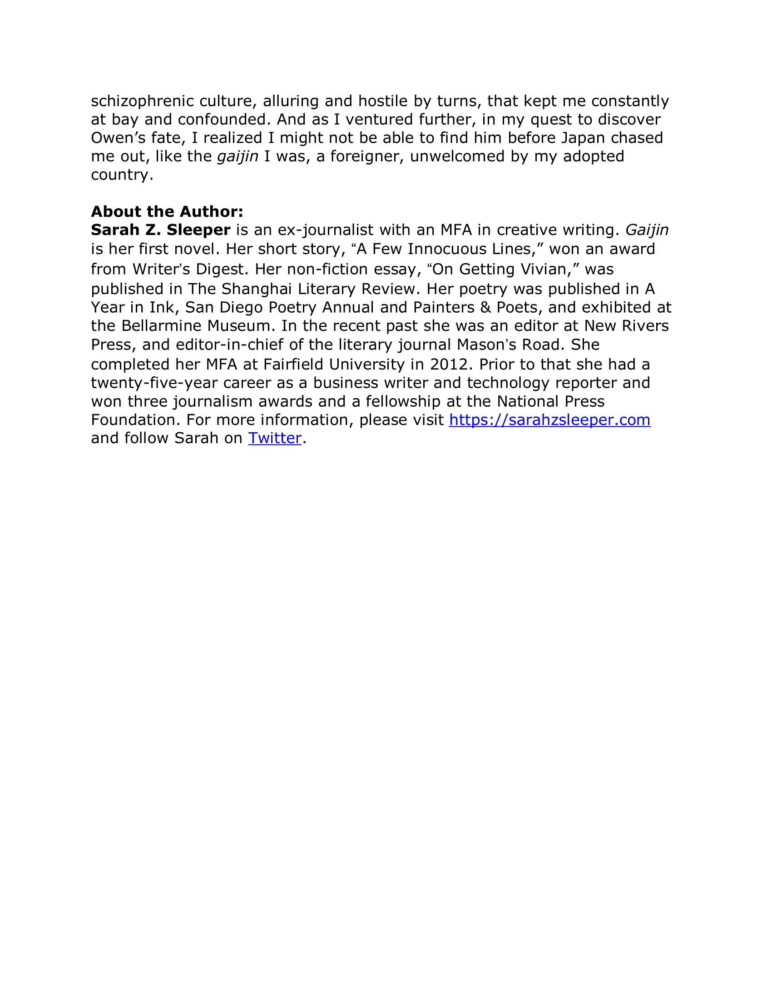
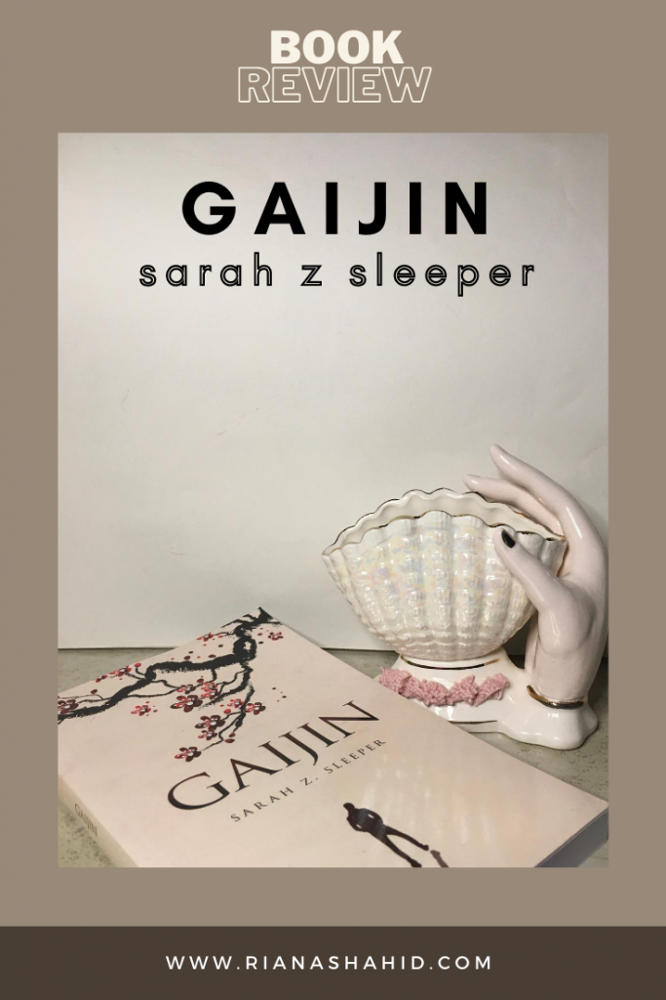

**TW: brief mentions of suicide, rape**

I received an advance copy of _Gaijin_ by Sarah Z. Sleeper for review, but all opinions expressed are my own. **Scroll to the bottom for an excerpt.**

_Gaijin_ starts off with Lucy on a flight to Japan. She is leaving her American life behind in an attempt to reconnect with Owen, her ex from college. She and Owen fell deeply in love with each other but just as quickly as Owen came into her life, he disappeared. He left school, saying his father wants him back in Japan, and cut all contact. Now, Lucy is trying to track him down in his home country.

Early in the book, she introduces us to the phrase, “mono no aware,” a Japanese term that translates to the “awareness of impermanence.” In short, this is the idea that we can look fondly on beautiful things in life while knowing that they don’t last. It’s joyous to have witnessed beauty, but there remains an undertone of sadness since this beauty is short-lived. Lucy uses this as the title of a poem she writes while on the plane. To the reader, it’s a metaphor for her relationship with Owen.

As Lucy starts to settle into life in Okinawa, she’s surprised when her surroundings don’t live up to her expectations. She imagines herself slowly integrating into Japanese culture, but instead finds that the city she moved into is the “least Japanese place of all Japanese places”. Furthermore, the office culture differs from what she’s used to, so her job at one of Okinawa’s newspapers isn’t as fulfilling as she hoped. And lastly, the presence of an American military base on Okinawa is a massive point of contention for the locals. After an American airman allegedly rapes a Japanese schoolgirl, Japanese citizens are outraged. With every glare from her neighbors, Lucy is reminded that she is part of the “other”. This is where the title comes from; gaijin is Japanese for “foreigner”.

Readers learn that as mysterious as Owen ghosting is, there’s a lot more beneath the surface. Lucy reveals that shortly after returning to Japan, Owen tried to commit suicide in Aokigahara – Japan’s Suicide Forest. Now, her quest to find him is not just in the hopes of getting closure on a relationship that ended too abruptly, but to also learn why he did it.

Overall, _Gaijin_ by Sarah Z. Sleeper was engaging and well-written all the way to the end. Owen’s character and his circumstances are so mysterious, but the way Sleeper reveals truths about him throughout the story is nothing short of skillful. I’m not someone who gushes over romantic stories (real or fictional), but I could still empathize with Lucy and see her point of view, even when I thought she was doing too much. During their time together, Owen was very hot and cold. He would hold Lucy’s hand and kiss her in one moment and then rush her out of his house the next. When he left, he told Lucy he loved her but didn’t try to keep in touch after leaving the country. Their relationship was very short lived but intense, especially for Lucy. Right after Owen leaves, Lucy tells herself that she’s not going to try to track him down online – she wouldn’t be that kind of ex. Instead, she just graduates college without seriously dating anyone else, moves to Japan, and takes a job at the same place Owen’s brother works. _Playing the long game, clearly._

The confusing circumstances around Owen likely is what made Lucy pursue the relationship harder. Add in the very real allure of a country as interesting as Japan and I can get behind Lucy without rolling my eyes. While the relationship aspects of the story were heartwarming, there were a few passages that I didn’t like as much. Lucy, as nice as she is, has heavy “I don’t see color” vibes. When she first meets Owen, she’s immediately struck by how handsome he is. She’s so captivated by him that she doesn’t even notice he’s Asian. (She literally says this! As if being Asian is something that should have made him less good-looking!) Later on, when she learns more about the struggles of darker-skinned Okinawa residents, she remarks that she didn’t register their skin tone at all. She’s confronted about this and tries to defend herself by claiming it’s a good thing she doesn’t judge anyone based on their race or skin color. But her friend shuts that down immediately by pointing out that ignoring differences doesn’t mean they don’t exist. I’m really glad that this was addressed, but I wish it went beyond just Lucy. Other residents don’t ignore race like Lucy does. In fact, there exists a strong sense of racial fetishization among other Americans living on the island. I know that this is actually a real-life problem, so I can’t complain about Sleeper’s choice to include it in the story. I also can’t blame Sleeper for the way non-white characters are described in general. There is always a focus on their race or their skin-tone being a central part of their character because readers are used to whiteness being the default. Anything non-white is seen as exotic and often, the only thing that makes a character interesting. There’s a lot to talk about on this topic, so I’m going to save that for a separate post.

Generally speaking, I enjoyed this book a lot. I finished the whole thing in a few hours, so this is perfect if you’re looking for a quick read. You can get your own copy of _Gaijin_ by Sarah Z. Sleeper [here](https://sarahzsleeper.com/product/gaijin) starting August 7, 2020.

##### Excerpt

___

___

    
    

        <a href="https://sarahzsleeper.com/">Sarah Z. Sleeper</a> is an ex-journalist with an MFA in creative writing. Gaijin is her first novel. Her short story, “A Few Innocuous Lines,” won an award from Writer’s Digest. Her non-fiction essay, “On Getting Vivian,” was published in The Shanghai Literary Review. Her poetry was published in A Year in Ink, San Diego Poetry Annual and Painters & Poets, and exhibited at the Bellarmine Museum. In the recent past she was an editor at New Rivers Press, and editor-in-chief of the literary journal Mason’s Road. She completed her MFA at Fairfield University in 2012. Prior to that she had a twenty-five-year career as a business writer and technology reporter and won three journalism awards and a fellowship at the National Press Foundation.
         
        author bio provided by FSB Associates
    

