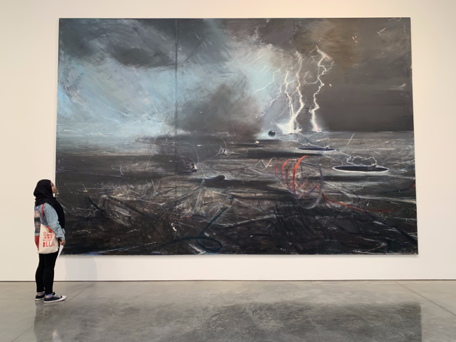
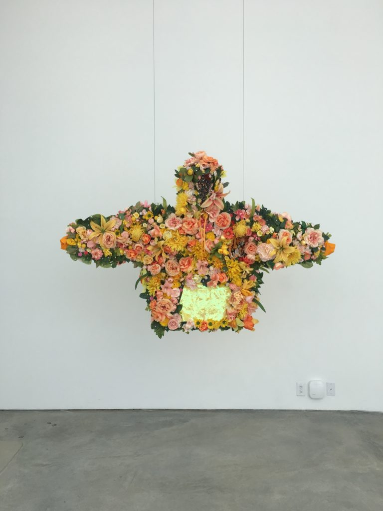
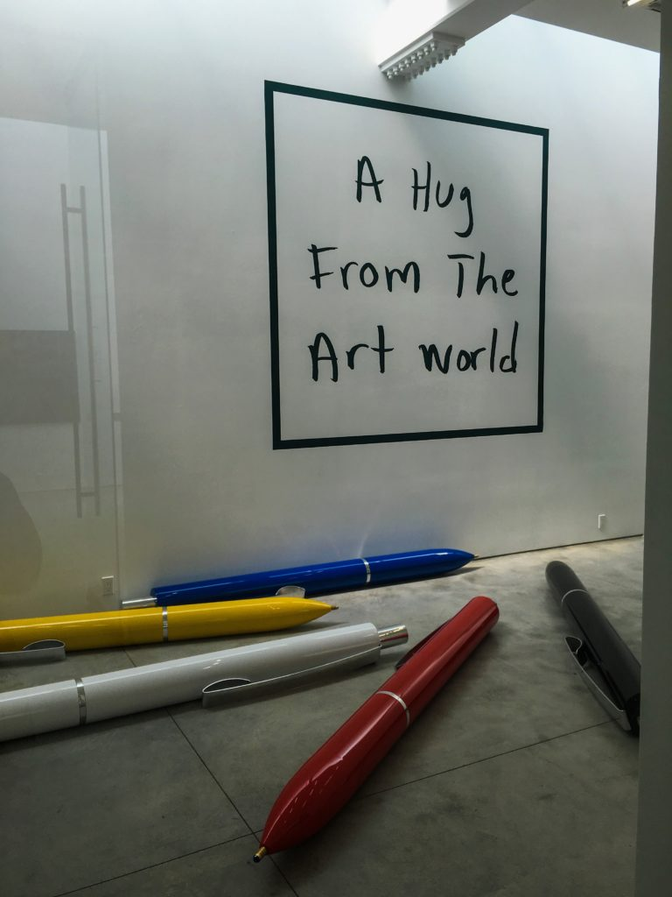
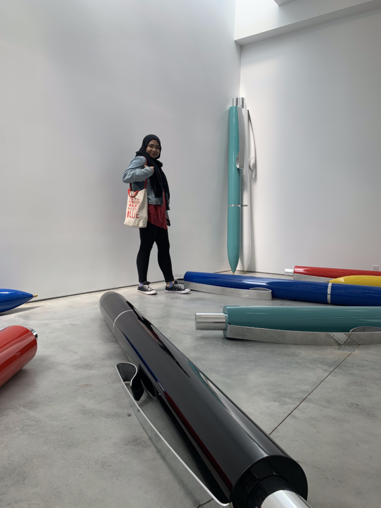
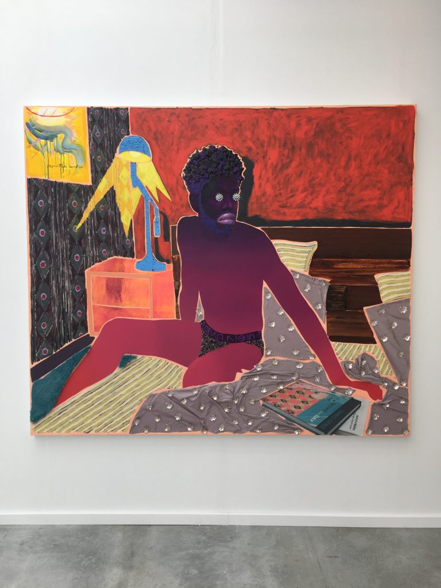

Chelsea is the perfect place to go gallery-hopping when you have some free time. (Fun fact: SoHo used to be THE place for art, but rising rent prices forced many art dealers and gallery owners to relocate).

Nearly every block surrounding the High Line has at least one gallery, but some of my favorites are the Gagosian and David Zwirner galleries. Last weekend was my first time at the De Buck Gallery, but I know I will be back soon.

