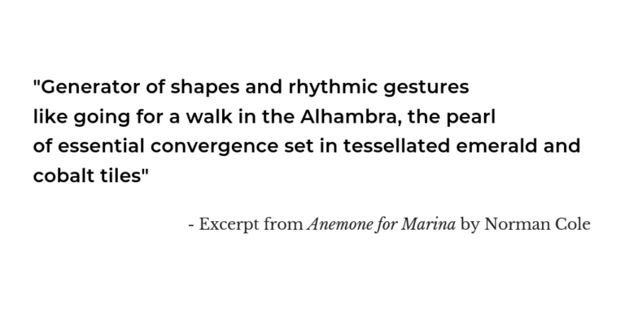
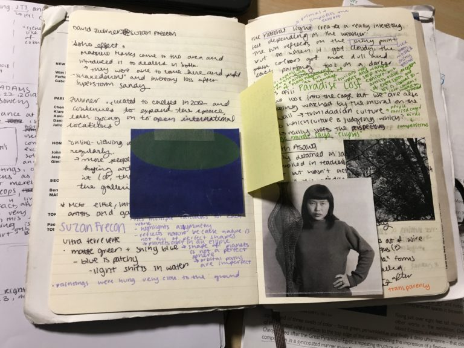
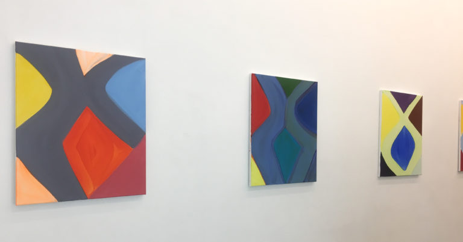
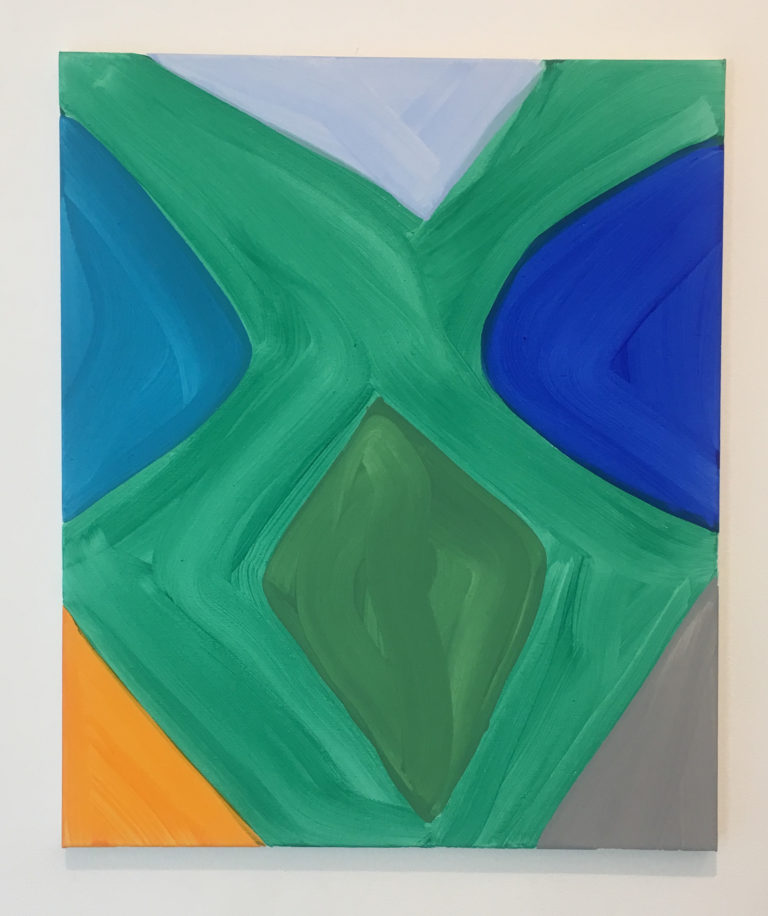
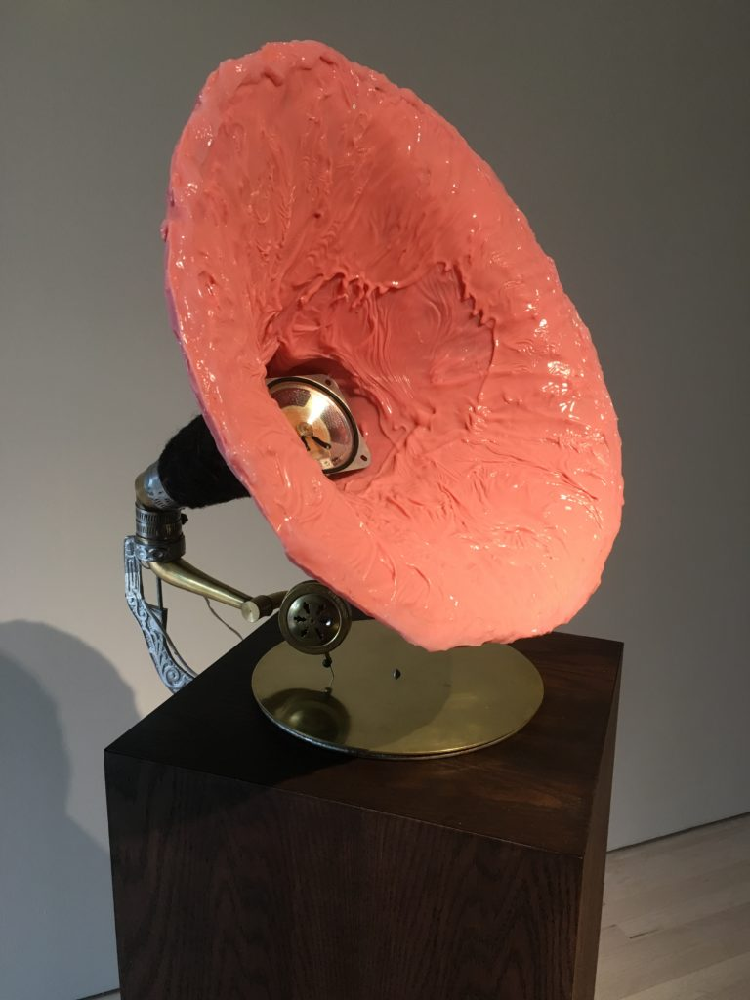
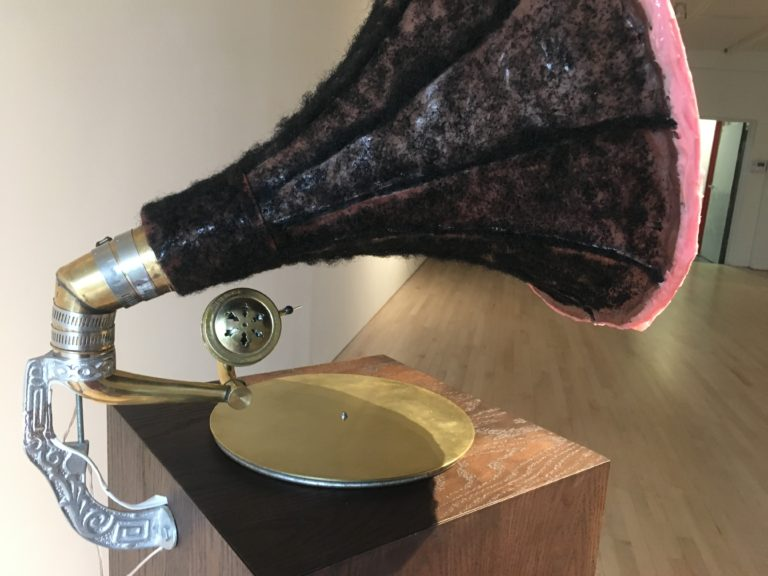
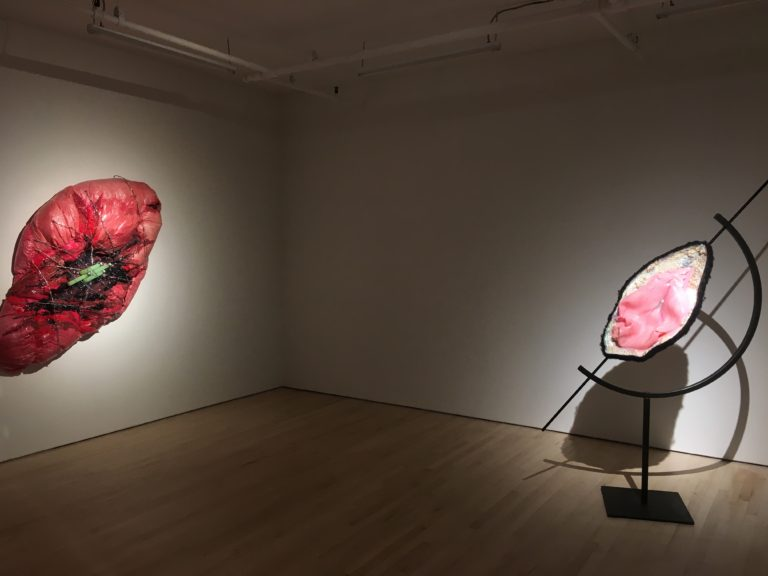
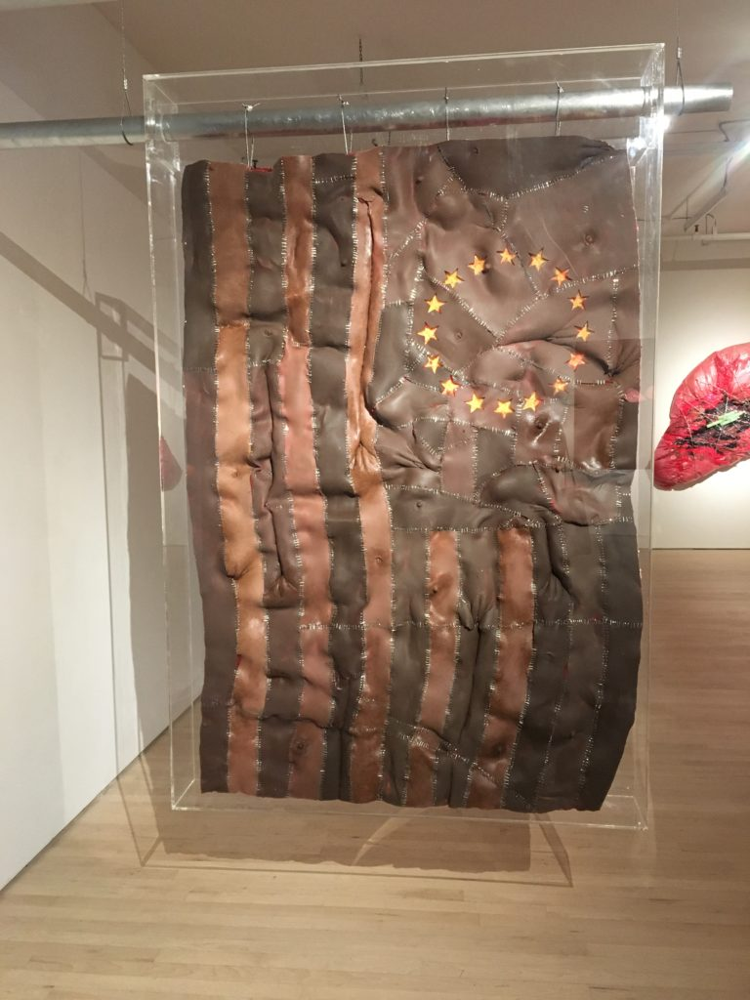
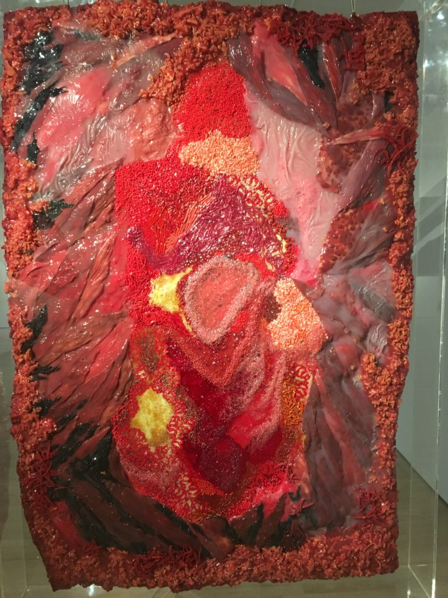

### MARINA ADAMS
#### May 3 – June 22, 2019 
##### Salon 94, Bowery

Upon first glance at Adams’ paintings, I think of Suzan Frecon, who I saw at the David Zwirner gallery in Chelsea last year. Both artists are generous with bold colors used on a massive scale, but they differ in composition. 

Frecon’s paintings, which almost exclusively feature elliptical shapes over a solid background, take up multiple canvases and are meant to be abstract landscapes. Adams’ paintings, on the other hand, are “expressions of what happens as line and color interact.” But what is a line if not merely a change in color?

In Adams’ Days and Nights (above), the decision to use the two dark blue triangular shapes in the middle draws the viewer’s eye to the center. In fact, the angular shapes that make up this entire painting lead the viewer’s eye all over the sloping lines, in a very structured manner.  If there had to be one main takeaway from this exhibition, it would be the “constructed” nature of art. Everything is intentional, from the choice of colors to materials used. **It’s art only because we say it’s art**. 

### DOREEN GARNER
### _She is Risen_
#### April 21 – May 26, 2019 
##### JTT

If you have any friends who are vehemently anti-mainstream, then bring them to JTT. This gallery is on the second floor of a building that is the definition of sketchy, complete with a door that opens only when you push it at just the right angle. Then, you go up a staircase that evokes serious American Horror Story season 2 vibes, but it’s all worth it because you’ll end up in She is Risen, Doreen Garner’s first solo show at JTT. This exhibition opened on Easter Sunday, which is appropriate for its themes of mortification and resurrection. 

Garner perfectly combines themes of history, politics, and art to produce works such as Heard From Her Larynx: Sandra, a gramophone that plays a recording of Sandra Bland’s arrest. The sides of the gramophone are wrapped in a cloth covered in synthetic hair to simulate the skin of black women and recall the sick histories of their treatment by gynecologists like James Marion Sims, who operated on black slaves without anesthesia.

Heard From Her Larynx: Sandra, 2019, silicone, synthetic hair, electronics, wood, brass, 60 x 14 x 14 inches 

Henrietta: After the Harvest is a large, pink, wall-mounted represention of the cervix of Henrietta Lacks. Wrapped in barbed wire and covered in metal pins, this structure represents the exploitation and unwitting participation in one of the most influential medical research experiments of the 20th century. 

From left to right: Henrietta: After the Harvest and Epigenetic Nacre Noire

The work that elicits the most visceral reaction for me is Betsey’s Flag. At five feet tall, this appears to be just an abstraction of Betsy Ross’s flag, rendered in shades of brown. But everything about this flag is intentional. It’s name is not a misspelling of Betsy Ross, but rather an homage to Betsey, one of Sims’s victims. On the surface, Betsey’s Flag can be interpreted as an amplification of the role black women played in American history, a role that is still deeply understated today. But on closer inspection, Betsey’s Flag is actually made of the skin of black women. Silicone molded to resemble skin is stapled together to create the stripes of Ross’s iconic flag. The stars are outlined in blood and cut into the skin, revealing the yellow fat (urethane foam) underneath. If that wasn’t enough, simply walk around the flag and you’ll understand why this is suspended from the ceiling in a plexiglass box. The back of the flag is covered in beads and more silicone, to depict the interior of the human body. Every shiny bead is placed perfectly to render wet, bloody flesh. 

Betsey’s Flag, 2019, silicone, glass beads, staples, plexiglass, steel pins, urethane foam, 60 x 43 x 5 inches
<html>
    

        

            
        

        

            
        

    

</html>

