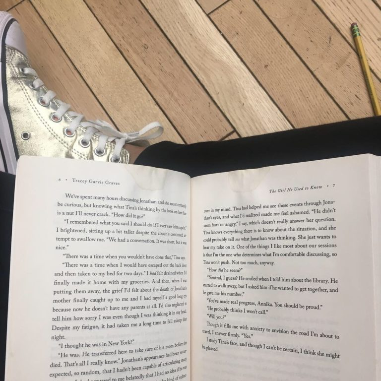
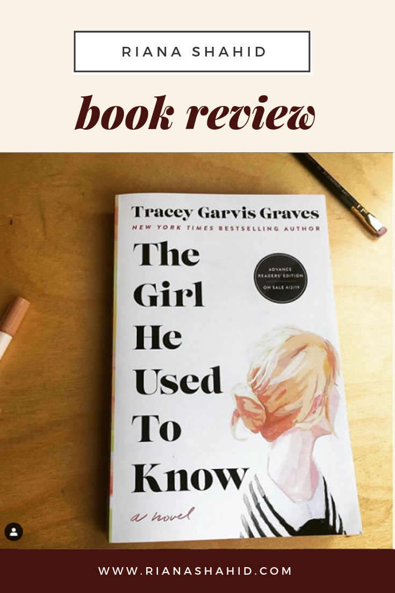

The Girl He Used To Know by New York Times bestselling author Tracey Garvis Graves is a novel about unconditional love in all its forms. 

This heartwarming book will be available wherever books are sold starting April 2, 2019. Or, you can order a copy here: http://bit.ly/thegirlheusedtoknow

In this book, we follow the story of Annika and Jonathan, a man she meets in college and reconnects with later in life.
 
To say that this is out of my usual genre would be an understatement. The fact that I have never read nor seen The Notebook should tell you what my relationship is like with the romance genre. Despite that, I thought this would be an interesting way to bring myself out of my comfort zone, especially since this book would technically be categorized as “women’s fiction”, and not strictly “romance”.
 
In this book we meet Annika, a pretty, young woman who is painfully awkward. We follow along on her journey of personal growth and development to adulthood.
 
My favorite thing about this book is that it doesn’t hit all the clichés that scream “romance”. It could be that I haven’t read romance novels in so long that I’m out of touch with what’s normal, but this book does a good job of bringing in topics that we rarely see in books. I don’t want to spoil the book for anyone, but we learn things about Annika that explain her “quirks” and the attitudes of those around her.
 
Before reading this book, I expected it to be a cliché love story. I don’t read that many romance novels so I did not know what to expect. But I was happy to find a compelling and interesting story. I found myself engaged and finished the book in a couple days. Reading this book was a journey of a little secondhand embarrassment, suspense, and ultimately joy. I have never read anything by Tracy Garvis Graves before but after reading this book I’m curious to see how her other novels hold up. In general I tend to read a lot of thriller/mystery, so it was refreshing to read something different for a change.

When I read about the people in Annika’s life, I saw their behavior as unrealistic. Annika is very awkward and socially inept, but she just so happens to have a roommate who cares for her the way a mother would a young child. Her roommate, Janice, picks out Annika’s clothes before her date, brushes her hair, does her make up for her and even coaches her on what to say to people. We also learn that Monica was homeschooled. Her childhood was relatively sheltered compared to those of other children. I was a little annoyed with how Annika’s random roommate happened to be just the person she needed, but we learn later why all this is the case.
 
I really like that this book was not just about the relationship between Annika and a man in her life. It also explores the relationships women have with their friends and family and how those relationships change with their lives.
 
I always think it’s kind of funny when books mention their title within the text. Here, this happens very early when Annika says “Such is my desire to replace the memories of the girl he used to know with the woman I’ve become.” It sounds a little corny now out of context, but for Annika it really highlights her immense character development. If you love heartwarming tales of growth and change and this is the book for you.
 
I received an on corrected proof of this book on behalf of She Speaks and St. Martin’s Press. This post is not sponsored and all opinions expressed are my own.

