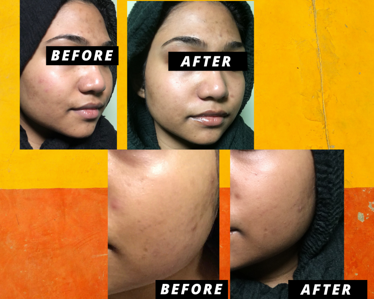
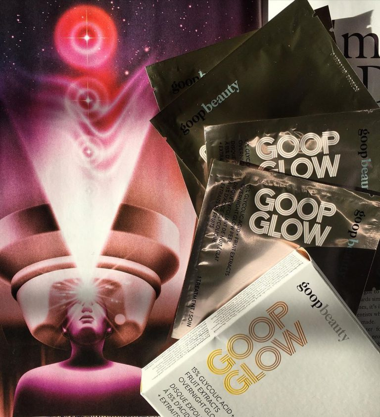

Last month, Goop gifted me their [Goop Glow 15% Glycolic Acid Overnight Glow Peel](https://www.octoly.com/c/hbwwc/r/hb70c) to try out and review. Since hyperpigmentation is my biggest skin concern, I love all kinds of exfoliating treatments. My skin is not sensitive at all, so I knew I would have no issues with a 15% concentration. That being the case, it’s worth mentioning that 15% is still rather high for an at home treatment, so Goop recommends that these be used no more then once per week. The set they sent over contained 4 treatments, which is perfect for one month of use. 

Each foil packet contains one “peel pad” — a circular face wipe that is textured on one side to help exfoliate and smooth on the other to sweep the serum over the skin. I thought it was little weird to have an abrasive side on a product that already has such a high concentration of acid, but I figure this is a constant feature for this line of product, which also has a 5% strength if 15% might be too harsh for you. 

These fall under “clean beauty”, meaning they’re free of sulfates, parabens, formaldehydes, phthalates, mineral oil, retinyl palmitate, oxybenzone, coal tar, hydroquinone, triclosan, and triclocarban, and contains less than one percent of synthetic fragrances. In my experience, these had the same acidic scent as any other glycolic acid product I’ve tried. It’s hard to explain, but if you know, you know. This is also vegan, cruelty-free, and gluten-free, which I never considered for skincare products, but it’s a plus!

The day after my first application, I noticed a big difference in texture. My skin felt so much softer to the touch (not that it was rough to begin with, but still). I did get some new zits in the month between these pictures, so I was able to test these out on active breakouts as well. As a disclaimer, I am not prone to blackheads or other surface-level blemishes, but I do get inflammation under the skin. While I used the peel pads, I felt like they healed/came to the surface faster then they normally would. Over the next four weeks, some of my dark spots lightened up and became less red, but I didn’t see the significant improvements that I was hoping for.

One thing that I liked is that there was plenty of serum for each application. I always had enough for my face, neck, and chest, and upper arms. It would have been so disappointing to have dry wipes, especially for a product in this price range. The set of four that I used retails for $45 at Sephora. This comes to just over $11 per application. You can also buy a three-month supply directly from Goop. That’ll set you back $125, or $112 if you get a subscription. These options bring the cost per use down a little, but a double-digit price for a single-use product is still expensive, especially when there are comparable products on the market. I really expected more from this and I’m disappointed to say that I wouldn’t repurchase. Overall, I would rate the Goop Glow 15% Glycolic Acid Overnight Glow Peel a 6 out of 10. These peel pads are not bad; I certainly wouldn’t mind using these if I received them as a gift, but I know I can get similar results from products that are more inexpensive. 

A more affordable option is the [Saturday Skin Pore Clarifying Toner with 10% Glycolic Acid](https://octoly.com/c/hbwwc/r/hb763). Like the Goop Glow pads, this is certified Clean at Sephora, which means it holds up to the same standards regarding sulfates, parabens, etc. While this doesn’t contain as high of a concentration of acid, 10% is not nothing and should be used only two or three times per week. One 125mL bottle costs $30 and will last you much longer than one month.

Another even more affordable option is the [7% Glycolic Acid Toning Solution](https://www.sephora.com/product/the-ordinary-deciem-glycolic-acid-7-toning-solution-P427406?skuId=2031508&om_mmc=ppc-GG_1165716884_53825926020_pla-418153770947_2031508_257731949198_9060351_c&country_switch=us&lang=en&ds_rl=1261471&gclid=Cj0KCQjwu6fzBRC6ARIsAJUwa2RKfC053Jie1OrWFttwdLkcp9t7tjuIvKv_58v_1TkYzNSJhFD5SE4aAncyEALw_wcB&gclsrc=aw.ds) from The Ordinary. A 240mL bottle of this costs less than $9 and can be used every night.

As with all chemical exfoliants, you MUST wear sunscreen during the day (yes, even when it’s cloudy) or else you run the risk of burning your skin. If you deal with hyperpigmentation like I do, then you know that the sun makes each spot worse, so why play yourself like that?? Also, keep in mind that no matter what product you use, it will take time to see results! Don’t try to use anything more frequently than directed, thinking that you’ll get faster results that way. When you use acids, your skin needs to be able to heal in between applications. So just let your skin do its thing!
