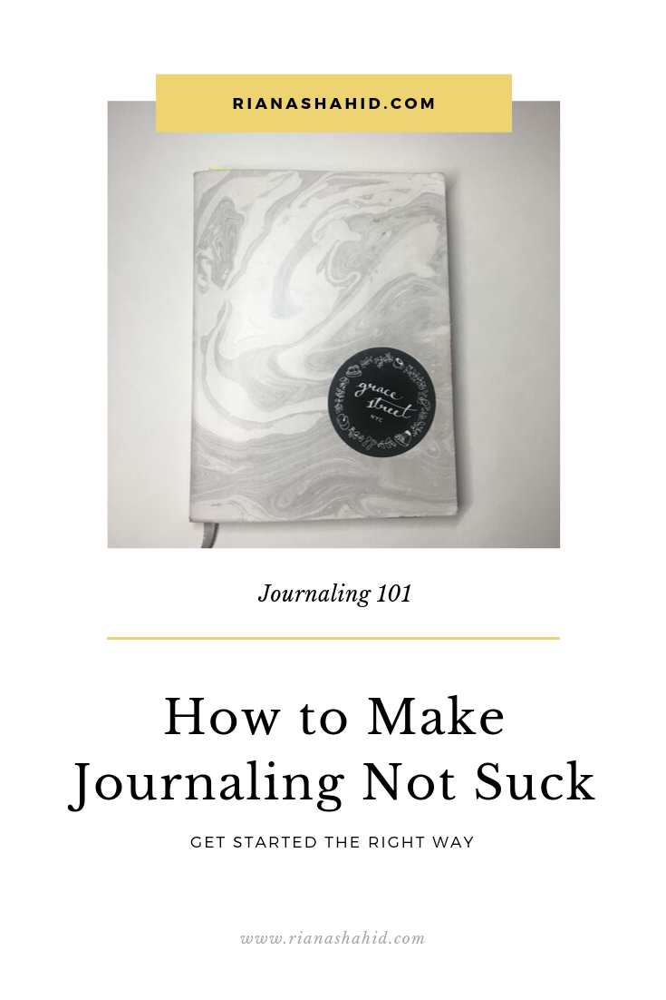
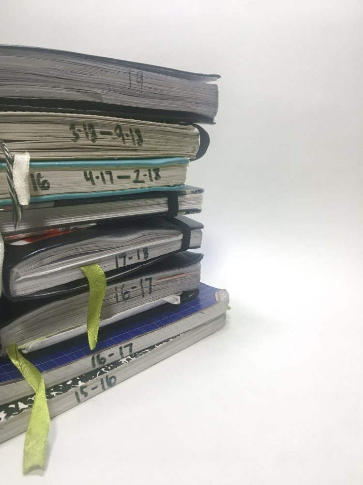
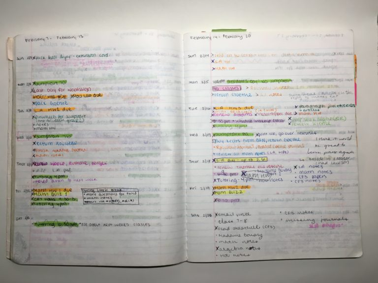
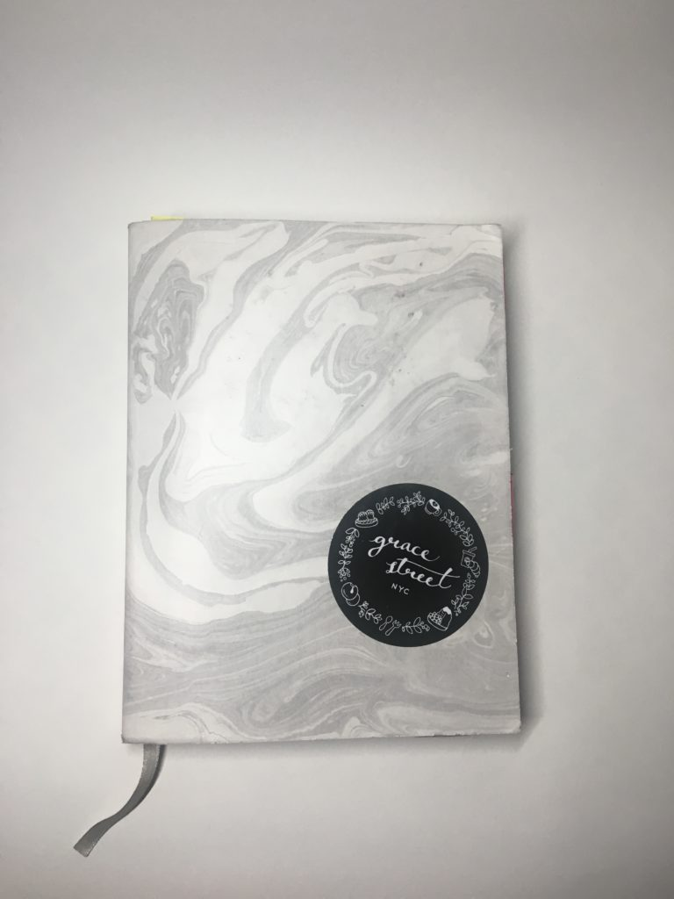
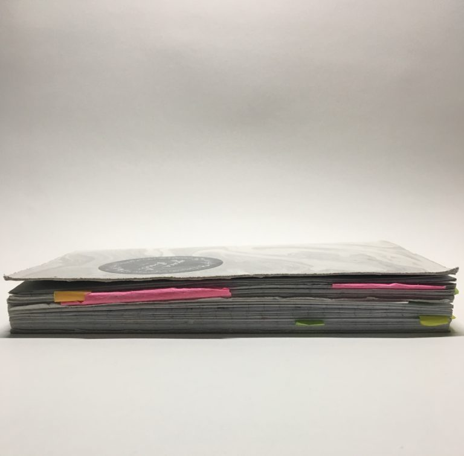

### Why I Love Journaling

I think we all have more journaling experience than we realize. Ever since middle school, I was always given a planner to write down my daily assignments and due dates. Even though these were provided by the school and not mandatory, we all used them. I personally used my planner for the day-to-day tasks, focusing mostly on what I had to get done each evening. Little did I know that this would lead me down a path to bullet journaling throughout college and into my adult life. 

I believe that everyone can benefit from introducing a journaling habit into their lives. In this post, I’m diving a little deeper into what journaling is to me and how to make it work for you.

### What is journaling? HINT: It’s not what you think!

What comes to mind when you think “journaling”? Many people picture a neat little notebook with daily entries or aesthetically beautiful spreads adorned in brush lettering and fancy stickers. This is NOT journaling — well, it’s not what you should think of as a standard example of journaling. These types of journals are as much an art form as they are journals. People who journal in this way most likely enjoy putting in the extra time and effort to focus on appearances, but that doesn’t mean you should too. Journaling should simply be a reflection exercise. You should be able to end your journaling session with a better sense of your mental and emotional state. This is not going to look like the #bulletjournaling spreads you might see on Instagram. Journaling can be ugly. 

Luckily there are so many kinds of journals out there, so you’re sure to find one that suits you.

##### Dream Journals

This is a log of your dreams as often as you remember them. I, like many people, am NEVER in the mood to turn on a light and write down remnants of my dreams, so I like to describe my dreams into the voice recording app on my phone. Later in the day, or even once a week, I jot them down into my dream journal. 

##### Bullet Journal

This is hands-down my favorite type of journal! A bullet journal focuses mainly on tasks and your agenda for each day. There is no layout to a bullet journal, so you can customize it to however you feel best suits you. Some people like to create a weekly spread with spaces for each day of the week. Others like to make a new list each day of things that need to get done. The central idea here is “daily”, so it’s useful to also have a monthly page where you can make a note of events happening in the long-term instead of waiting to put it on that day’s agenda. Bullet journals can be overwhelming at first, because there is so much planning and setup involved, but once you get the hang of it, they can really add a level of clarity to your life.

##### Diary

This is the kind of journal where you write entries as if you’re talking to yourself. These can be a recollection of things you did during the day or a stream of consciousness type of entry. 

##### Scrapbook

Tell your stories with (flat) souvenirs of the things you came across. Scrapbooks are a really fun and dimensional way of remembering your life, because you can add pictures, receipts, pressed flowers, and more.

##### Commonplace Book

I only learned about commonplace books earlier this year, but they have been around for ages. A commonplace book is a collection of information that you might want to refer back to later. Your commonplace book can be a collection of your favorite recipes, song lyrics that speak to you, excerpts from books that stand out, etc. I unintentionally created my own commonplace book when I started my reading journal in January of 2018.

You can also take your favorite elements from each kind of journal and combine them however you like. (That’s what I do.)

### Why People Give Up

The number one reason why people give up journaling is because it feels like too much work. This is true of any habit. If there are too many barriers to success, then it is expected that you will give up. The key to following through is to make journaling as easy as possible.

### How to Make Journaling Work

##### Time

You don’t have to dedicate a lot of time to your journal. Taking five minutes each day to write out anything on your mind is more than enough. Journaling shouldn’t feel like something you HAVE to do. You need to believe, to some extent, that journaling is something that genuinely benefits you. You can do this by picking a journaling method that you like and then committing to whatever frequency you define for yourself. If five minutes per day seems like too much, then say your goal is to write something three times per week. Or one. Whatever you want!

You should also think about whether you want to pick a time for journaling. Some people like to only journal in the morning because they might be too tired or busy later on. Others like to make several small entries throughout their day. I like to start my day with a quick list of tasks on my agenda for that day and (if time permits) a longer diary entry at the end of the day of how everything went.

##### Size Matters!

Think about whether you would like to be able to take your journal with you wherever you go. You need to consider the size of the book and whether it would be too bulky to carry around all the time. I personally like A5 or 5 in by 8 in. Using anything bigger than that can feel a little intimidating. I can write for ten minutes and still have so much empty space. Small books take away the anxiety of having to fill up a page. On the other hand, writing on pages that are too small can lead you to use up your journal very quickly. But, you will feel like you’re making more progress if you have to start a new page (or two) for just one entry. 

You should also consider the number of pages. The standard size for many journals is between 70 and 100 pages. I think this is a pretty good number for most people. If you have too many pages, then you run into the same problem of using too-large pages. You will use that journal for months and months, but all you’ll see is how many pages you have left to go. But when you write in a journal with too few pages, you might find yourself asking if an entry is “good enough” to use up a page. You never want to question whether your writing is worthy, so make sure you have enough pages. 

##### Quality Materials

Some people are loyal to their Moleskines or Leuchtturms, but I like to switch it up for every journal. I also don’t like to use books that are too expensive because I never want to feel like I’m “wasting” any pages. You can find affordable journals at Michaels, Barnes & Noble (check their Bargain Books section), Flying Tiger, and small bookstores in your neighborhood. As long as you look for a sturdy notebook that can withstand long-term use and has pages that won’t bleed through, you’re all good!

You should also consider what your preferences are for the binding. I personally do not like spiral notebooks because the wire can get in the way and make journaling unpleasant. 

##### Keep It Simple

You don’t have to write about every aspect of your day. To keep your journal entries simple (or if you feel uninspired about what to write), pick one question to answer. You can answer the same question for each entry, or you can switch it up depending on what you feel like talking about. Here are some sample questions:

* What made me happy today?

* What successes did I have today?

* What can I look forward to tomorrow?

* What do I need to do more of?

* How do I feel right now and why do I feel this way?

### Final Reminders

Lastly, remember that you are doing this for yourself. Don’t worry about how Instagrammable your pages are. There’s a reason I didn’t include any digital forms of journaling in my list above. Don’t try to be a perfectionist when you journal. There is no need for editing or worrying about your grammar. Just get your thoughts on paper. The act of writing in your journal is an exercise for you to clear and calm your mind. In the future, when you read your old entries, you’ll remember what you were feeling at that moment and you’ll be so glad you took the time to write everything down. 

Thanks for reading if you made it this far! Tell me about your experience with journaling. Do you have a journal? If so, what kind of journal do you use. If not, what’s stopping you?
