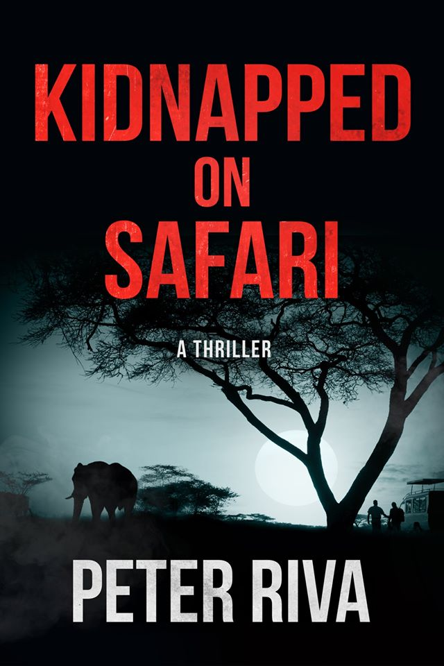
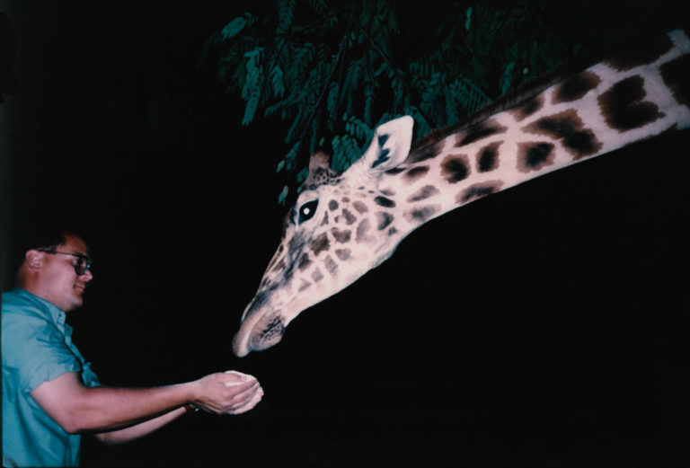
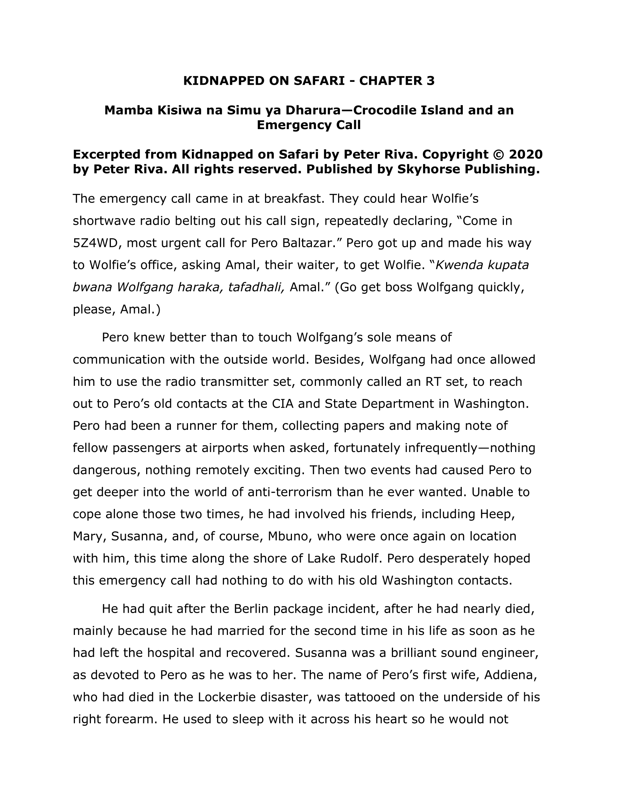
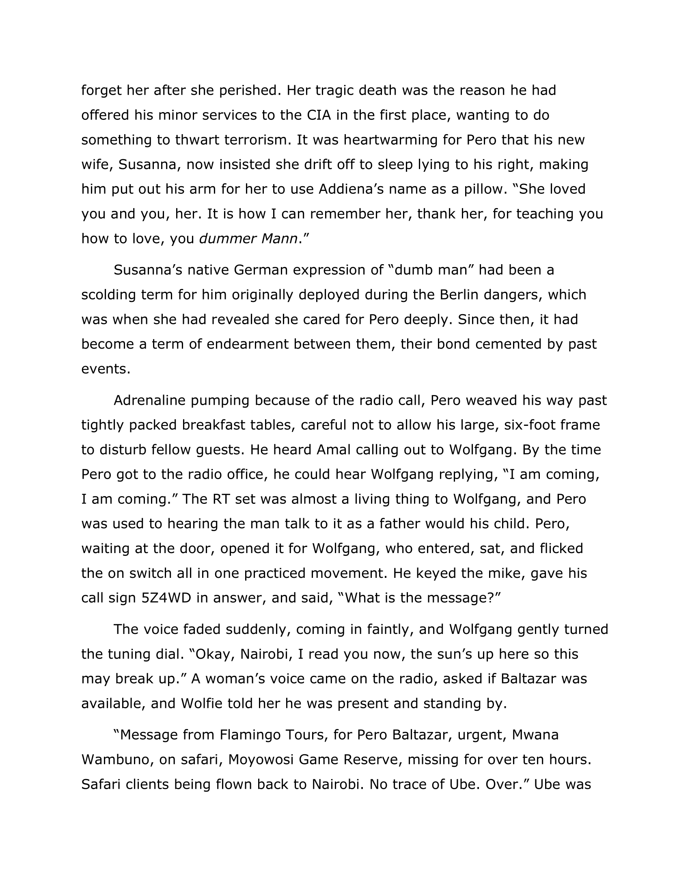
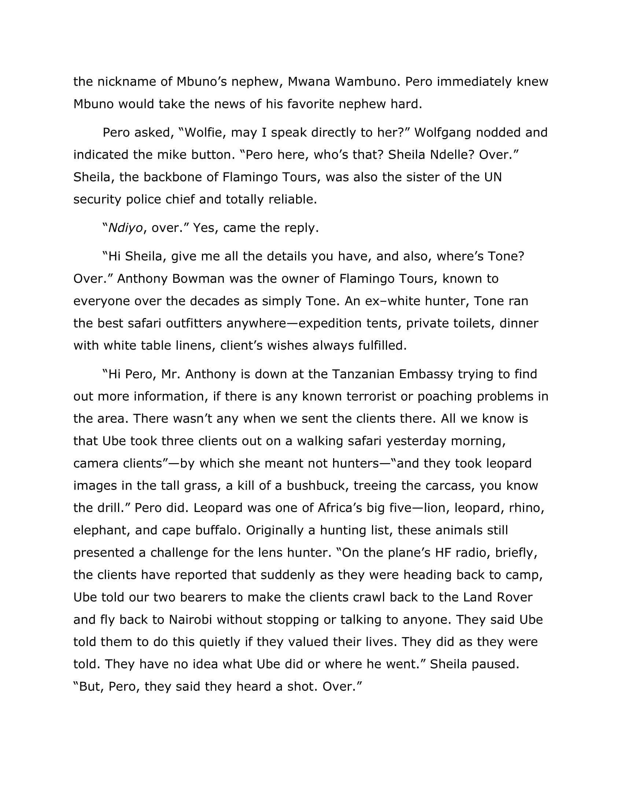
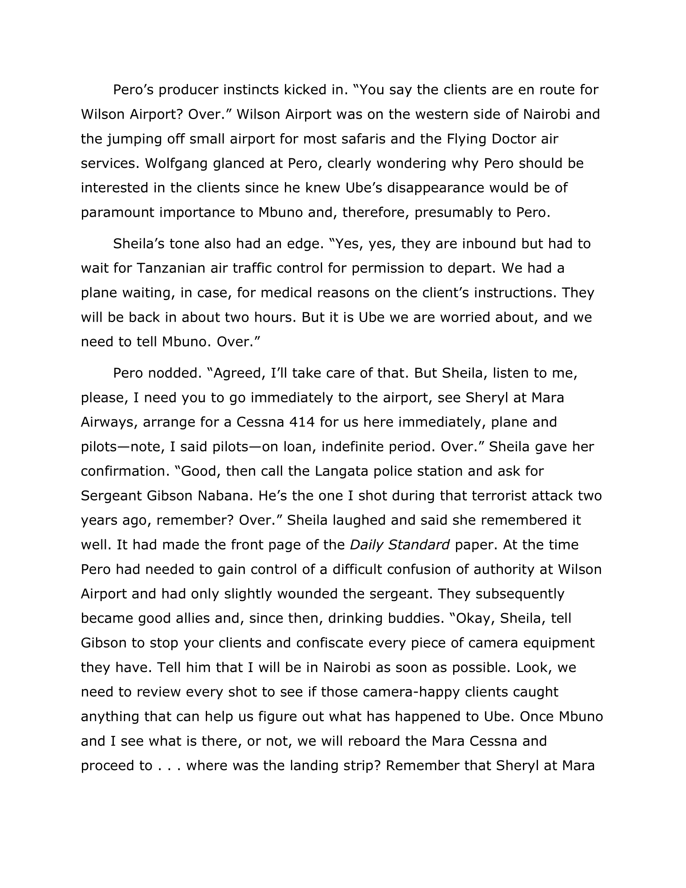
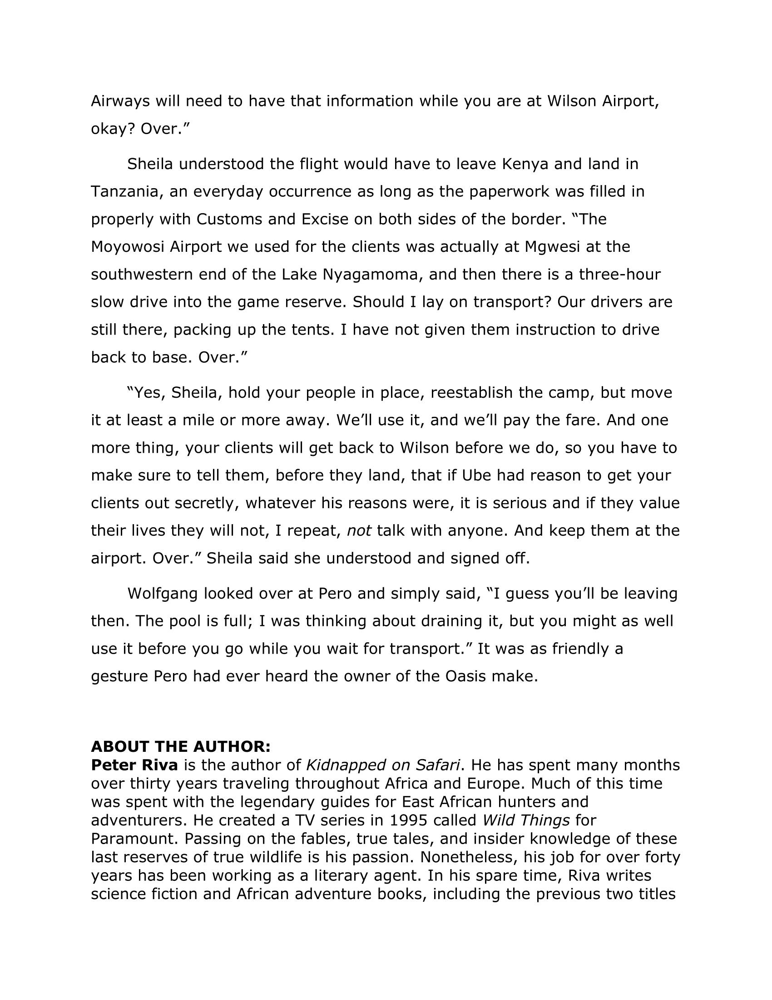

*I received an advance copy of this book for review. 

_Kidnapped on Safari_ starts off with safari guide Mbuno as he leads TV producer Pero (who is also a CIA agent) through the wilderness to film footage for his show. Things quickly head south when they learn that Mbuno’s son Ube is missing. Ube was guiding a photography group through the wilderness in Tanzania when they ran into trouble. To save the group from whatever danger he spotted, Ube created a distraction so the group could escape. Unfortunately, that very thing prevented Ube from returning home. 

Mbuno, Pero, and a member from Ube’s tour group embark on a rescue mission to bring Ube back. The team realizes that Ube has been kidnapped by not just anyone, but Boko Haram mercanaries themselves! Furthermore, Ube is not the only victim; other captives among him are missing girls from neighboring areas. 

Ube’s kidnappers have been illegally clearing protected forests to grow tobacco and coca plants and importing large amounts of Siberian gold. The underlying goal behind all of this: a coup to overthrow the Tanzanian government. To say this sounds insane and complicated is an understatement. There is _a lot_ going on in this book. When you think the problem is resolved (when Ube’s whereabouts are determined), another one reveals itself (how to rescue him and the girls without threatening the stability of an entire country). For me, this became a bit of a problem towards the end based on the type of reader I am. I sometimes go long stretches before picking up the same book again. Because of this, it got a little confusing keeping track of who’s who (also part of the reason why I didn’t enjoy Stephen King’s _The Stand_). I didn’t mention this earlier, but there are a lot of characters in this story. Pero had a whole team with him for filming, plus he uses his CIA connections to help rescue Ube. Mbuno is a well-respected member of the community, so he has a lot of friends that we meet in the book too. On top of that, this is the third book in a series featuring Mbuno and Pero, so there are a handful of references to their earlier adventures. While this book does a very good job of being able to stand alone, I wasn’t absorbed in this one like I was in last week’s _Law and Addiction_. 

Overall, this wasn’t a light, easy read, but the action-packed story makes it worth it to give it a try! 

Also, this is a minor sidenote, but I think this book taught me how to safely remove leeches from the skin? Maybe that will come in handy one day 😉

This book is dedicated to “[those] readers who want the real East Africa with a rip-roaring adventure thrown in”. Based on Peter Riva’s extensive background in Africa, I would say he’s more than qualified to provide that kind of adventure. 

Peter Riva has spent many months over thirty years traveling throughout Africa and Europe. Much of this time was spent with the legendary guides for East African hunters and adventurers. He created a TV series in 1995 called Wild Things for Paramount. Passing on the fables, true tales, and insider knowledge of these last reserves of true wildlife is his passion. Nonetheless, his job for over forty years has been working as a literary agent. In his spare time, Riva writes science fiction and African adventure books, including the previous two titles in the Mbuno and Pero Adventures series, Murder on Safari and The Berlin Package. He lives in Gila, New Mexico. For more information, please visit [peterriva.com](https://peterriva.com/). 

_Author bio provided by FSB Associates._

Fun fact: Riva was also a math major, like me!

Kidnapped on Safari will be available wherever books are sold starting January 21, 2020. Keep reading for an excerpt:

<!-- <object data="./riva" type="application/pdf" width="100%"> 
</object> -->

