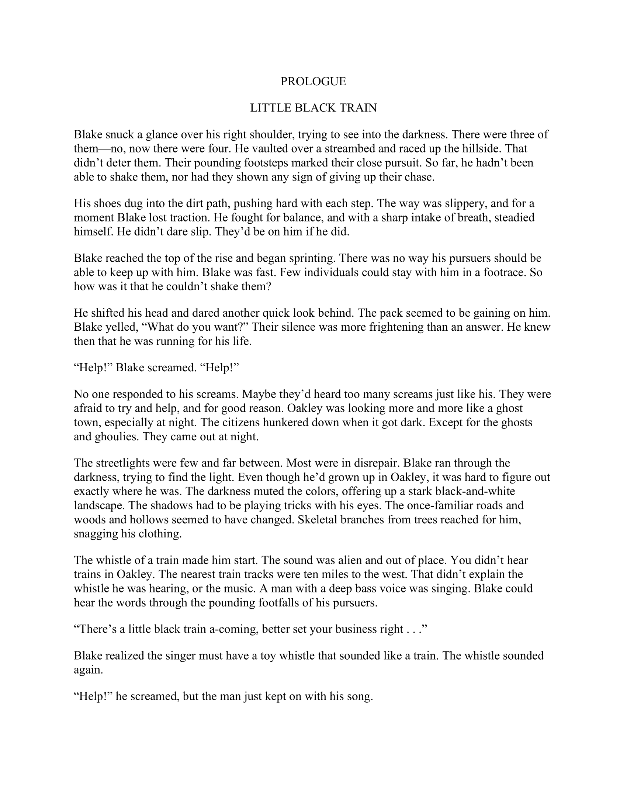
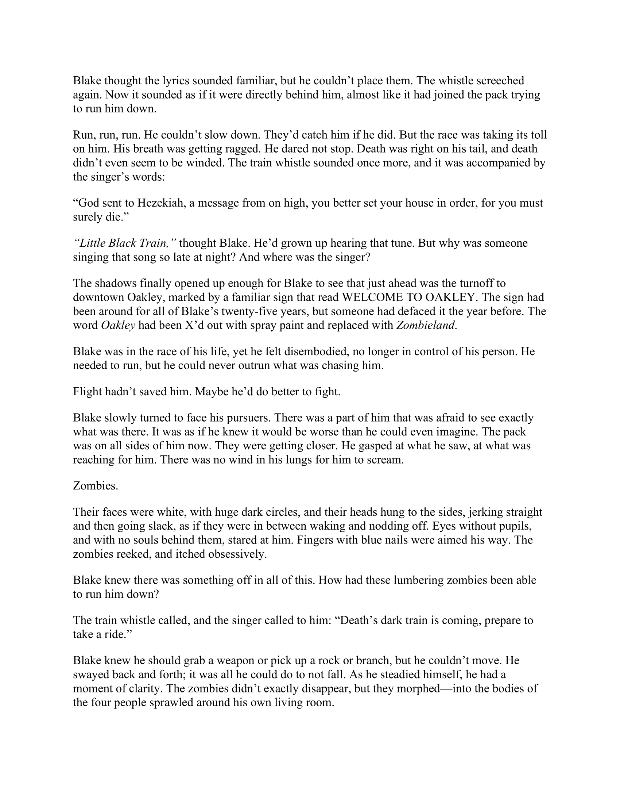
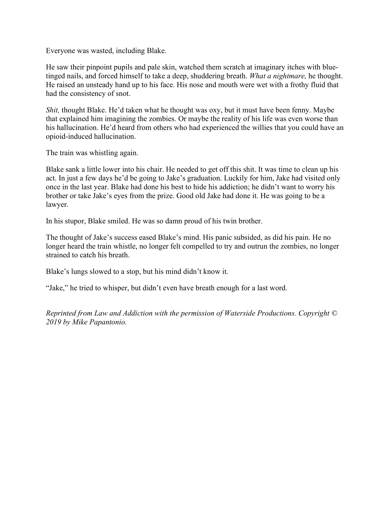

I was a little uneasy about starting this book. Like in The Hate U Give, I was afraid of getting a bad, albeit more realistic, ending or one that is improbably positive. I like happy endings, but I know we don’t live in a world where big corporations take responsibility when they should. Justice doesn’t come easily. It’s fought for by people like Jake Rutledge, the protagonist of _Law and Addiction_. Early in the book, Jake’s brother Blake dies of a drug overdose , but his situation is not unique. Over a hundred people die of drug overdoses every single day. And despite what you might imagine, these aren’t a bunch of junkies throwing their lives away. These are regular people who were prescribed high volumes of opioids when they did not _need_ them. Once the patients were hooked (which happens very quickly), people continued to get their supply from pill mills, aka doctors who hand out prescriptions too freely. Part of the problem was that even the doctors didn’t know how addictive these drugs truly were.

Entire towns were (and continue to be) ravaged by the opioid crisis, which was overseen by drug companies. See, these companies don’t just turn a blind eye towards any data proving over-prescription and over-use. They also make it extremely difficult for the public to access the information showing the massive amounts of drugs flowing through the country.

In _Law and Addiction_, Jake Rutledge and hotshot lawyer Nicholas “Deke” Deketomis try to hold Big Pharma accountable. Readers get insight into the red tape and bureaucratic hoops to jump through when taking on such a big case. I didn’t think I would like a legal thriller, but this truly kept me on the edge of my seat. This is not a boring book about a lawsuit. This is a story about the horrifying, far-reaching effects of the legal and illegal drug trade. I personally know people who struggled with addiction and withdrawals before finally getting clean, but there were still so many negative consequences that I was not aware of. This book reveals all of them and the lengths our federal agencies will go to in order to shift responsibility. _Law and Addiction_ has a little of everything; bribery, fraudulent property seizure, kidnapping, and even a little romance. Papantonio’s experience as a lawyer and skill as a writer come together to create a book that I think you all will enjoy. **Scroll to the bottom for an excerpt**.

While this book is a work of fiction, the death toll from the opioid crisis is not.

> [Somewhere] in America an individual is dying of a drug overdose. During the next twenty-four hours, there will be at least 115 deaths from the same cause. In 2017, more than 72,000 people in the United States died of a drug overdose. To put that in perspective, during our seventeen-year involvement in the Vietnam War, there was a total of 58,220 American casualties.
>
> – Mike Papantonio

Mike Papantonio is currently on a team of lawyers representing hundreds of local governments nationwide in the fight to hold some of the biggest drug companies accountable. One of those companies is Purdue Pharma, which is owned by the Sackler family. They are responsible for the invention of OxyContin, a synthetic pain reliever whose active ingredient is oxycodone. They aggressively marketed this drug and lied about its addictiveness, which directly led to the thousands of deaths mentioned above.

About a third of my posts here are about art in New York City, so I would be remiss to not mention that the Sackler name is all too familiar in the art world. Philanthropic contributions from wealthy families like the Sacklers provide the means for many of the art institutions in the city. Have you ever taken a typical tourist selfie in the Met’s Temple of Dendur? Yeah, that’s in the Sackler Wing. If you’ve ever been to the Guggenheim, you might have passed through the Sackler Center for Arts Education. The Sackler family’s reach is worldwide, but thanks to the work of people like Papantonio, artists, and activists, that reach is starting to dwindle.

Here’s a brief timeline of things that happened in the last two years alone:

- March 2018 – Photographer Nan Goldin and her group Prescription Addiction Intervention Now (P. A. I. N.) protested in the Metropolitan Museum of Art and staged a die-in in the Temple of Dendur to call on the museum to remove the Sackler name from its wing and stop accepting Sackler money. [ [ARTnews](https://www.artnews.com/art-news/news/nan-goldin-p-n-group-stage-protest-sackler-family-purdue-pharmaceuticals-mets-sackler-wing-9946/)]
- February 2019 – Goldin and P. A. I. N. did the same at the Solomon R. Guggenheim Museum and marched down Museum Mile to hold another protest in front of the Met. [ [ARTnews](https://www.artnews.com/art-news/news/nan-goldin-sackler-protest-met-museum-guggenheim-11874/)] Goldin also refused to show her art at Britain’s National Portrait Gallery if they continued to accept monetary gifts from the Sacklers. [ [The Guardian](https://www.theguardian.com/artanddesign/2019/feb/16/nan-goldin-sackler-gift-oxycontin-national-portrait-gallery?CMP=share_btn_fb&fbclid=IwAR0B-XpgUagIxwt2qJA8tVHS8ZN76sZNi1HJ83k4dmyiK4CUHsoB-1S49Ww&utm_source=Breakfast+with+ARTnews&utm_campaign=714225adc2-EMAIL_CAMPAIGN_2019_02_18_04_34&utm_medium=email&utm_term=0_c5d7f10ceb-714225adc2-293936999)]
- March 2019 – Tate Gallery and National Portrait Gallery in London stopped accepting funding from the Sacklers. [[ ARTnews](https://www.artnews.com/art-news/news/tate-sackler-trust-donations-12197/)] The Guggenheim soon followed suit. [ [ARTnews](https://www.artnews.com/art-news/news/report-guggenheim-museum-says-it-will-decline-sackler-funding-12215)]
- April 2019 – The Jewish Museum in Berlin stopped accepting money from the Sacklers, but will not remove their name from within the museum.\* [[The Art Newspaper](https://www.theartnewspaper.com/news/jewish-museum-berlin-says-it-would-no-longer-accept-sackler-family-donations?utm_source=Breakfast+with+ARTnews&utm_campaign=0fcaaa7959-EMAIL_CAMPAIGN_2019_04_03_06_51&utm_medium=email&utm_term=0_c5d7f10ceb-0fcaaa7959-293936999)]
- May 2019 – The Met stopped accepting donations from the Sacklers, but like the Jewish Museum, will not remove their name from the Sackler Wing.\* [ [NY Times](https://www.nytimes.com/2019/05/16/opinion/sunday/met-sackler.html?utm_source=Breakfast+with+ARTnews&utm_campaign=3286b4d471-EMAIL_CAMPAIGN_2019_05_16_04_18&utm_medium=email&utm_term=0_c5d7f10ceb-3286b4d471-293936999)]
- July 2019 – The Louvre in Paris stopped accepting Sackler money and removed their name from their galleries. [ [Forbes](https://www.forbes.com/sites/lisettevoytko/2019/07/17/louvre-removes-sackler-name-joining-growing-list-severing-ties-from-family/#67f37b412dce)]

\*What reasons could a museum have for not removing a donor’s name? Removal would require that the money be returned. In many cases, this would force the museum to dip into public funds, which would be inappropriate. The public shouldn’t pay because of the actions of a big corporation. Also, some feel that changing a name is merely an attempt to cover up the problem. I personally feel that changing the names is a good opportunity to educate museum visitors about the Sacklers’ role in the opioid crisis, but I understand the merits of not doing so.

If you want to learn more about the Sackler family’s involvement in the creation and distribution of OxyContin, check out this thorough article in [The New Yorker](https://www.newyorker.com/magazine/2017/10/30/the-family-that-built-an-empire-of-pain?verso=true).

<html>
    

        

            
        

        

            Mike Papantonio is the author of Law and Addiction. A truth-teller, he is a crusader who uses fiction to entertain and inform his readers about some of the most pressing issues of our time. In each of his thrillers, he lays bare the conspiracies and white-collar crimes that hurt ordinary Americans — and that are rarely covered by the national media. A senior partner of Levin Papantonio, one of the country’s largest plaintiffs’ law firms, Papantonio uses his own cases as springboards for his novels. He has aggressively taken on Big Pharma, tobacco, weapon manufacturer, and the automobile industry, among other bastions of corporate greed. One of the youngest inductees into the Trial Lawyer Hall of Fame, Papantonio is also a well-known media presence as host of America’s Lawyer and co-host of the syndicated radio show Ring of Fire. A skilled musician and athlete, he is based in Pensacola, Florida. [bio provided by FSB Associates]
        

    

</html>

As promised, here is an excerpt of Law and Addiction:

To learn more about Mike Papantonio and get your own copy of Law and Addiction, click [here](https://www.mikepapantonio.com/law-and-addiction/). I know I’ll be checking out the other books Papantonio has written.

