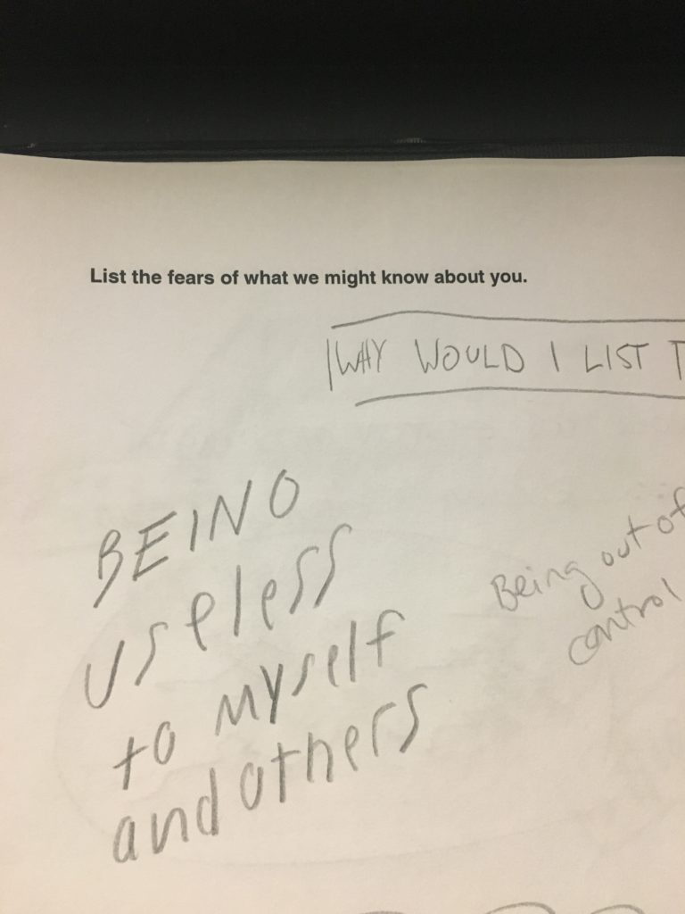
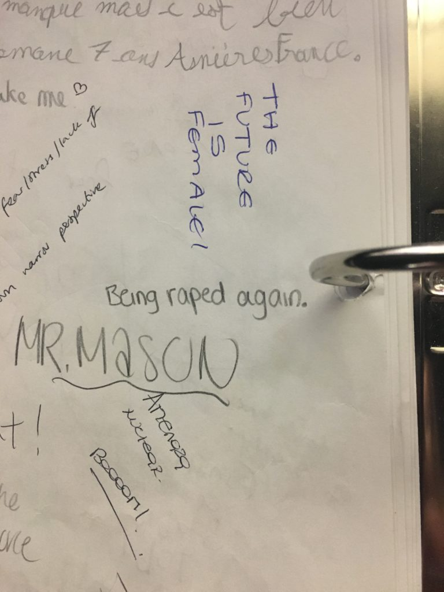
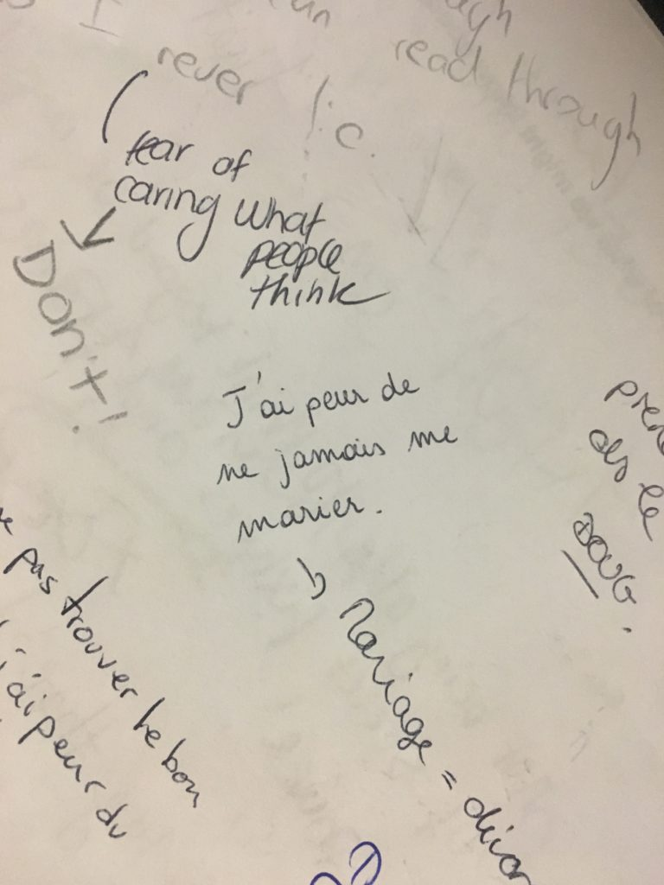
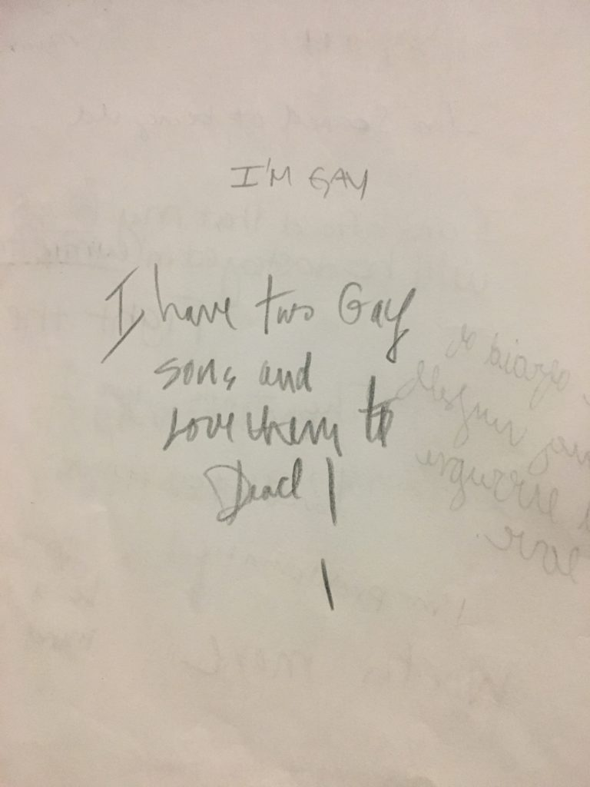
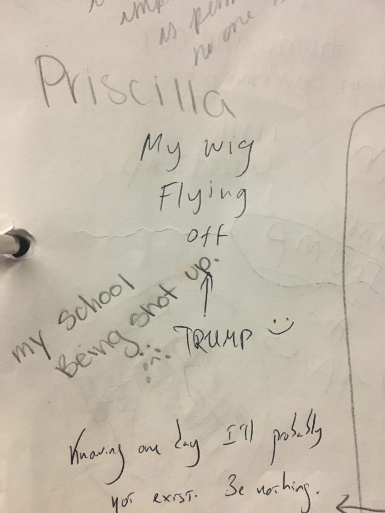
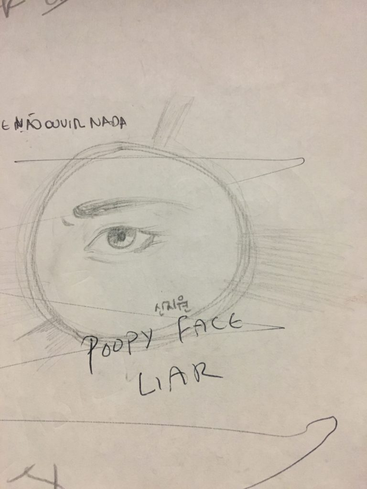

These are supposed to represent voting booths. Inside each booth was a binder full of pages and pages of people answering various prompts. Each booth had a different prompt, one of them being:

### List the fears of what we might know about you

Some people took the opportunity to draw pictures or leave their Instagram usernames. Others actually wrote about their fears. It was really interesting to see all the different kinds of handwriting and languages all in one place (thank you, two semesters of intensive French!). It really highlights the fact that people from all walks of life can visit the museum and participate in activities like this one.

For me, the most beautiful part of this work was seeing the places where people responded to and commented on the fears of others. The original writer will likely never see the responses to their fears, but others who share that fear might.

