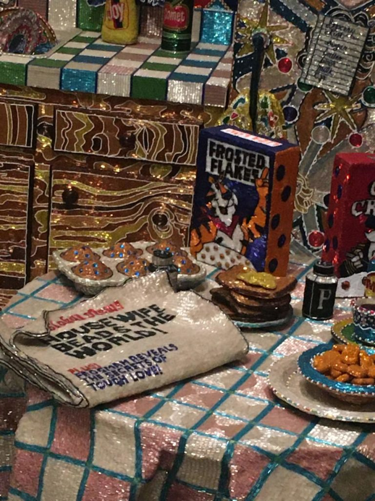
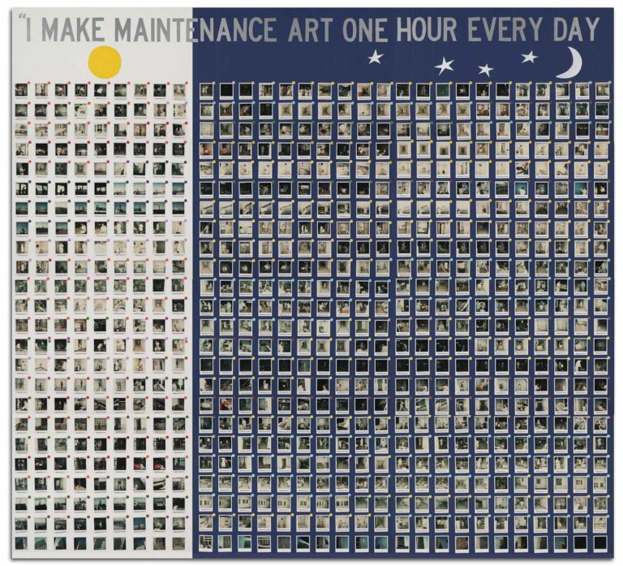

### Liza Lou

#### _Kitchen_

1991-1996

Beads, plaster, wood, and found objects
96 x 132x 168in
on view as part of **_Making Knowing: Craft in Art, 1950 – 2019_** at The Whitney Museum of American Art

_Kitchen_, as the name suggests, is a a fully-stocked kitchen where nearly every surface is covered in a layer of beads. Liza Lou referred to kitchen design manuals and researched the lives of women in the nineteenth century before making the fixtures out of paper mâché. The beads are applied in a mosaic-like pattern, adding texture to every surface.

According to Lou, _Kitchen_ “argues for the dignity of labor,” which can be interpreted a few ways. One way is that it emphasizes the role of the housewife. Beaded on the side of the stove is a banner that reads
> She rose to his Requirement,
>
>dropped the playthings of her life
>
>to take the honorable work
>
>of woman and of wife.

This is an excerpt from a sarcastic poem by Emily Dickinson about patriarchal society and the erasure of women’s individuality post-marriage. After getting married, a woman is supposed to dedicate herself to running her household. She has to take on the responsibilities of cleaning, cooking, and more. She must bear these tasks without praise, since these are seen as very basic, but without her, the household would not be able to function. So, _Kitchen_ highlights all the tasks that a woman has to do in just this one room alone. Viewers can see a broom and dust pan (which hasn’t been emptied yet), an open bag of Lays potato chips, a sink full of dishes, and breakfast still on the table —  as if she stepped out for a moment but is coming back to clean up and put things back in order. Lou wants us to see _this_ moment and notice all the “basic tasks” that a household revolves around. 

_The paper reads “Housewife Beads The World!”_

Alternatively, “labor” could be a nod to the labor of women in general. Beading as a craft is usually done by women and appreciated by women. By building something on this scale and covering every surface in beads (glued on one-by-one with tweezers), Lou forces viewers to take notice. We notice not just the beauty of the beadwork, but the time and skill needed for such a laborious and tedious task. In a way, Lou serves to legitimize the craft and by extension, women’s work as a whole. 

This isn’t the Whitney’s first exhibition on labor as art. During my first trip to the Whitney in 2017, I saw Mierle Laderman Ukeles’ _I Make Maintenance Art One Hour Every Day_. For this exhibition, Ukeles asked 300 maintenance workers to look at their work process as an art form and photograph themselves doing so. Ukeles, who is the Artist-in-Residence at New York City Department of Sanitation, wanted to put a spotlight on work that is usually invisible. Like Liza Lou, she uses art to lessen the stigma of work and bring it closer to the realm of conversation.

