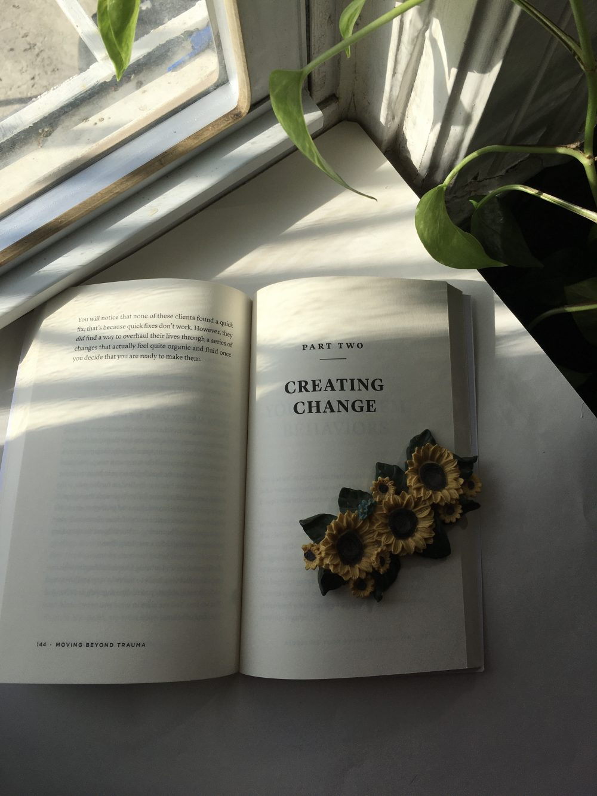

I received an advance reader copy for review, but as always all opinions are my own. Moving Beyond Trauma will be available for purchase starting May 5, 2020. 

Does anyone else read self-help books thinking they’ll finally get their life together, only to not make a single change? Because same.

But on a more serious note, I have been reviewing a lot of fiction recently, so I thought I’d switch genres for a bit. Moving Beyond Trauma by Ilene Smith calls itself “the roadmap to healing from your past and living with ease and vitality”. The way to do that is through the concept of Somatic Experiencing. In short, your trauma is not just in your head — it manifests itself through the rest of your body, so any methods you use to heal must take that into account. When you practice Somatic Experiencing, you get the opportunity to become closer to yourself. By learning the ways your mind and body are connected, you form a basis for a new way of approaching your trauma going forward. 

Smith addresses early on that trauma sounds like a scary word. It has always been characterized by extreme suffering and damage. But the truth is that trauma is not rare or extraordinary. 

>Trauma is not about an event. […] [Trauma] is the result of the energy that gets locked in our body when it experiences threats, both real and perceived.

Smith goes on to explain different kinds of trauma, the way they impact our lives, and most importantly, why talk therapy doesn’t always help. Talk therapy can be a helpful tool in identifying key aspects of our behavior, but when it comes to healing trauma, it doesn’t always work to the extent we need it to. When we engage in talk therapy, we think we’re addressing the problem, but for many people, all we’re doing is reliving the trauma by bringing it up. In fact, this is true of all top-down methods, where the focus is on changing thoughts and behaviors. According to Smith, bottom-up methods, which begin with sensory information, are going to be the most effective, because they emphasize starting with the body to heal. Smith ends this chapter with what is probably my favorite feature of this book: an assessment. This first assessment quantifies trauma symptoms and gives readers an overview of the healing process, like a self-help horoscope. 

From there, the focus shifts to recovery. Smith retells the stories of her clients and their struggles with depression, anxiety, chronic pain, eating disorders, and rigidity. Smith guides all of them through the practices of Somatic Experiencing and equips them with a toolkit for helping themselves in the future. She then turns to the reader. The next chapter contains five assessments to shed light on our current state in order to heal.

>“[This] information is designed to spark curiosity about yourself, your life, and how you relate to the world and to other people. It’s designed to help you understand how your nervous system is functioning and to make you aware of what’s happening when your responses kick in. It’s about helping you become more attuned to yourself on a sensory level.

The assessments in this section are as follows:

* **Fight**, **Flight**, or **Freeze** What do you usually do when threatened?
* **Task Approach** When it comes to completing tasks, are you productive or do you disengage?
* **Organizational Style** Are you flexible or rigid in your behaviors when faced with a new challenge?
* **The Sensory Scale** How sensitive are you to your body when it tries to tell you something?
* **Interoception** How well can you sense the inner state of your body?

You can take these assessments yourself at [movingbeyondtrauma.co](https://movingbeyondtrauma.co/)

Finally, we get to healing. Smith details a series of exercises starting from simple breakthwork to self-soothing to even more advanced boundary exercises. Throughout this chapter, Smith makes specific recommendations based on the results of the assessments. We’ve alreader identified our traumas. Now, our goal is to master these exercises as parts of a new, healthier lifestyle. 

I think this book came to me at a very critical time. Like most of you, I am under lockdown and as much as I appreciate the hours of free time I have, this has been one of the most mentally exhausting times of my life. I’ve spoken to some of my friends about this and we are all in the same boat. People are spending all of their waking hours stuck at home, sometimes in a house full of family members. People who usually rely on a therapist or counselor have had to make do without their usual visits and others are just feeling trapped. Whatever the case, I think this is the perfect opportunity to learn more about ourselves. I know that I’m going to spend a lot more time with this book in the near future. Am I going to completely change my life? I can’t say for sure, but Ilene Smith makes me feel like I can. 

<html>

    
<!-- </html> -->

Ilene Smith is a certified professional coach and Somatic Experiencing practitioner who is passionate about helping others explore life with curiosity and exuberance. Her research into Somatic Experiencing and eating disorders has contributed to the importance of Somatic Experiencing and body-based therapies in recovery. Ilene has also worked extensively with patients suffering from addiction. With master’s degrees in exercise physiology and mental health counseling, Ilene blends talking, touch work, and movement to create synergy between a client’s body and mind. In addition to her private practice, Ilene has developed a series of trauma healing workshops and lectures, which she hosts worldwide. Ilene lives in Arizona.

>author bio from [movingbeyondtrauma.co](https://movingbeyondtrauma.co/)

</html>

