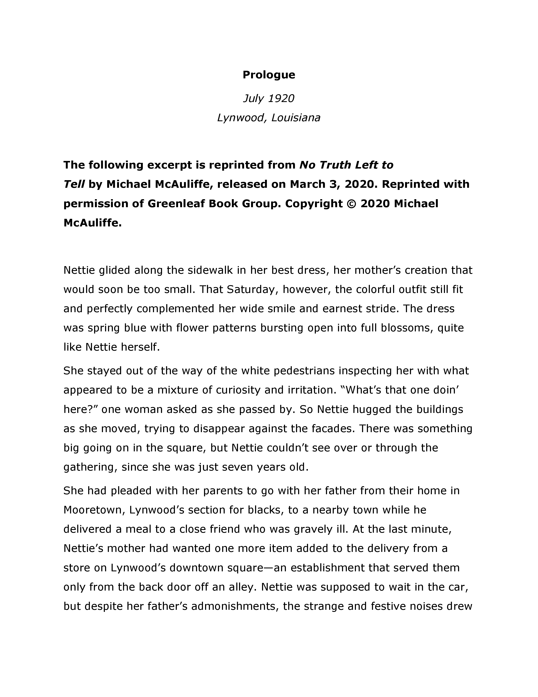
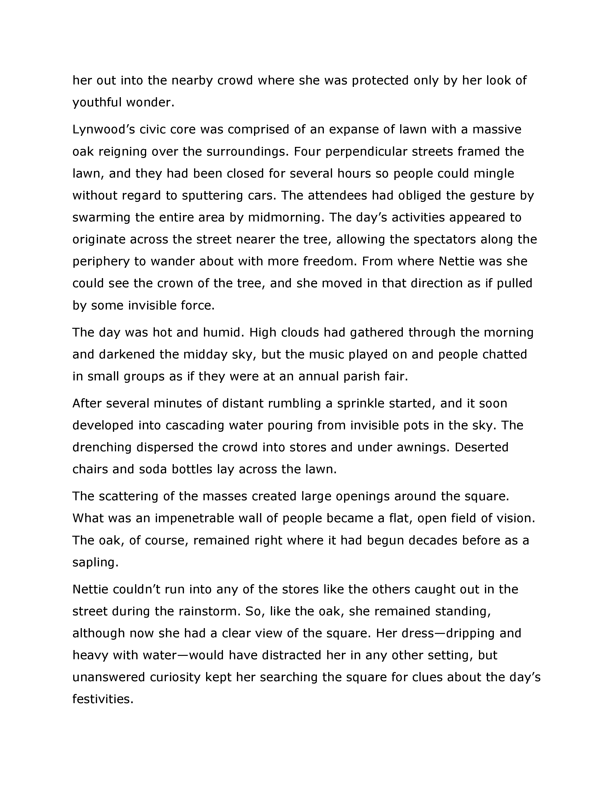
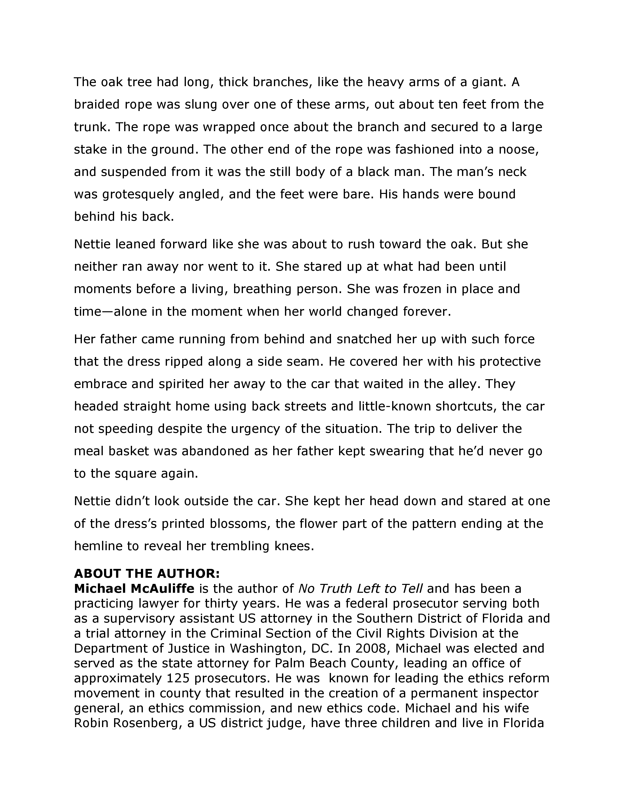

I received an advance reader copy for review, but all opinions are my own. 

Let me start off by saying that I have no law background whatsoever. So, when approaching legal thriller No Truth Left to Tell, I wondered whether the “legal stuff” would be too boring for me. But lucky for me (and hopefully you), Michael McAuliffe does an awesome job at writing a compelling page-turner that continues to draw you in until the end. 

>It is 1994 in Lynwood, Louisiana, and flaming crosses light up the night and terrorize the southern town. The resurgent Klan wants a new race war, and the Klansmen will start it here. ​For Nettie Wynn, a victim of the cross burnings and lifelong resident of the town’s segregated neighborhood, the hate crimes summon frightful memories of her youth, when she witnessed white townspeople lynch a black man.
>
>When federal civil rights prosecutor Adrien Rush arrives from DC to investigate the crimes with Lee Mercer, a seasoned local FBI special agent, their partnership is tested as they clash over how far to go to catch the racists before the violence escalates. Rush’s role in the case becomes even more complicated after he falls for Nicole DuBose, a successful New York City journalist who returns to Lynwood to care for her grandmother, Nettie. 
>
>When crucial evidence becomes compromised—threatening to upend what should be a celebrated conviction—the lines between right and wrong, black and white, collide with deadly consequences.
>
>
>summary provided by FSB Associates

Michael McAuliffe has been a lawyer for over 30 years, so it’s safe to say that he knows what he’s writing about. Using his background and experience living in the south, McAuliffe puts together a story that is as appalling as it is believeable. Yes, as unfortunate as it is to say, there are incredibly racist people who still exist among us. In fact, this book was inspired by real life events. But despite what you think you know about how often racist criminals are held accountable, this book will still shock you by the end. 

I’m all the more impressed that this was Michael McAuliffe’s debut novel! I’m looking forward to see what else he’ll write in the future. If this seems like your kind of book, check out the excerpt below:

___

___

___

___
To learn more about Michael McAuliffe or get your own copy of No Truth Left to Tell, click [here](https://notruthlefttotell.com/product/no-truth-left-to-tell).