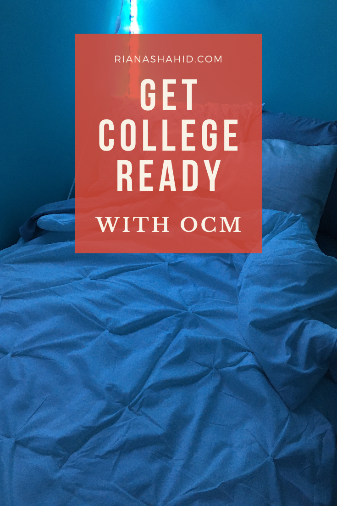
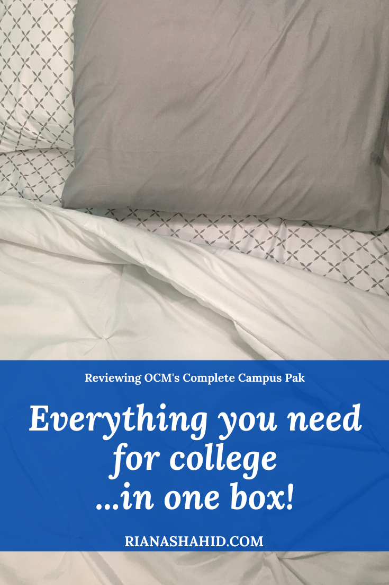

Disclaimer: I received a complimentary Complete Campus Pak for review. But as always, all opinions are my own. If you decide to shop at [OCM](http://ocm.com/), you can use code **RIANA** for 20% off!

Back to School season is stressful enough for college students as it is! Between leaving families and friends behind and having to live independently, it can get overwhelming for students. Thankfully, there’s [OCM](https://www.ocm.com/), the “one stop shop for all things needed to make your dorm room feel like home”. They recently gifted me their [Complete Campus Pak 24 Piece Bedding and Bath](https://www.ocm.com/product/complete-campus-pak-24-piece-twin-xl-bedding-and-bath-set-2147904920?list=product%20listing%20page&lob=dorm-life&category=bedding&subCategory=value-paks#main-content) set for review.

This set contains all the basics to send any college student off prepared with the comforts of home. The Complete Campus Pak comes in 27 different colors and styles, so you’ll be sure to find something you like! Even better, this set comes already packed in a neat box, so that’s one less thing for you to worry about packing and transporting.

Amidst all the uncertainty around whether students will be allowed to stay in their dorms, it’s nice knowing that they’ll be taken care of if they do. With the Complete Campus Pak, they’ll get:

* 2 sheet sets in different styles, each set contains:
  * 1 extra-long fitted sheet
  * 1 extra-long flat sheet
  * 1 standard pillowcase
* 2 extra-fluffy machine-washable pillows – these are very soft, which I like, but if you need a firm pillow, you should buy one separately
* 1 Twin XL reversible comforter
* 1 Twin XL quilted mattress pad
* 1 egg crate mattress topper — can be upgraded to a gel memory foam mattress pad (I highly recommend you do this!)
* 1 extra-long microplush blanket
* 6-piece towel set, which contains:
  * 2 all-cotton bath towels
  * 2 matching cotton hand towels — HAND TOWELS!!! Who remembers to buy hand towels??
  * 2 matching cotton washcloths
* 2 oversized bath sheets — a bath towel, but BIGGER! You NEED to get one, even if you’re not a college student!
* 1 dorm laundry bag — this has a handle that lets you hang it from a hook or nail, so it also doubles as a clothes hamper! 
* 2 underbed storage solutions
* 1 bedside storage caddy

This entire set usually costs $300.30, but right now you can get it for $199. That is a STEAL for everything included!

I know many people are picky about their sheets, so lets take a look at the two sheet sets included here. Each set is made of 100% microfiber, which is soft on the skin and easy to wash. Compared to cotton sheets, microfiber sheets dry faster, which is perfect for students who might be doing laundry for the first time (no judgement!). In general, microfiber is very tightly woven, which makes them resistant to stains (What college student doesn’t eat in bed??). Microfiber is also a good option for people who have allergies, since this material does not attract dust or airborne allergens.

Once again, I have to reiterate how SOFT these sheets feel! I’ve always used cotton or satin sheets on my bed, so I was blown away when I first touched these sheets! They feel like a blanket, in sheet form. That’s the best way I can describe it.

Here’s a quick run-down of some of my favorite items (after the sheets, of course!) from this set:

* Gel Memory Foam Mattress Topper

   This can be added onto your Complete Campus Pak. It’s an upgrade from the standard egg crate topper, and while you do have to pay extra for it, I would say it’s worth it! Dorm room beds are not always great, so you need to make sure you’re getting the best sleep possible! A mattress topper like this one is going to help keep your spine better-aligned and will cushion your joints. Disclaimer: Gel memory foam products like this one do need to be aired out before you can comfortably sleep on it. This is known as off-gassing and is completely normal for memory foam.
* Underbed Bags

   Storage is limited in dorm rooms, especially if you’re sharing with roommates. These storage bags are great because they’ll fit neatly under a bed. Plus, they have a clear top, so you can see what’s inside without having to unpack them. 

   

* Bedside caddy

   Honestly, whoever came up with these deserves an award. You “install” this by lifting up the mattress a little and sliding the top flap underneath. The weight of the mattress will hold it in place and you can store all your bedtime essentials. There’s even a little pocket for smaller items! 

If you’d like to buy any of the items from this set separately, you can do so here:

* [Microfiber 3-Piece Sheet Set in Gray](https://www.ocm.com/product/premium-supersoft-washed-microfiber-3-piece-twin-xl-sheet-set-solids-2147911699?list=product%20listing%20page&lob=dorm-life&category=bedding&subCategory=sheets#main-content)
* [Microfiber 3-Piece Sheet Set in Xavier Gray](https://www.ocm.com/product/premium-supersoft-washed-microfiber-3-piece-twin-xl-sheet-set-patterns-2147911698?list=product%20listing%20page&lob=dorm-life&category=bedding&subCategory=sheets#main-content)
* [Extra Soft Pillows](https://www.ocm.com/product/college-classic-plush-pillow-82882?list=search%20page#main-content)
* [Reversible Comforter](https://www.ocm.com/product/premium-college-twin-xl-comforter-2147911453?list=search%20page#main-content) in Kiss Pleat White
* [Quilted Mattress Pad](https://www.ocm.com/product/full-xl-sized-mattress-pad-2147620494?list=search%20page#main-content)
* [Gel Memory Foam Mattress Topper](https://www.ocm.com/product/ultimate-gel-flex-memory-foam-2147621460?list=product%20listing%20page&lob=dorm-life&category=bedding&subCategory=mattress-pads#main-content)
* [Microplush Blanket](https://www.ocm.com/product/twin-xl-microplush-blanket-2147970844?list=search%20page#main-content) in White
* [6-Piece Towel Set](https://www.ocm.com/product/six-piece-cotton-towel-set-2147911219?list=product%20listing%20page&lob=dorm-life&category=bath&subCategory=towels#main-content)
* [Oversized Bath Sheets in White](https://www.ocm.com/product/cotton-oversized-bath-sheet-81203?list=search%20page#main-content)
* [Laundry Bag](https://www.ocm.com/product/gray-laundry-bag-2147923529?list=search%20page#main-content)
* [Underbed Storage](https://www.ocm.com/product/underbed-bag-light-gray-2147972176?list=search%20page#main-content)
* [Bedside Caddy](https://www.ocm.com/product/deluxe-bedside-caddy-2147622103?list=search%20page#main-content) – The exact one from the Complete Campus Pak isn’t available for purchase separately, but there is a deluxe version that you might like better! 

If you’re interested in the exact set that I have, click [here](https://www.ocm.com/product/complete-campus-pak-24-piece-twin-xl-bedding-and-bath-set-2147904920?list=product%20listing%20page&lob=dorm-life&category=bedding&subCategory=value-paks#main-content) and choose “White Kiss Pleat – Grey and Xavier.” Remember to use code **RIANA** for 20% off! Even if you’ve already bought some of these essentials, OCM has lots of great decor and college essentials for sale as well. Be sure to check out their site!

