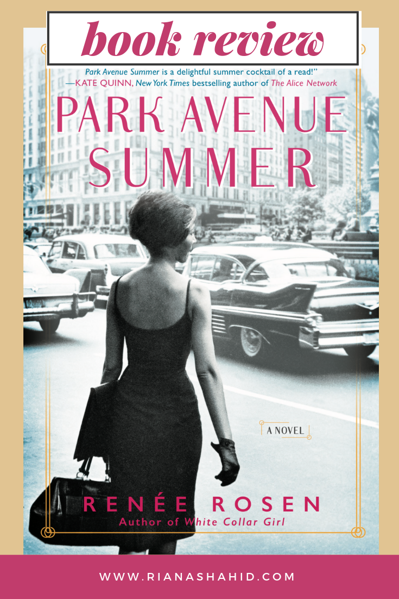

Let me preface this review by saying that I LOVE rooting for the underdog! And Helen Gurley Brown is an underdog is there ever was one! In _Park Avenue Summer_, Helen is brought in to be the new editor of a failing magazine. Readership and advertising is on the decline and people are quitting left and right. It’s up to Helen, and her secretary Alice (a photographer at heart) to save this magazine, which, by the way, is Cosmopolitan.

_Cosmo_?! The magazine that not only is still around today, but has over 20 million readers each month? I was shocked when I realized this book was about _the_ Cosmo. The funny thing about historical fiction if that there can’t be any spoilers. It’s like being surprised when the Titanic sinks in the movie. But Park Avenue Summer still comes out as an inspiring story of success in the face of failure.

One issue that some readers may have with this book is whether we want to celebrate someone like Helen Gurley Brown today. Ignoring for a moment, the body-shaming and self-esteem issues that come out of magazines like Cosmo, do we want someone whose legacy involves teaching young women to embrace their roles as sex objects? I don’t think there’s a clear answer here. Brown’s version of feminism was molded in a time when it was unheard of for women to talk about their sexuality. So, in her time, and in those days of Cosmo, this is what young women needed to hear in mainstream media. Brown would be considered too restrictive today, but there is no doubt that she played a pivotal role is bringing taboo subjects to light.

