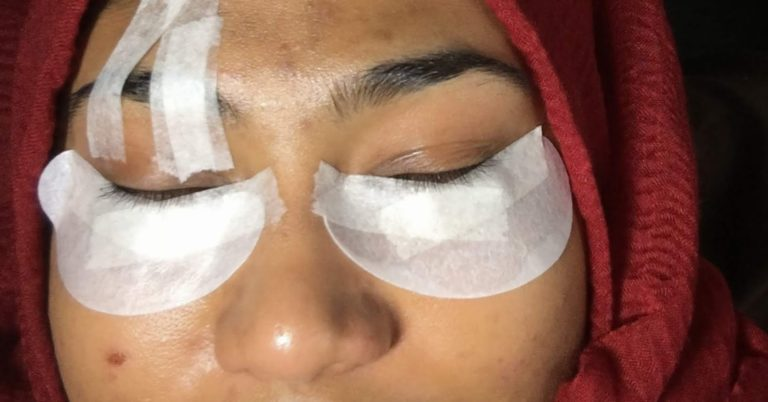
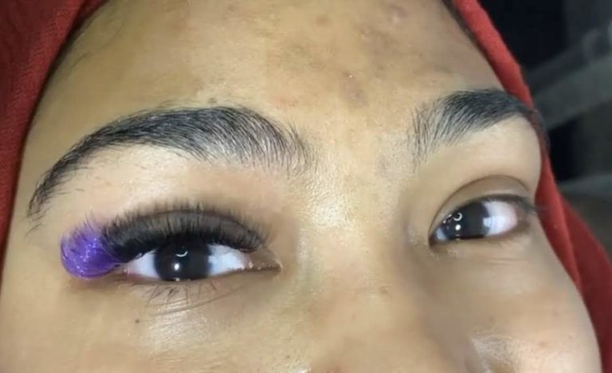
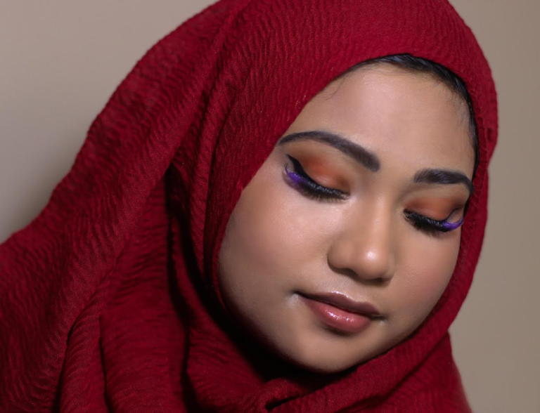
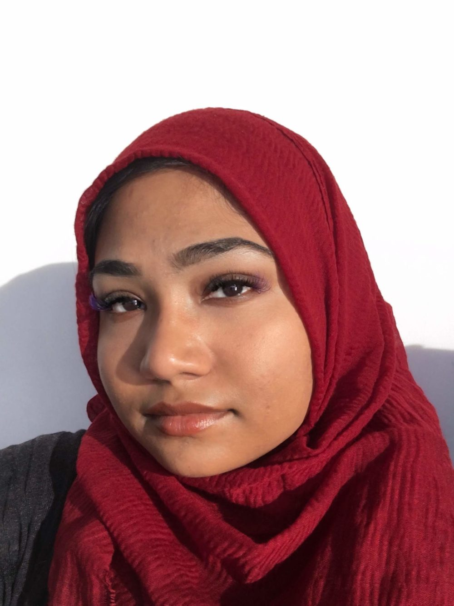
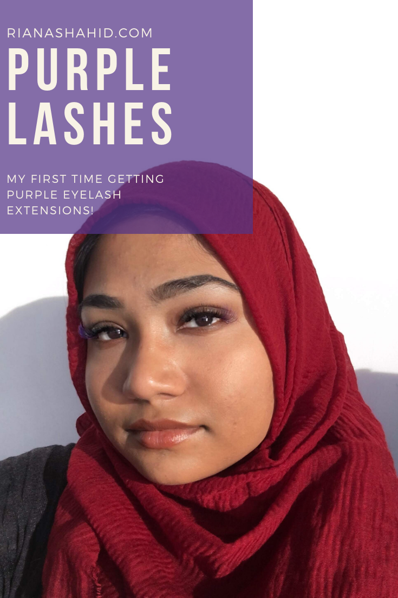

I’ve had eyelash extensions before, but never like this. This time, I got purple eyelashes instead of the usual black. I was really excited to get extensions in such a bright color. They’re uncommon but not loud in the same way dyeing your hair a crazy color is.
 
I got my lashes done by Nora, CEO of Project Lash. She is a lash technician based in NYC who does editorial shoots featuring a different lash color each month. December is the month of purple, so I chose to finish off my lashes with a pop of purple at the outer corners. Since this was my first time wearing colored lashes, I didn’t want to get full purple, but I’m interested to try it in the future.
 
### Before You Get There

The #1 rule of getting eyelash extensions is to go without makeup. I went to my appointment wearing only an oil-free moisturizer. Eyelash extensions are usually expensive, so you don’t want to risk all your lashes falling out prematurely due to a dirty or oily base.
My next tip would be to make sure you don’t have anything urgent planned for the day. My entire appointment took about four hours. Some of that time was spent doing my makeup and taking photos, but the majority was spent on my lashes. Full disclosure, I don’t know exactly how long my lashes took … because I fell asleep in the middle of it. I was laying on a soft table with my eyes closed, so I’m honestly surprised I didn’t fall asleep sooner. Nora said it happens, so it’s not that weird and certainly nothing to be ashamed of (at least that’s what I’ll keep telling myself).
 
### During Your Appointment

Your lash tech should ask you what kind of look you’re going for. I didn’t have anything specific in mind, so I told Nora to do whatever she thought would look best on my eye shape. 
 
I laid down, got comfortable, and let Nora tape up my face so she could get started

I have gel pads on my undereye area to hold down my bottom lashes and tape on top to lift up the extra skin I have on my eyelids.

My right eye is done!

I seriously could not have anticipated how the purple would look on me. Nora used two different shades and styles of purple lashes to create a more dimensional look that is more noticeable in person. On camera, the pops of purple are vibrant and compliment my brown eyes while opening up my eyes.
 
Here’s the finished look:

I love how full my eyelashes are! Nora did my makeup for this photoshoot, but even without makeup, my eyes appear more defined and open. What I love about having eyelash extensions is that I can wake up and look so put together without putting in as much effort each morning. I can skip all my eye makeup and still end up looking better than I usually do.
 
After You Leave
Now for the important questions: How do you take care of your extensions? Will your eyelash extensions damage your natural lashes?

If your extensions don’t last as long as they should, no need to lash out! Google “how to take care of eyelash extensions” and most people will tell you that you have to keep them clean and keep them detangled. But I bet you didn’t know this wasn’t just about appearance. According to Nora, it is crucial to brush your lashes each day. This will help clear buildup and make your extensions last longer. This also allows your natural lashes to continue their growth cycle as normal. This is corroborated by many other sources online. The key to lashes that last is to take care of them with their fragility in mind. This means you shouldn’t rub them harshly when washing your face or wipe aggressively when removing your makeup. Avoid using too-warm water, as this can break down the glue, and use a cotton swab to gently clean makeup away from the lashes. If you follow these steps, then your eyelash extensions will last longer. Remember, you never want to do anything that causes tugging or pressure on your natural lashes. This will ensure that your natural lashes are not damaged.
 
To book your own appointment and get lashes like mine, click [here](https://iamjaperaandprojectlash.as.me/schedule.php) and then choose “color lashes”.

To see more of Nora’s lash work, visit Project Lash on Instagram [here](https://www.instagram.com/_projectlash/). To see more of her photography, click [here](https://www.instagram.com/iamjapera/) for I AM JAPERA.

Here are my lashes almost two weeks later! While I did lose a few lashes, my eyelashes still look even and full.
___
