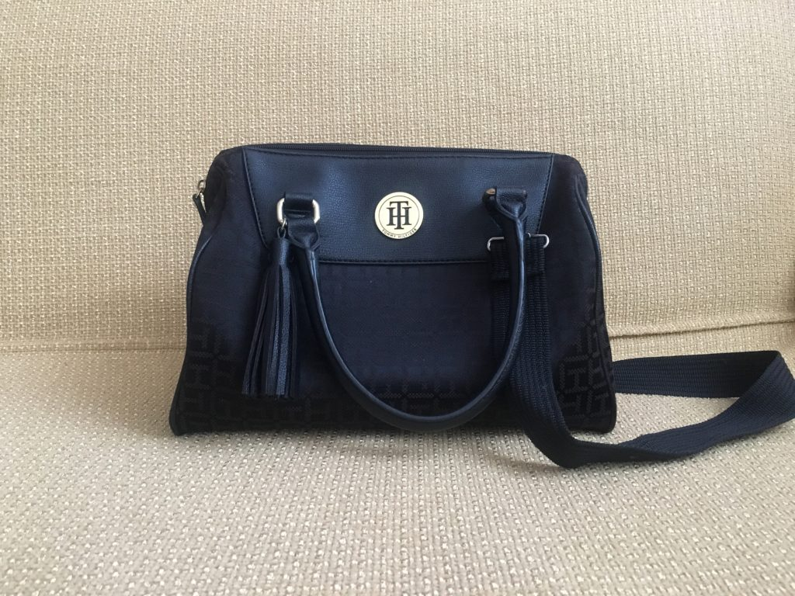
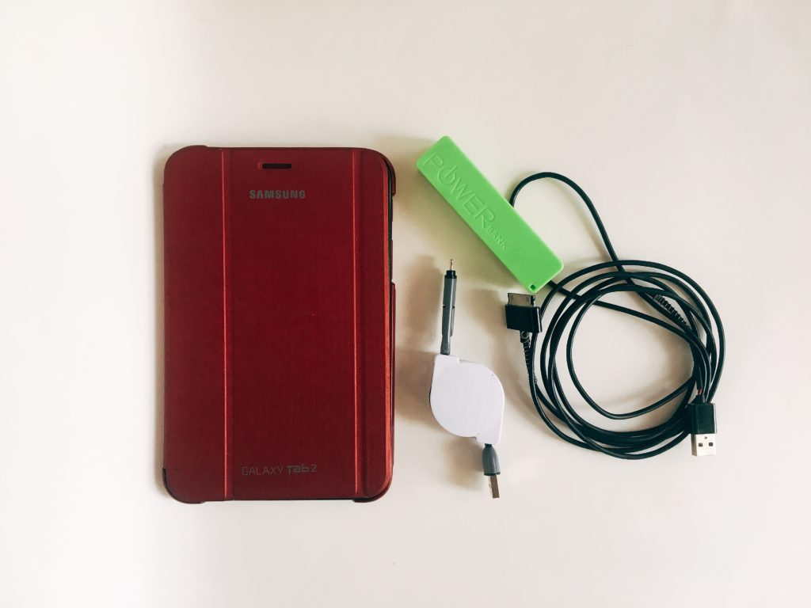
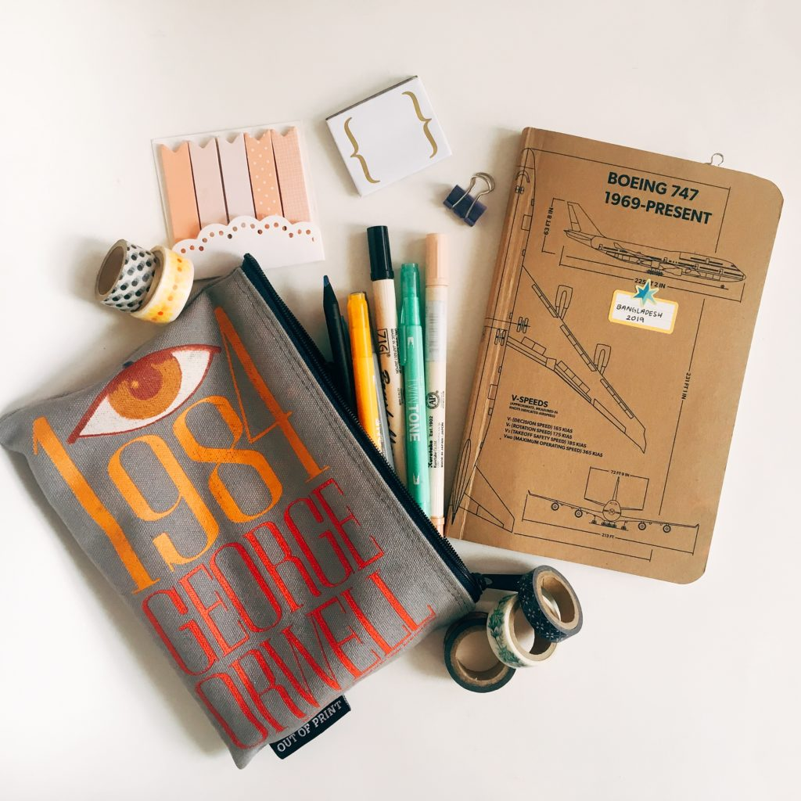
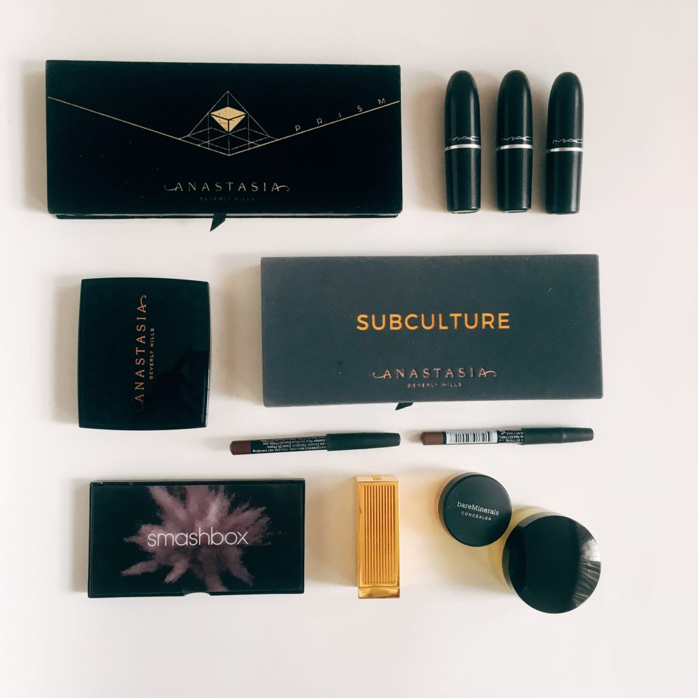
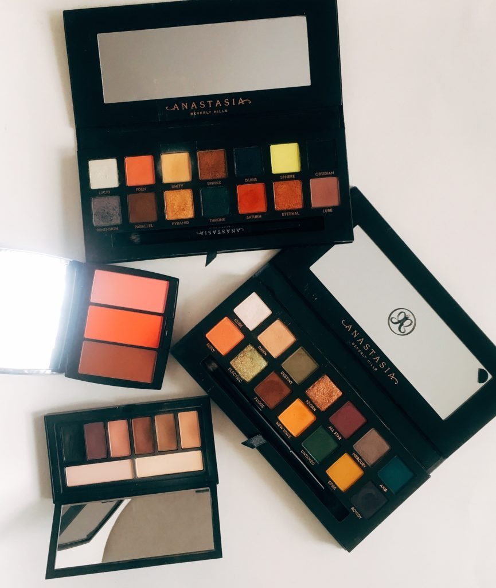
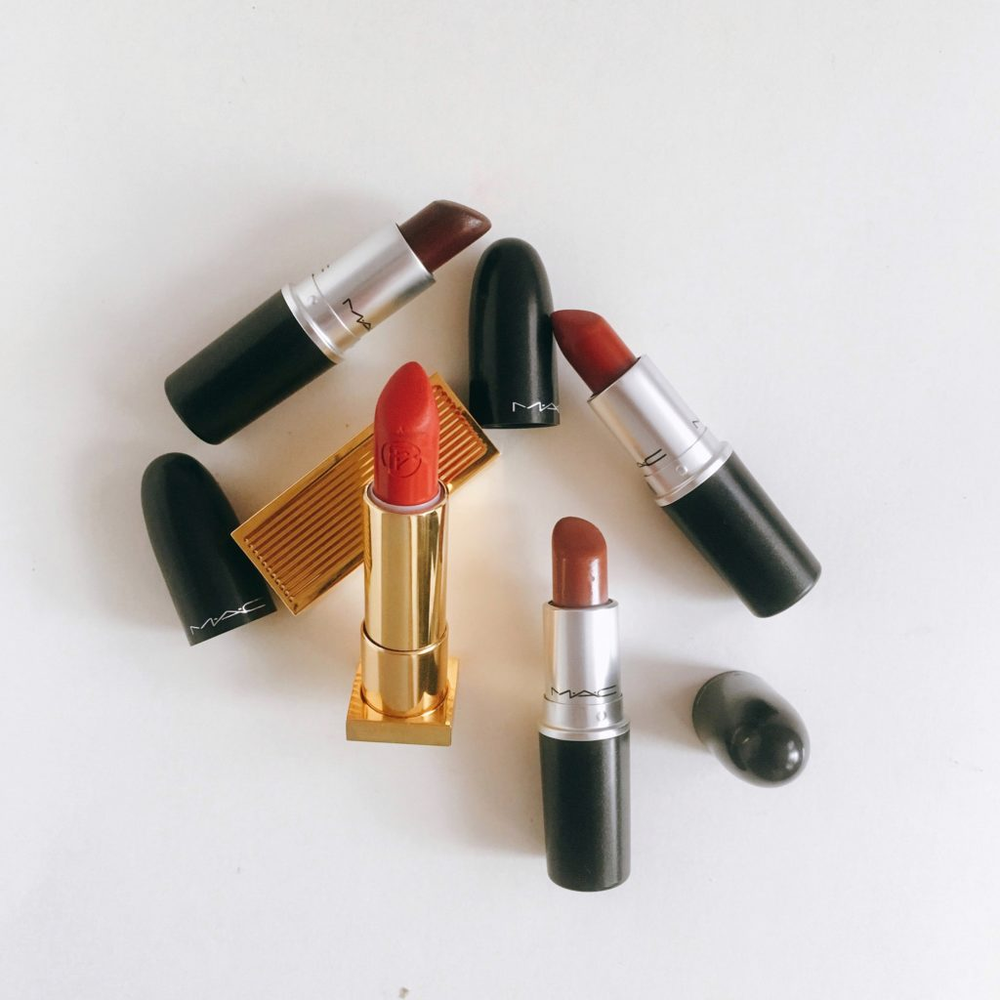
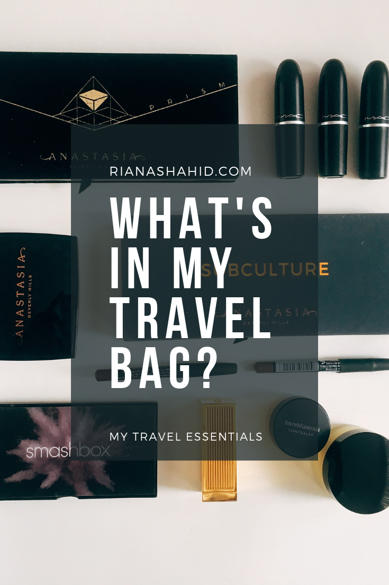

I’m the kind of traveller who is packed and ready well in advance. I hate the thought of leaving behind anything important, so I always give myself a generous window of time to make sure I have everything I’ll need.

Despite being a tote bag kind of woman in my day-to-day life, a small purse with a zipper is a must for long flights and hours spent at the airport. Luckily, I found my perfect bag right in my own closet!

I’m using a Tommy Hilfiger satchel that was gifted to me years ago. It has two short handles, but I’m also attaching a longer strap from another bag, so I can carry this hands-free. This bag is roomy without being too big, which is perfect when you’re already managing a carry-on and checked luggage. It’s also the right size to use as an everyday purse throughout my trip. The fact that this is a canvas bag is especially great, because I can use it everywhere without having to worry about it getting wet or scratched.

### Here’s everything I’m carrying in this bag:

##### Phone & Earbuds

This one’s a no brainer, but I’m going to need my phone during the flight to listen to music and podcasts or to watch movies and shows downloaded on Netflix.

##### Reading Material

I’m packing a few physical books in a checked bag to read over the course of my stay, but I wanted to have a few ebooks for the flight. I have a Samsung Galaxy Tab 2 that is now too old to be supported by any of the more fun apps, but it works perfectly as an e-reader.

##### Power Bank & Charging Cables

I don’t anticipate having to recharge any of my devices during the flight, but it’s always a good idea to be prepared!

##### Travel Journal & Journaling Supplies

This is one of the things I’m most excited about! This summer, I’m keeping a travel journal to document my entire trip. It’s going to be a combination of a scrapbook, a diary, and possibly more. Click here for a more in-depth post about travel journaling, exactly what I’m using, and how to start your own.

##### Makeup

While I wouldn’t put my makeup in a checked bag out of fear of it getting lost, I don’t want everything to get jostled around in my carry-on either. I’m keeping all of my non-liquid makeup in my purse. It’s much safer and easily accessible if needed.

##### Moisturizers

My skin gets very dry during flights, so I’m bringing my mini tube of Innisfree Cica Balm. It’s moisturizing, feels nice on the skin, and small enough to be allowed in flight. It’s a good idea to also bring something for your hands, as well as a lip balm.

##### Wet Wipes & Hand Sanitizer

If you’re not bringing some kind of hand sanitizer with you, then please re-evaluate your life choices. Seriously, airplanes are DISGUSTING. Now, I am not a germophobe to any degree. I spent several years working in preschool classrooms and I often joke that I’m immune to everything at this point.
But between some flights, trays are only wiped down with a rag at best. Having hand sanitizer and my own wipes for the trays gives me peace of mind.

##### Basics: wallet, tissues, etc.

Can’t go anywhere without these! I had some leftover taka from a previous trip, so I’m taking that with me along with cash/cards in case I need to buy anything at the airport.

**What are some things that you NEED to have while traveling?**
