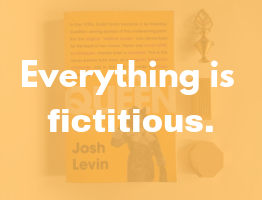

I think on some level we all love anomalies. We like people who somehow succeed even when they don’t stay on the “normal” path to success. We love hearing about people who make their own way. Linda Taylor is no exception. She purportedly used 80 aliases to get welfare checks, bought/kidnapped children to create her needy families, and murdered people who got in her way. We could call her methods extreme, even for an anomaly. Linda Taylor was a criminal who got away for most of her life. In this book, Josh Levin takes us through that life in an easy-to-follow, not quite thriller, but story that keeps you on the edge of your seat, waiting to see what comes next.

There have always been people who take advantage of the system, but despite the fact that the majority of welfare recipients actually need it, people love to hang on to wild stories. Linda Taylor allegedly defrauded the government out of over a hundred thousand dollars. In the 1970s, journalists, politicians, and especially average people became incredibly invested in the case against the woman they deemed a leech to society. Linda Taylor was a minority in the way she cheated the government, but people used her as a representative of all people on public assistance. Even when an investigation could only prove a stolen sum less than $10,000, there was no clearing of her name. I want to say that the attitude of the public towards Taylor was just a response to her extreme crimes, but the vilification of welfare recipients prevails today. People continue to police eligible purchases under the welfare program, as if financially secure people never buy anything that isn’t a necessity.

I’m not trying to argue that Linda Taylor was treated unfairly. Based on the scope of her crimes, she should have been caught much earlier. Every time it seemed like her crime spree would come to an end, she found a way to escape. And when I thought there was nothing else that could surprise me about this woman, Josh Levin throws in a twist so big that I think I audibly gasped.

I like to think of this book as “soft” true crime. It’s about as ghastly as a book about welfare fraud can be, but it is engaging even for people like myself who wouldn’t consider themselves a huge history buff. Click [here](https://www.littlebrown.com/titles/josh-levin/the-queen/9780316513272/) to learn more.