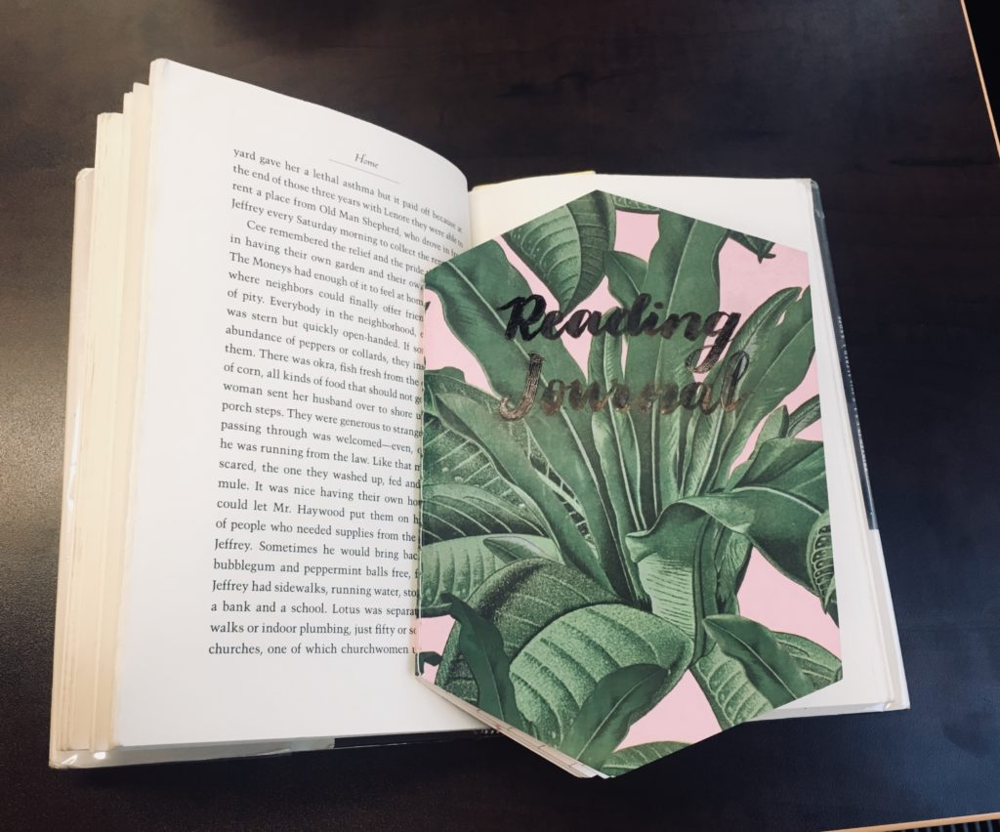
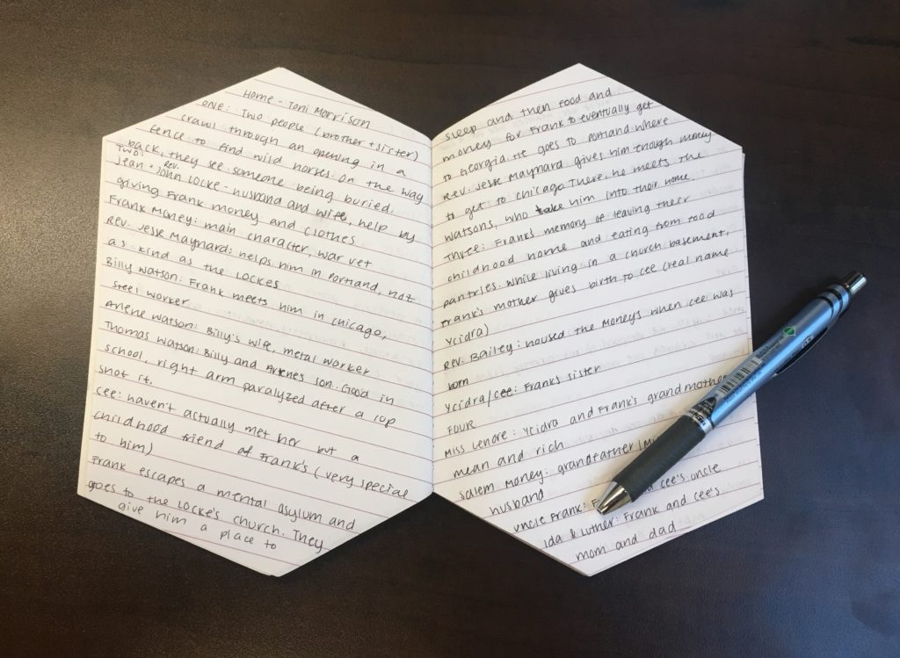

One of the goals on my Impossible List is to read 36 books in a year. I feel that reading three books each month is extremely reasonable but I’m concerned that trying to quantify reading might make me focus more on trying to finish each book rather than actually enjoying each one. So, in an effort to read more mindfully, I’m starting a reading journal.

At the end of each chapter, I’m going to take a few minutes to jot down a short summary, new characters, and quotes that stand out to me. I’m doing this in a cute, little notebook I bought from Flying Tiger Copenhagen. I chose this because it is fairly small and thin, so I won’t have to worry about carrying too many books/notebooks.

I’m looking forward to writing about all the books I read this year!
