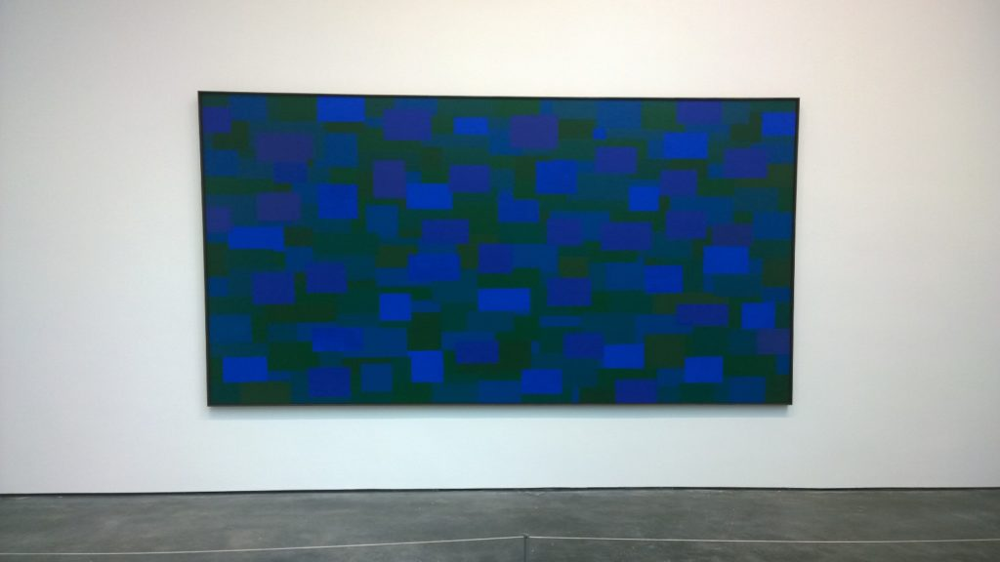
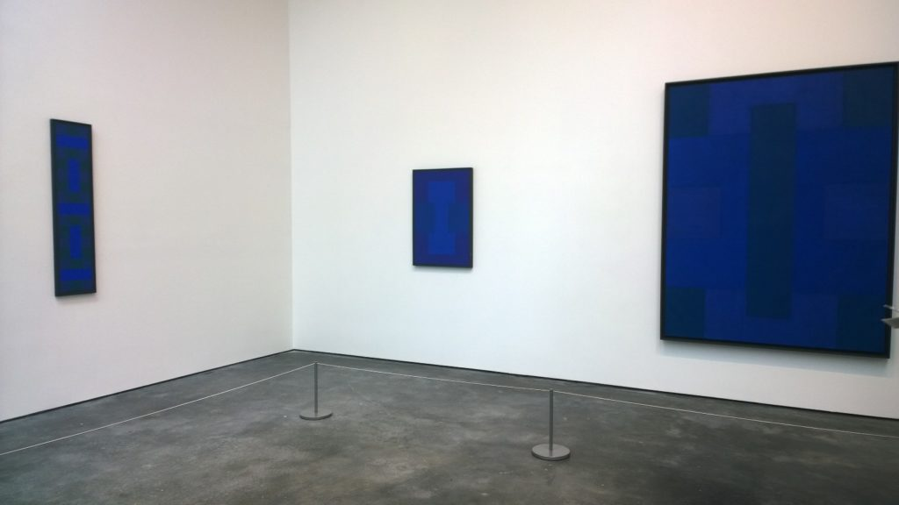
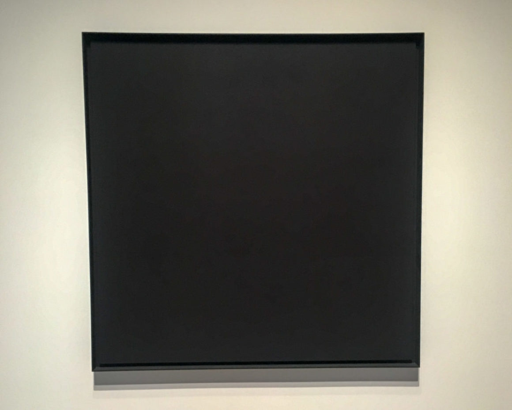
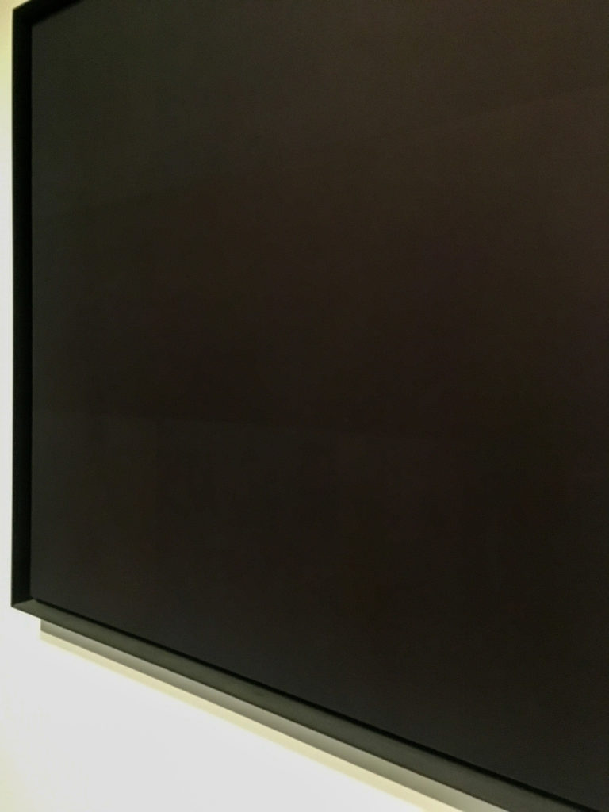

An Incomplete History of Protest is one of the Whitney’s ongoing exhibitions, featuring pieces from their vast collection. Visitors can take a walk through some of the major socio-political movements from the 1940s to present day. This timeline of events presents itself through images, paintings, and more. While the mediums of each work differ greatly, every piece in this exhibition served — and continues to serve — as a declaration that something needs to change.

On of the featured artists is Ad Reinhardt, a minimalist, abstract painter. I first encountered Reinhardt at a David Zwirner gallery in Chelsea, where I saw his blue paintings late last year.

But what caught my attention at the Whitney was his Abstract Painting, 1960-66.

Abstract Painting, 1960-66

Reinhardt describes these as:

>A square (neutral, shapeless) canvas, five feet wide, five feet high, as high as a man, as wide as a man’s outstretched arms (not large, not small, sizeless), trisected (no composition), one horizontal form negating one vertical form (formless, no top, no bottom, directionless), three (more or less) dark (lightless) no–contrasting (colorless) colors, brushwork brushed out to remove brushwork, a matte, flat, free–hand, painted surface (glossless, textureless, non–linear, no hard-edge, no soft edge) which does not reflect its surroundings—a pure, abstract, non–objective, timeless, spaceless, changeless, relationless, disinterested painting—an object that is self–conscious (no unconsciousness) ideal, transcendent, aware of no thing but art (absolutely no anti–art).

From a distance, this piece looks like one flat color, but upon closer inspection, different shades of black become visible. Achieving this look was no small feat. For these paintings, Reinhardt mixed black paint with various quantities of red, blue, and green paint. Then, he let each mixture sit undisturbed for weeks, until the pigments separated from the solvents. He could then decant the solvents, and use only the concentrated pigments on canvas. This technique hid all of his brush strokes, adding to the perceived uniformity present in his work.

### What does Reinhardt’s Abstract Painting, 1960-66 — a painting that looks like a canvas full of nothing— have to do with protest?
At this point, you might wonder why this painting shares a room with photographs of Black Panthers and Japanese internment camps.

The answer to this is in what Reinhardt believes art should be. In his art, Reinhardt wanted to exclude all references to the outside world. Everything on the canvas should exists there for the sake of it being art; not to represent something else. Those viewing any of the Black Paintings should think of nothing else but the painting.

Reinhardt’s refusal to create representational works implies his resistance to the standards of art; a protest to the idea that it should tell a story or be beautiful in some way. Think about that in terms of the entire exhibition. Protest, at its core, is resistance. Resistance to society. Resistance to the status quo. Resistance to the idea that there can be an end to protest; replacing it with the notion that the record of protest remains un-ending.

Click [here](https://www.moma.org/collection/works/78976) to see where I found Reinhardt’s quote about his black paintings.

<!-- 

    

        
    

    

        
    

 -->

<!--  -->