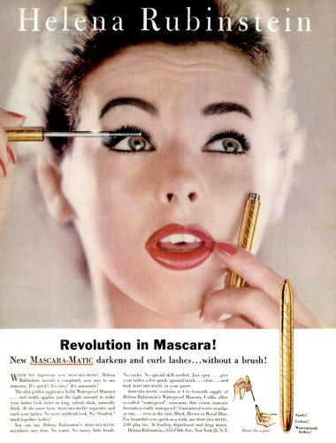
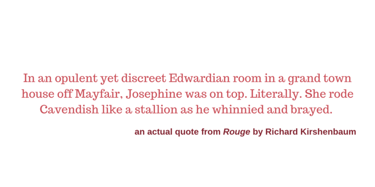

Rouge by Richard Kirshenbaum tells the story of the rise and inevitable competition between two rival beauty brands: Herz Beauty and Gardiner Cosmetics. This book feels similar to Park Avenue Summer by Renee Rosen in that they’re both historical fiction to some extent, but Rouge tells a more glamorous story about two industry giants. While Park Avenue Summer is explicit in its retelling of the history of Cosmopolitan magazine, Rogue is not. Josephine Herz and Constance Gardiner are not real historical figures, but they are based on Helena Rubenstein and Elizabeth Arden. Though the book is mainly about these two, we also follow the journey of CeeCee Lopez, who makes the first less-irritating relaxer for African American women, and Mickey Heron, who fills the high-quality-cosmetics-shaped void in Hollywood. There are also references to a certain pink and green tube of mascara, but to my knowledge, Maybelline was the only brand to use this now-iconic color combo.

As far as the actual plot goes, I really enjoyed this book. Josephine Herz and Contance Gardiner are both smart ladies who are good at what they do. I was hooked right from the first chapter, when Constance makes an appearance during Josephine’s funeral to serve Herz Beauty with a lawsuit. (Sidenote, Park Avenue Summer also opens with the announcement that a major character has died before diving in to tell their life story.)

There were sections later in the book that I felt were too flowery and superficial, especially in describing the women’s bodies and their views on their romantic relationships. One of the issues I had with Harlan Coben’s Run Away was that the author makes unnecessarily descriptive comments about women’s appearances in irrelevant passages (like when he stopped in the middle of a woman telling a traumatic story of her childhood to make sure that the readers knew the exact shade of her green eyes. Kirshenbaum keeps these kinds of descriptions in contexts where they actually make sense, but there were a few eyeroll-worthy passages.

Something interesting that I noticed as I read this book was that it’s hard to root for any one character. There’s no clear good guy or bad guy. Every character has their faults, and since our main characters are business rivals, they constantly work to one-up the other. Even when they aren’t, they aren’t exactly kind and caring individuals. For both of the main ladies, their businesses are their top priorities. We see them consistently choose work over anything else, no matter the effect on family ties and other relationships. I can’t say I’m surprised though, as neither of them would have been able to build their international businesses any other way.

Would you read this book? What books have you read lately? Leave the title in the comments below!

P.S. In case you’re not much of a reader, don’t worry! [Sony got the rights to this book](https://variety.com/2019/film/news/sony-rouge-exclusive-1203210317/) earlier this year, so you might be seeing Herz Beauty and Gardiner Cosmetics on the big screen soon!
