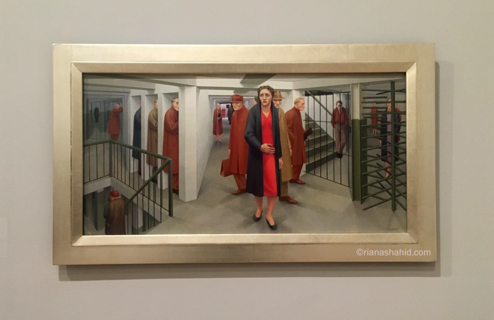

The above quote describes George Tooker’s art style perfectly. At first glance, his paintings appear almost photorealistic, but upon closer inspection, the viewer will notice oddities that defy reality. That is very much the case with The Subway. This is one of Tooker’s best-known paintings, for good reason.

The central figure in The Subway is a woman in a red dress, considerably brighter than her surroundings. She wears a pained, anxious expression, as if she is unsure of where to go next. She is surrounded by other subway riders, though she travels alone. The ideas of loneliness and, more specifically, isolation are concepts that Tooker wanted to emphasize in this painting. The subway is a familiar environment for most of us who live in the city, but Tooker’s subway is different. The Subway features cubicles that completely isolate people and long hallways that seem to lead nowhere.

>“I never really wanted to be part of the New York scene.”

Tooker was born in Brooklyn but raised in Long Island. He found urban life to be depressing and depicted this sentiment in his art. To say that George Tooker didn’t like New York City’s subway system would be an understatement. He disliked the city in general.