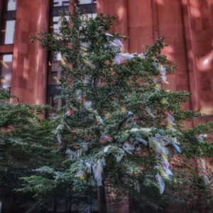
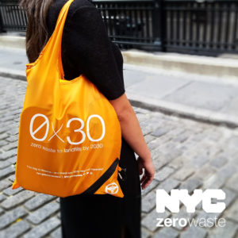

<html>
<h4>Arts & Science in Action </h4>

A few weeks ago, I wrapped up my summer class/internship at NYU: Arts & Science in Action (formerly known as “Action Research Internship”). In this program, students in the College of Arts and Sciences and Liberal Studies school of NYU partner with faculty to first learn more about issues affecting the NYU community. Then they work together to try to address those issues. This summer, we learned about a few issues within sustainability in the city.
  
More specifically, we explored the complexities of waste management in New York City. Our class tackled two big aspects of waste: the concept of zero waste and the issues surrounding green infrastructure in terms of storm water management. I chose to be on the zero waste team because that seemed like the more relatable option for me. While I definitely contribute to the amount of water that enters New York City’s sewers, I felt like there was more I could do in terms of creating less waste and urging others to do the same.
  
Like many Americans, I use countless products each day without ever considering what happens to them afterwards. Through this class, I hoped to gain a deeper understanding of what happens to the waste stream in my city as a whole as well as how it compares to NYU’s own waste management.
  
Before we could work together to come up with action steps that NYU could take, we had to educate ourselves about our resource use and current state of waste management. To do this, we read and discussed relevant articles and reports and took part in all kinds of field work. This is really what made this program stand out to me. Field work involved:

<ul>
    <li>going to specific sites that were related to our class </li>
    <li>sitting in on conference calls and meetings</li>
    <li>going on exciting field trips</li>
</ul>

This allowed me to see how the topics we discussed as a class extended beyond the classroom to New York University and New York City as well. Some of the field excursions included: the Central Park Conservatory Garden, a tour of the Silver Center at NYU, a waste audit at the Silver Center, a trip to Sims Municipal Recycling Facility, and a grant-writing workshop by the Department of Environmental Protection. I’l be writing more about the field excursions in-depth in a second blog post.

</html>
<!-- 
 -->
    <!--  -->
<!-- 
 -->

<html>
<h4>The Lemon</h4>
While my classmates and I had our own responsibilities for either the Zero Waste report or the Green Infrastructure grant, we all collaborated on The Lemon. A “lemon” is something that has become unsatisfactory or defective. Our “lemon” was a tree that no longer could serve as just a beautiful, natural addition to the city streets. It could no longer just be something straight from nature, untainted by the side effects of modern life. Our lemon was a big tree that we draped in plastic bags (with the help of an arborist).

Have you ever seen a plastic bag (or two) caught in the branches of a tree?

That’s what inspired this project. We wanted to make a point about how prevalent the issue of plastic bag waste really is. So, my classmates collected plastic bags that they found around the NYU campus and tied them to a long chain that was later draped over the tree. Then, we all gathered near the tree one Friday afternoon to talk to passersby about our project and to inspire them to sign a petition for a plastic bag fee in the city.

Plastic bags are such an integral part of our lives that we don’t think about the negative aspects that they carry. According to Sam Silver from Sims Municipal Recycling Facility, we send 18 tons of plastic bags to landfills every day. How much does a plastic bag weigh? Nearly nothing! Eighteen tons worth of plastic bags is an immensely massive amount and we send that much plastic to landfills each and every day. Many stores advertise that they collect plastic bags for recycling but the sad truth is that very few of these bags actually get recycled. Not all facilities are equipped to handle the type of plastic that makes up these bags. The facilities that can recycle these bags are often too far away to collect them. The cost of sending plastic bags to these facilities usually outweighs the cost of just sending them to a landfill.

It is for these reasons that I encourage everyone to use reusable bags as often as possible. While we were engaging with passersby about The Lemon, my classmates and I distributed reusable tote bags (courtesy of DSNY) to people who showed interest in making a difference. Each bag folds up into a tiny little pouch and can be carried in your pocket or purse for easy use.

To learn more about Arts & Science in Action and what we did this summer, please read check out NYU’s [Sustainablog](https://wp.nyu.edu/sustainability-nyusustainablog/), where you can read [this article](https://wp.nyu.edu/sustainability-nyusustainablog/2017/07/05/arts-science-in-action-nyus-student-sustainability-project/), written by one of my classmates.
</html>
