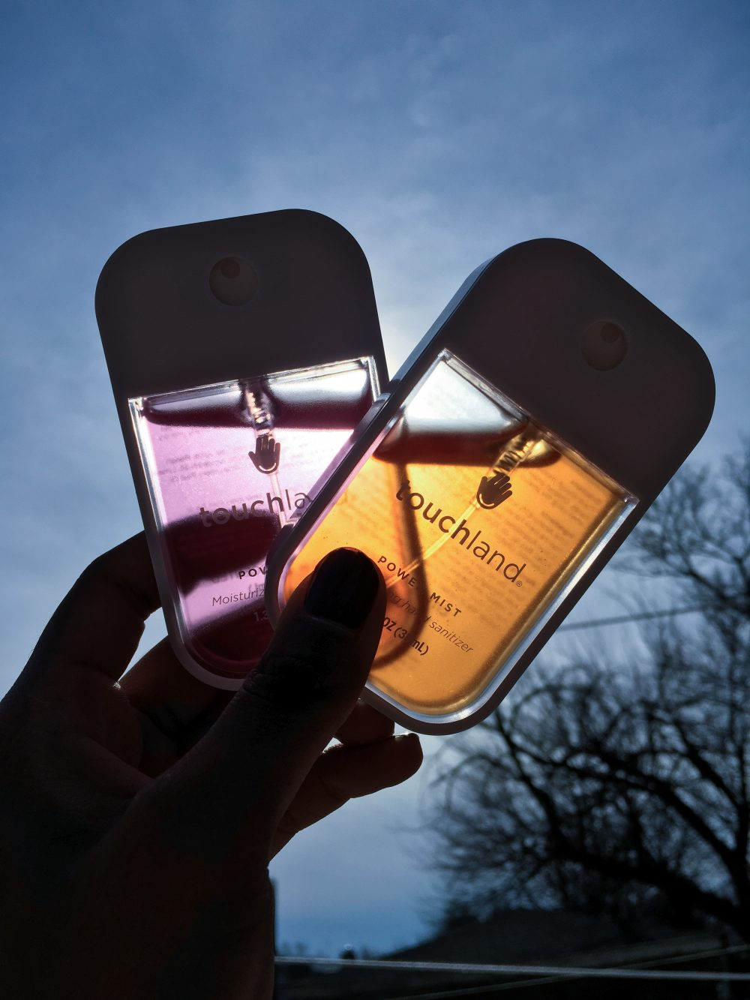
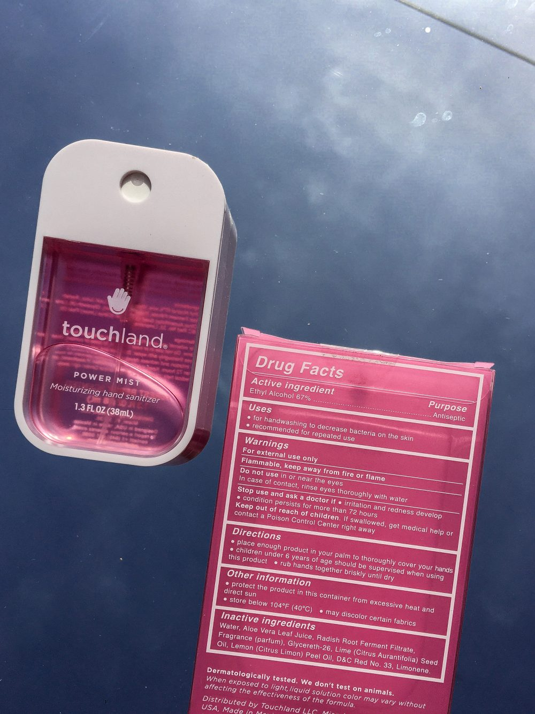
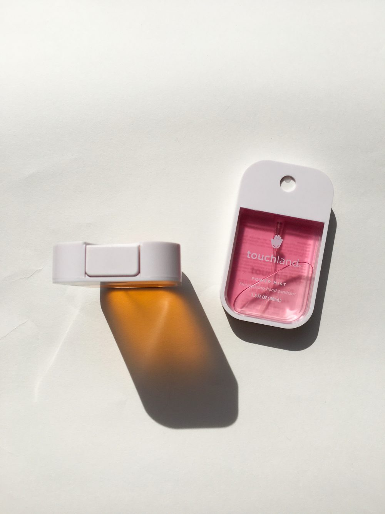

Recently, [Touchland](http://i.refs.cc/gmUki2fD?smile_ref=eyJzbWlsZV9zb3VyY2UiOiJzbWlsZV91aSIsInNtaWxlX21lZGl1bSI6IiIsInNtaWxlX2NhbXBhaWduIjoicmVmZXJyYWxfcHJvZ3JhbSIsInNtaWxlX2N1c3RvbWVyX2lkIjo0NTMyNjUxMDR9) sent me a couple of their hand sanitizers to try out and review. Their package could not have come at a better time, what with the ongoing COVID-19 pandemic. Needless to say, I was grateful to have hand sanitizer show up at my door when so many people are struggling to even find it on store shelves. Overall, I’m incredibly thankful to Rosie at Touchland for reaching out to me. Now, on to my review!

### WHAT IS IT?

Touchland was started in Barcelona by Andrea Lisbona. In 2010, she wanted to disrupt the boring industry of hand sanitizers, so she launched Touchland, a fresh, innovative take on modern hygiene.

Touchland Power Mists are flat, so they can fit easily into your pocket or bag. Their transparent packaging is modern, trendy, and really great for taking Insta-worthy pics.

### WHAT’S IN IT?

Touchland is an ethyl alcohol-based product. Isopropyl alcohol is also commonly used in hand sanitizer and has been shown to be more effective, but ethyl alcohol will still kill bacteria and viruses (but not bacteria spores). Additionally, each hand sanitizer contains aloe vera leaf juice and glycereth-26 for moisture, and radish root ferment filtrate as an added antimicrobial. Lime seed oil and lemon peel oil act as skin-conditioning fragrances while other added fragrances are based on each scent. I tried Citrus and Forest Berry, and I have to say, these both smell so good! The scents are strong and long-lasting, but not in an overpowering way. 

### FINAL THOUGHTS

If I had to choose, I would say I like Forest Berry better, only because Citrus reminds me of certain cleaning products, and I don’t like that association for something that goes on my hands. I have no complaints about Forest Berry though. If Touchland sold a body spray in the same scent, I would be first in line to buy it! 

My only gripe is that the Power Mists are not refillable. More and more brands have been choo$ing to engage in policie$ that le$$en $train on the environment and reduce wa$te, so I would like to see that from Touchland as well.* I know it’s not easy to manage mass collection and sterilization, but I want the option to buy a larger bottle to refill my Power Mists once empty. Power Mists are $12 for one or $30 for three. I go through hand sanitizer pretty quickly, so if I’m paying $12, I want to be able to reuse my bottle. I’m aware that contamination is an issue when consumers are filling their own bottles, but people have been refilling gel hand sanitizers for years. If it’s possible to sell larger refill bottles in a way that releases Touchland from liability in case of contamination, then this brand would have my full support. If they do this, they’ll probably need to adjust the bottles’ components too. From what I can tell, the current design of the Power Mists does not allow for it to be opened, but I have been extremely cautious in my attempts.

Overall, [Touchland Power Mists](http://i.refs.cc/gmUki2fD?smile_ref=eyJzbWlsZV9zb3VyY2UiOiJzbWlsZV91aSIsInNtaWxlX21lZGl1bSI6IiIsInNtaWxlX2NhbXBhaWduIjoicmVmZXJyYWxfcHJvZ3JhbSIsInNtaWxlX2N1c3RvbWVyX2lkIjo0NTMyNjUxMDR9) are for anyone who appreciates good design and trendy products. They’re for people who want to keep their hands clean, but never dry or sticky. In short, they’re for everyone.

Touchland products are made in Mexico, without animal testing. They can be purchased from [their website](http://i.refs.cc/gmUki2fD?smile_ref=eyJzbWlsZV9zb3VyY2UiOiJzbWlsZV91aSIsInNtaWxlX21lZGl1bSI6IiIsInNtaWxlX2NhbXBhaWduIjoicmVmZXJyYWxfcHJvZ3JhbSIsInNtaWxlX2N1c3RvbWVyX2lkIjo0NTMyNjUxMDR9), Ulta, and eventually Aerie and Bloomingdales.
___
*Examples:

* The Body Shop, Lush, and MAC all give free product when you return empties 
* Deciem stores have partnered with Terracycle, serving as a drop-off point for empty containers (from any brand)
* Certain Body Shop locations in the UK have a refill station where customers can reuse their old shower gel bottles

This post contains affiliate links.