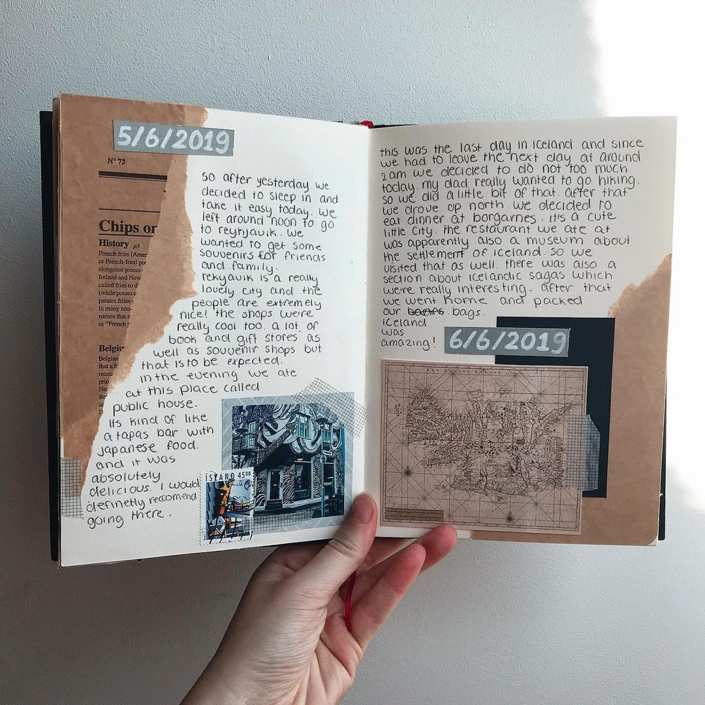
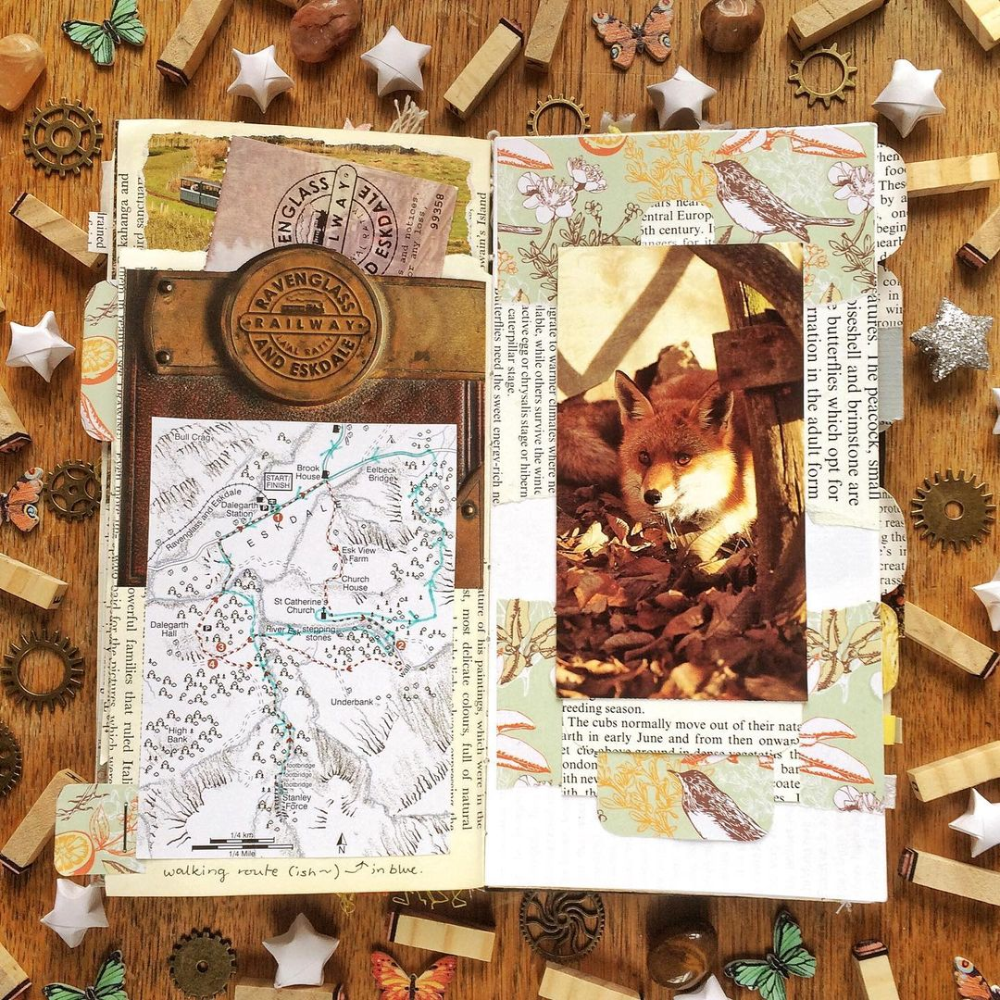
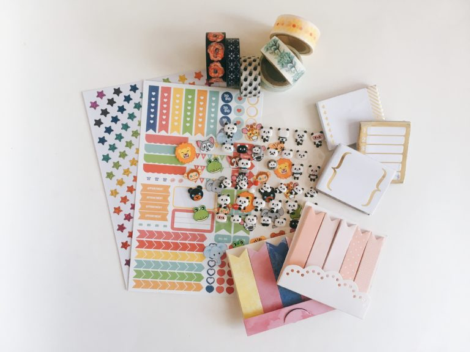
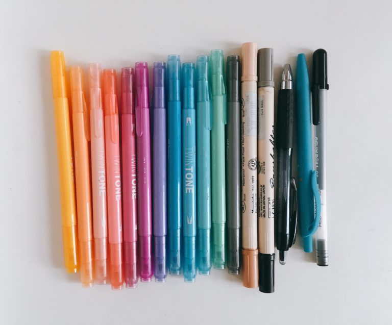

As mentioned on my Instagram, I will be keeping a travel journal this summer, during my trip to Bangladesh. This is a new format for me, since I’ve never kept a journal specifically for travel before. I love the way journaling makes me feel and I tend to hold on to souvenirs like ticket stubs, receipts from cool places, etc. so a travel journal is the perfect way to document my summer. As with all journaling, there is no right or wrong way to do it. You choose whatever structure works for you. Generally, a travel journal can be either a combination of a diary and scrapbook, full of exciting memories and pictures, or a kind of log to track the places you’ve been or want to go.

Take a look at these examples:

For my travel journal, I’m using a 5’’ x 8’’ lined notebook from Owen&Fred (which has since rebranded as Boarding Pass NYC). It has 70 pages, so filling it up in one summer is not out of the question, but I won’t feel like I’m going to run out of space. Ideally, I would have liked to use an unlined journal, but come on, just LOOK at it!

The cover is decorated in blueprints from different versions of the Boeing 747. I received this notebook as a gift at a Birchbox event of all places, but since I was journaling in a simple Picadilly notebook at the time, this journal sat on my bookshelf until now. Airplanes might be a little on the nose for a travel journal, but I think it’s cute.

### Supplies

While you do not need to focus on aesthetics at all when it comes to journaling, it really is a lot of fun. Here are all the things that I’m using:

##### Stickers, Washi Tape, Sticky Notes

Stickers and washi tape are the easiest ways to spruce up your journal pages. Aside from their aesthetic purposes, you can also use them to attach pictures and keepsakes to your journal.

I bought all of the stickers, tape, and sticky notes from Michael’s over the years. I’ve used a lot of cheap washi tape from Amazon, but I prefer the Michael’s brand. I love how their tape has a papery feel to it. It’s very easy to tear by hand, which is necessary since your scissors might not be allowed on the plane. Plus, they are only 3/$1!

##### Tombow TwinTone Pastel Markers

I’ve been a fan of Tombow markers for years, so this set of markers was a natural choice. The pastel colors go well together and are light enough that they don’t bleed through the page. The best part is that each marker is double ended. One side has a standard thin marker, while the other is an extremely fine-point.

##### Kuretake Zig Brushables Dual Tip Markers

I love the look of brush lettering so I knew I would take some kind of brush pen with me. Tombow dual ended brush pens are usually my go-to, but their markers are too long to fit comfortably in my pencilcase. Zig Kuretake markers are much shorter and have a different tone on each end. One color is from their Zig Memory System line, while the other end is a 50% tint of the same color. The markers in the picture are Fawn (064) and Pure Black (010).

##### Pens

I pretty much only use Uniball Signo 207 0.38 mm pens (other pens smear or skip), but I’m also taking some others ~~incase the altitude and pressure changes make me rethink my weird loyalty for one obscure line of pens~~. If you think three pens won’t be enough for a summer-long trip, you’re probably right. I plan on buying a pack of Matador ballpoint pens from Bangladesh as soon as I get there. They are my all-time favorite ballpoints, with ink smooth and dark enough to rival any liquid gel pens (including my Uniballs!)

##### Pencil/Eraser (not pictured)

I’m a huge pencil snob too, but I don’t want to risk the pages fading and smearing over time. I’ll be writing in pen to ensure longevity of the journal as a souvenir itself. That being said, I’m still taking one mechanical pencil and pack of lead, incase I want to draw something.

### Journaling Prompts
I don’t mean to sound repetitive, but there is literally NO WRONG WAY to journal. But we could all use some inspiration sometimes:

##### Before the trip

* packing list for checked bags
* packing list for carry-on
* packing list for your purse/handbag (basically, anything you need to have easy access to without going into the overhead bin)
* list of everyone you want to bring souvenirs for
* food you want to try
* attractions you want to see
* how you feel about your trip, what you’re looking forward to, etc.

##### During the trip

* daily list of everything you did
* daily list of every regional food item you ate
* attach tickets, receipts, pressed flowers, etc.
* interactions with locals
* how your expectations for the trip are holding up
* news/current events

##### After the trip

* reflect on your trip as a whole
* favorite/least favorite parts
* things that surprised you
* how useful your packing lists were: what you would bring/leave at home next time
* plans for future trips

**Have you ever kept a travel journal? What other prompts would you include?**