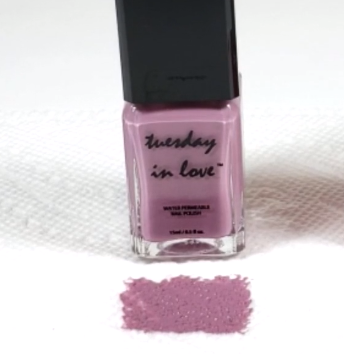

UPDATE: After sharing my review with Tuesday in Love, they addressed some things I got wrong and explained why I got the results I did. Check out the update here.

***

Like many people, I appreciate a good manicure. However, I can’t always have my nails painted because nail polish usually isn’t water permeable. I had heard of water permeable nail polish and wanted to try it, so I reached out to Tuesday in Love to test out their formula.

### Why “water permeable”?

Permeability is important for Muslims because we must do wudhu before praying or reciting Qur’an. This is a process of ablution to purify and cleanse the body. The problem is that wearing nail polish prevents water from reaching the nails.

_Enter water permeable nail polish!_

Tuesday in Love claims that their nail polish allows water molecules to pass through, making it a suitable choice for Muslims who want to paint their nails without having to forgo prayer.

### Does it really work?

I sure hope so! But seriously, not only is this nail polish halal certified by ISNA (Islamic Society of North America), they even have their clinical test results to back it up. You can view their report here but in summary, a hygrometer was used to confirm that water does in fact pass through two coats of the nail polish.

### The Famous Paper Towel Test

It seems that permeable nail polish is always tested in the same way: apply one or two coats to a paper towel and let dry. Then, place a drop of water to the surface and observe as the water magically soaks through. While this method has somehow become the standard, I’m wary of its accuracy for one reason: capillary action.

Capillary action is the reason paper towels are so absorbent. They suck up as much liquid as they can by bringing it far into the paper towel. That means that when you dip one corner in water, before long, your entire paper towel will be soaked.

So what does this have to do with testing nail polish? Most paper towels have some sort of raised pattern on them (more surface area = more absorbent), so it’s challenging to fully cover the surface with polish. Even when it looks like you have full coverage, you might still have tiny holes where the paper towel is exposed

Take a look at this screenshot from Tuesday in Love’s own video. I’m fairly certain that the white specks are holes in coverage. When you place a drop of water on top, instead of soaking through the layer of nail polish, the water will soak through the exposed paper towel instead. This does not test permeability of the nail polish unless you can ensure complete coverage.

That’s why for my test, I applied the nail polish with a sponge. I wanted to make sure I was able to get into all the nooks and crannies, however small they may be.
<html>

<iframe src="//gifs.com/embed/tuesday-in-love-on-paper-towel-71gM5r" frameborder="0" scrolling="no" width="480" height="270" style="backface-visibility: hidden; transform: scale(1); position: absolute; height: 100%; width: 100%;"></iframe>
</html>
The video was approximately two and a half minutes long before editing. I could see small gaps in the square that was applied with a brush, but the water still passed through in both cases. Turns out, the gaps are too small to really matter! Click to read more ADD LINK TO SECOND POST HERE.

In the spirit of leaving no stone unturned, I also wanted to test permeability without a paper towel. I painted two coats of the nail polish onto a sheet of plastic and let it dry before carefully peeling it off. Then, I placed the pieces of nail polish onto a paper towel and continued the test as normal.
<html>

<iframe src="//gifs.com/embed/til-test-r8LpOE" frameborder="0" scrolling="no" width="1024" height="576" style="backface-visibility: hidden; transform: scale(1); position: absolute; height: 100%; width: 100%;"></iframe>

<iframe src="//gifs.com/embed/results-wVQ5pg" frameborder="0" scrolling="no" width="297" height="272" style="backface-visibility: hidden; transform: scale(1); position: absolute; height: 100%; width: 100%;"></iframe>

</html>

### Results

My camera battery died before the water droplet fully passed through, but I could see that the water definitely impacted the nail polish. Skip through the video (which was 46 minutes long before I sped it up!) and you’ll see that something happens to the water. It doesn’t pass through, like it does on a paper towel, but there is a noticeable change. The sheet of nail polish looked and felt thinner in the place where the water was applied. And while the drop of water didn’t completely disappear from where it was applied, I could feel moisture on the back of the piece of nail polish.

I’m curious to know why the water doesn’t flow through the layer of nail polish alone. But more importantly, I want to know which case is a better representation of how the nail polish performs when it’s on the nails. If the paper towel method is indeed more accurate, then we’re all good! The water passes through the nail polish easily when it’s applied to a paper towel. But if the second test is a more accurate picture, then we might have a problem. No one takes 46 minutes to do wudhu, so it’s unclear if it would be enough time for water to reach the nail. However, this nail polish is halal certified by ISNA and is trusted by many worldwide, so I’m inclined to think (read: hope) that the paper towel test is proof enough. What do you think? Would you try this nail polish?

___
Since writing this review, Tuesday in Love has come up with a NEW way of testing permeability. Their new method addresses the issues of testing without a paper towel. Check out their updates here.
___

