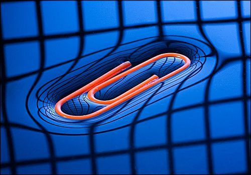
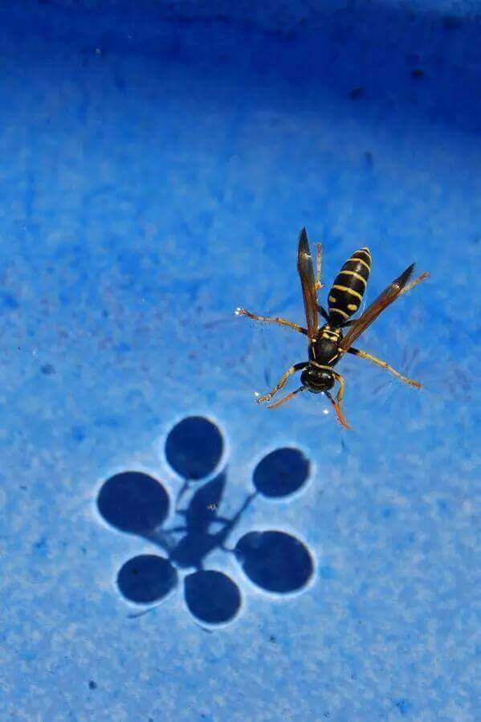
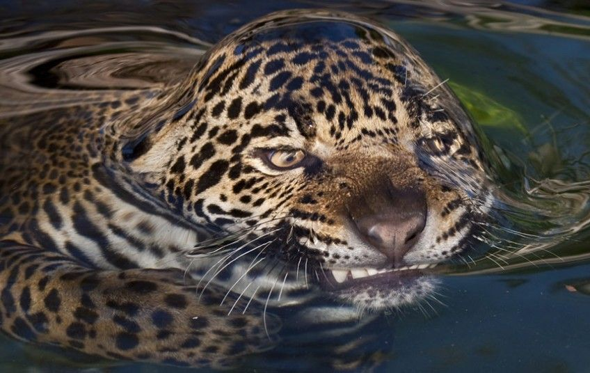

Last week, I tested out Tuesday in Love’s Water Permeable nail polish.(Read that review here.) There were a couple things I had concerns about, but after sharing my review with the company, they were able to put all my concerns to rest!

### Coverage Issues

I noticed that in other tests of permeability, the nail polish is always applied to a paper towel using a brush. This can lead to tiny gaps where the paper towel is exposed. I thought that because of the absorbent nature of paper towels, these gaps would pull water through. This means that instead of water going through the nail polish, as it’s supposed to, it goes through the paper towel directly. Obviously, this isn’t a good measure of permeability.

BUT, it turns out that the gaps do not matter! The reason is surface tension.

We all learned in school that liquids take the shape of their container. Furthermore, water molecules are attracted to each other with a force stronger than that between water and other surfaces. This leads a body of water to reduce its surface area. The water molecules “pull in” the top-most layer of water, creating tension at the surface. When this happens, some organisms can actually walk on the surface of water!

This paperclip is light enough to sit atop the water without breaking its surface tension.

This wasp is not floating on the water. It’s standing on the surface. The shadow shows how the water’s surface bends around each leg. The weight of the wasp is not enough to break through the surface.

Surface tension also affects things trying to come out from below the surface. An animal as big as a jaguar is definitely strong enough to break the surface tension, but there’s still a moment where the surface “bends” as the jaguar tries to break through.

So, what does this mean in terms of nail polish? The specks of exposed paper towel are not big enough to break the surface tension of the water droplet. I haven’t had a chance to test this out myself, but according to Tuesday in Love, repeating this test with non-permeable nail polish will show that the specks do not matter. 

### Why the “Paper Towel Test”?

It turns out that there’s a reason everybody uses paper towels to test permeability. When people wash their hands or do wudhu, the force of the water from the tap can be anywhere from 30 to 60 psi (pound-force per square inch). This is a measure of the pressure of the water as it hits the surface of the nail. In this case, the water will go through the layer of nail polish instantly. Obviously, using an eyedropper to drip water onto a surface will not have nearly as much force as a tap, so the paper towel is needed to “pull” the water through. It also helps to show the flow of water in one direction. Tuesday in Love explained to me that when the nail polish is applied to a hard, non-absorbent surface, it looks like water just sits on top of it. But what actually happens is that water flows in both directions (through the nail polish and then back up).

### Why the “peeling” method doesn’t work

I was disappointed in my last post that my method of trying to test the nail polish without a paper towel didn’t work. I didn’t know enough about how the nail polish behaves on a microscopic level to understand what happens in each scenario (i.e. on a paper towel vs on its own). Tuesday in Love’s explanation clears up the issue completely:

>Some attempts have been made to perform the Water Permeability Test by using a layer of nail polish that has been peeled off a hard surface and then placed on an absorbent surface. This method creates a false negative due to the contraction of the peeled nail polish. Think of the nail polish as a balloon with holes, stretched over a rough surface. When stretched, the holes become large (hence allowing water molecules to pass through. However, once the nail polish is peeled off of a surface (such as glass or plastic) the nail polish contracts and the water channels/pores of the nail polish contract and miniaturize. This prevents the water from passing through the nail polish.

Furthermore, Tuesday in Love came up with a way to test permeability on a hard surface!
<html>
<iframe width="560" height="315" src="https://www.youtube.com/embed/LESEfRvzSpA" frameborder="0" allow="accelerometer; autoplay; clipboard-write; encrypted-media; gyroscope; picture-in-picture" allowfullscreen></iframe>
</html>