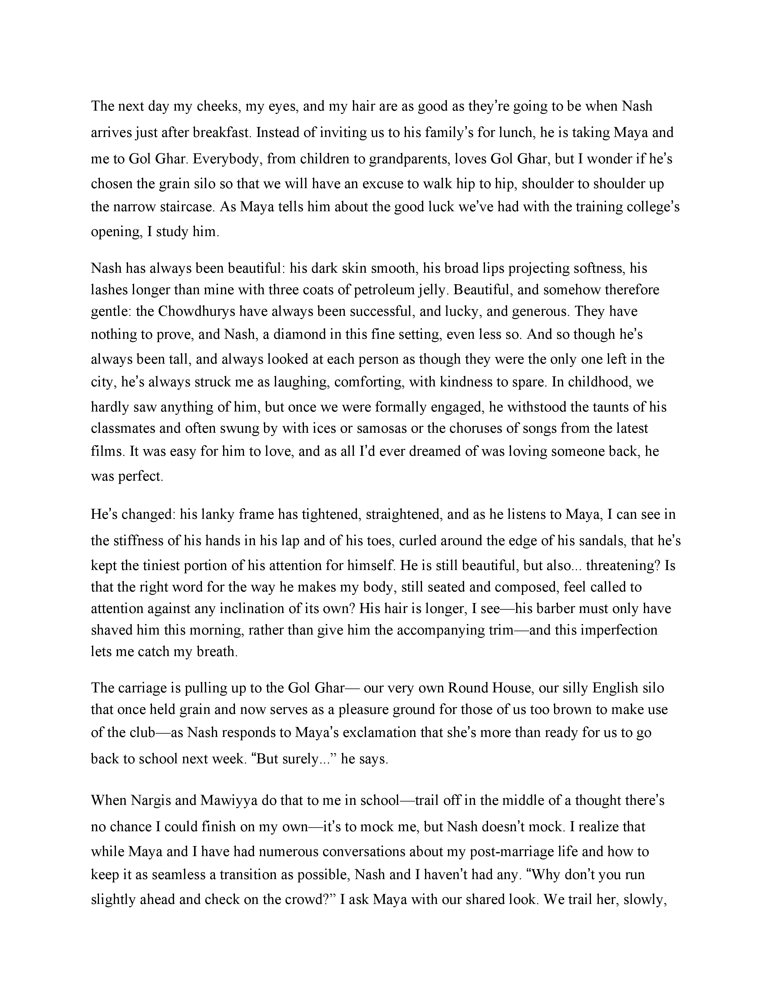
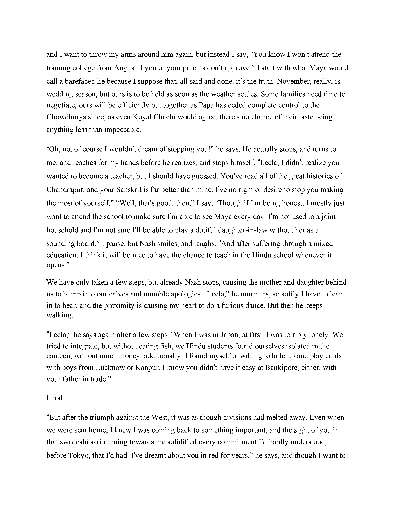
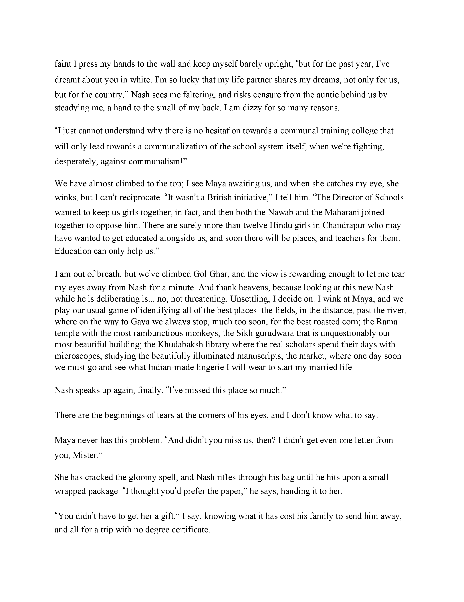
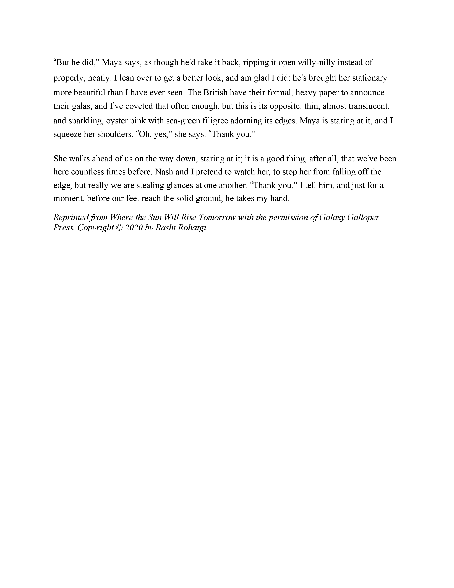

>It’s 1905, and Japan’s victory over the Russians in the Russo-Japanese War has shocked the British and their imperial subjects. In India, 16-year-old Leela and her younger sister, Maya, are spurred on to wear homespun as a sign of protest to show the British that the Indians won’t be oppressed for much longer, either. 
>
>But when Leela’s betrothed, Nash, asks her to circulate a petition amongst her classmates to desegregate the girls’ school in Chandrapur, she’s wary. She needs to remind Maya that the old ways are not all bad, for soon Maya will have to join her own betrothed and his family in their quiet village. When she discovers that Maya has embarked on a forbidden romance, Leela’s response shocks her family, her town, and her country firmly into the new century.
> 
>
>summary provided by FSB Associates

First of all, let me say that Rashi Rohatgi does a fantasic job of explaining enough of the history and politics of the era to immerse the reader without turning this into a textbook (*cough cough* Sophie’s World). Alongside these history lessons, we learn about the love first between Leela and Nash, and then her sister and a boy who she normally wouldn’t be able to interact with. 
 
After the Japanese victory, Britain pulls out all of the Indian citizens studying in Japan, including Nash. Whille this disrupts the plan Leela and Nash had to get married after he got his degree, their plan become even more scattered when Nash has more revolutionary ideas in mind. Initially, schools in India were segregated by religion. Nash wants Leela to help him bring the schools together to show a sense of unity among Indians. Leela supports him, but is wary about why it has to be her. Of course, she wants her people to be united, but she was done with all of this already. She had left school, she was engaged to someone she loved, she was ready to start her new life. Now she must reconcile what is expected of her from her culture and family and what she feels is right in these desperate times.  
Keep reading for an excerpt:

___

___

___

___

<html>
    

    
    

        Rashi Rohatgi is the author of Where the Sun Will Rise Tomorrow. An Indian-American Pennsylvania native who lives in Arctic Norway, her short fiction and poetry have appeared in A-Minor Magazine, The Misty Review, Anima, Allegro Poetry, Lunar Poetry, and Boston Accent Lit. Her non-fiction and reviews have appeared in The Review Review, Wasafiri, World Literature Today, Africa in Words, The Aerogram, and The Toast. She is a graduates of Bread Loaf Sicily and associate professor of English at Nord University. Learn more about Rashi here. (author bio provided by FSB Associates)
    

</html>

