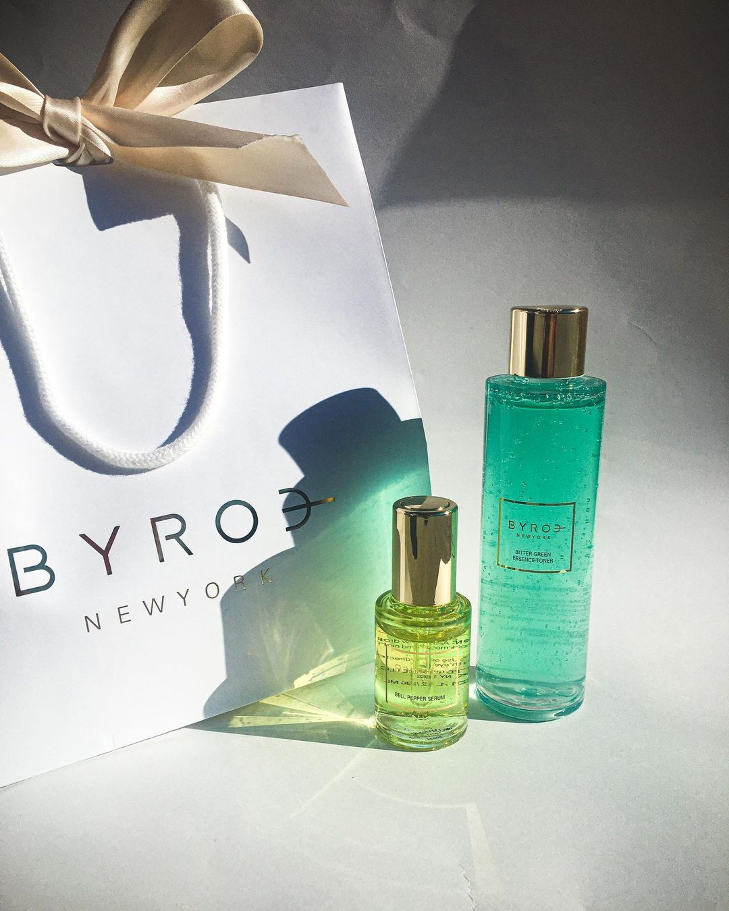
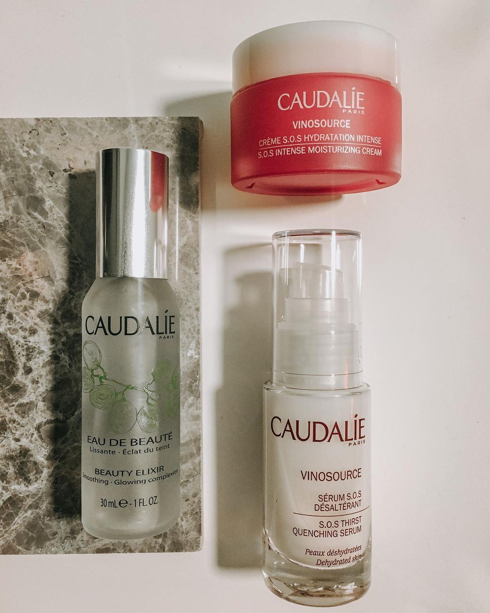
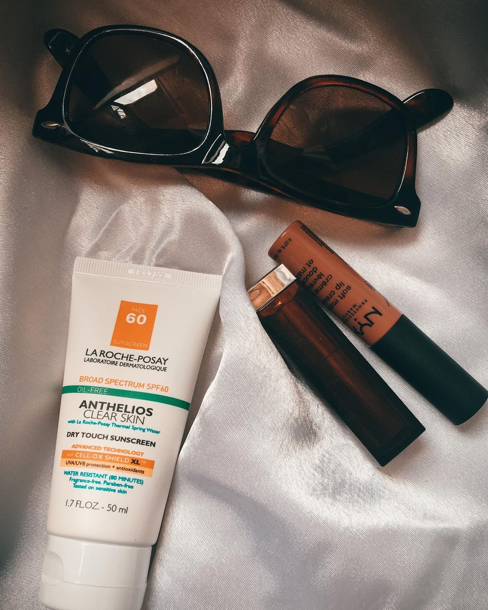
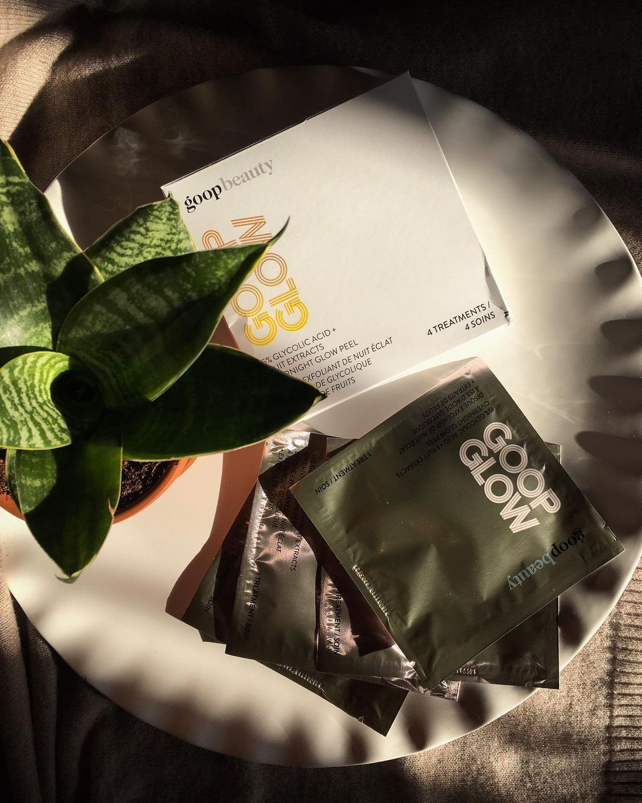

As I’ve gotten older, my combination skin has gotten more extreme. The oily parts have gotten oilier and the dry parts have gotten drier. This, combined with the harsh winter air means that I’ve had to change my routine quite a bit.

### Winter Skincare Basics

Regardless of your skin type, here are some general rules to abide by:

##### Hydrate

Winter is not only cold — it’s also dry. Low humidity means that you need to moisturize inside and out. Slather on the face creams and drink lots of water too!

##### Exfoliate

If you deal with hyperpigmentation like I do, then you know that every spot gets worse in the summer. Winter is the perfect time to work on exfoliating the skin to fade these spots because let’s be real, I am not spending as much time out in the sun this season. Even if you don’t have hyperpigmentation, you can still reap the benefits of smooother, softer skin through exfoliation. I personally would advise against physical scrubs and recommend you use chemical exfoliants. Keep reading to see which products I stand behind!

##### Hydrate Again

with masks this time! While one of my favorite masks is bentonite clay with apple cider vinegar, I opt for more hydrating gel masks in the winter. Peter Thomas Roth makes a good set of gel masks, but there are so many great drugstore options. Freeman’s makes decent affordable products but you can even use plain aloe vera gel. 

##### Protect Yourself

from the sun, that is. If I was in a rush and I only had time to either brush my teeth or put on sunscreen, I would pick sunscreen. I’m THAT person. Even though this season is not as sunny as summer, the sun still rises — which means it’s shooting out UVA and UVB rays that age and burn your skin, respectively. If you do one thing from the list, let it be this!

### My Products of Choice

* Byroe Bitter Green Essence Toner*
    
   I first wrote about this brand a while ago when I reviewed this and their Bell Pepper Serum. I’m still waiting until I finish the products before writing my updated review, but I am in LOVE with this toner. I emphasized this in my original post, but I feel so refreshed every time I use this. It’s like splashing your face with cool water except now, the water smells fresh and leafy and provides a light layer of hydration.
* Caudalie Vinosource SOS Thirst-Quenching Serum and Cream*
    
   I really like how this serum sinks into the skin. I was never the type of person to avoid fragrance in skincare, so I don’t mind the scent of this at all. To me, it’s a very light fresh scent with hints of citrus. I also like to layer different products, so I need to use serums like this; meaning ones that don’t take long to absorb or pill up under heavier creams. The cream version of this is great too!
* Cerave Moisturizing Lotion

   Speaking of heavier creams, I couldn’t make this list without including my holy grail, ride or die moisturizer. L’oreal would have to do something truly heinous for me to ever stop using this. I love this product as a final layer to lock in all the moisture. It also doesn’t bother the oily parts of my skin, despite being marketed for drier skin types. My skin always feels soft and smooth when I use this. The silicones also help to “prime” the skin in preparation for makeup, if I choose to wear makeup that day.
* The Ordinary 100% Organic Cold-Pressed Rosehip Oil

   I bought this oil a while ago when rosehip oil started becoming a trendy ingredient (thanks Farah Dhukai!) but only recently started incorporating it into my routine. On the nights I feel the most dry, I pat this over the Cerave lotion as an occlusive layer. When I do this, I wake up with the most glowy, moisturized skin. For daytime, this is the perfect thing to have under sunscreen. Because this is just an oil, it’s impossible for it to pill when you apply sunscreen over it. This has been a lifesaver in terms of keeping a smooth base and also saving time (because once your products start to pill on one side of your face, it won’t stop until you’ve dusted off your entire face!). Plus, it’s from The Ordinary, so it’s very affordable. The only downside here is the scent. Rosehip oil has a nutty scent that lingers. Sometimes I can smell it through my sunscreen and makeup, but I don’t mind it. I know that the benefits outweigh the costs, so this is something I’ll keep repurchasing for a long time.
* La Roche Posay Anthelios Clear Skin Dry Touch sunscreen
    
   I’ve talked about this sunscreen on Instagram before. Good sunscreen is hard to find, especially on darker skin tones, but this just doesn’t disappoint. This line from La Roche Posay is made up of chemical sunscreens, which do not leave a white cast. Some people might experience allergic reactions to chemical sunscreens, but I haven’t had any issues (you should do a patch test if you’re unsure about your skin). What I like about this is that it doesn’t make my skin look greasy at all, which says a lot since I apply it over oil.
* Peter Thomas Roth Cucumber Gel Mask Extreme Detoxifying Hydrator

   I first tried this in a set of mini masks from the brand and later got a larger tube in my Birchbox. It doesn’t really do anything beyond hydrating, so I don’t use this too often throughout the year. This is perfect for winter however, when I actually need the moisturizing treatment.
* Goop Glow 15% Glycolic Acid + Fruit Extracts Overnight Glow Peel*
    
   I have a full review coming soon (with before and after photos) but overall, these are meant to help slough away the top layer of your dead skin cells, revealing a glowing complexion. I am no stranger to acids and my skin is not sensitive at all, so the 15% concentration is perfect for reducing texture on my skin.
* The Ordinary Glycolic Acid Toning Solution

   If you don’t regularly exfoliate, and the Goop Glow’s concentration would be too intense for you, then this is a great affordable option. It’s The Ordinary, so it costs less than $10 and it contains only 7% glycolic acid. I use this every night (because my skin can handle that) to help lighten dark spots while making existing active blemishes heal faster.

So that’s every one of my winter skin care favorites! Do you use any of these products? Anything you would add? Let me know in the comments below!

Click the links below to learn more about any of the brands mentioned:

[Byroe](https://byroe.com/), [Caudalie](https://us.caudalie.com/), [Cerave](https://www.cerave.com/), [Goop](https://shop.goop.com/shop/collection/beauty/skincare/?country=USA), [La Roche Posay](https://www.laroche-posay.us/on/demandware.store/Sites-lrp-us-Site/en_US/Default-Start?GeoRedirectOff&cm_mmc=cpc-_-googleSearchBrand-_-Search%20-%20LRP%20Brand%20-%20ex_Brand%20Short-_-kw:%20la%20roche-posay&gclid=CjwKCAiA7t3yBRADEiwA4GFlI2I8mo0FJkHv1eP4XPItBXD9A6Hy0eyUE6x8cIbon0RVbfMP2vv4jhoCvUEQAvD_BwE), [Peter Thomas Roth](https://www.peterthomasroth.com/), [The Ordinary](https://theordinary.com/)

*Certain items have been gifted but as always, all opinions are my own.