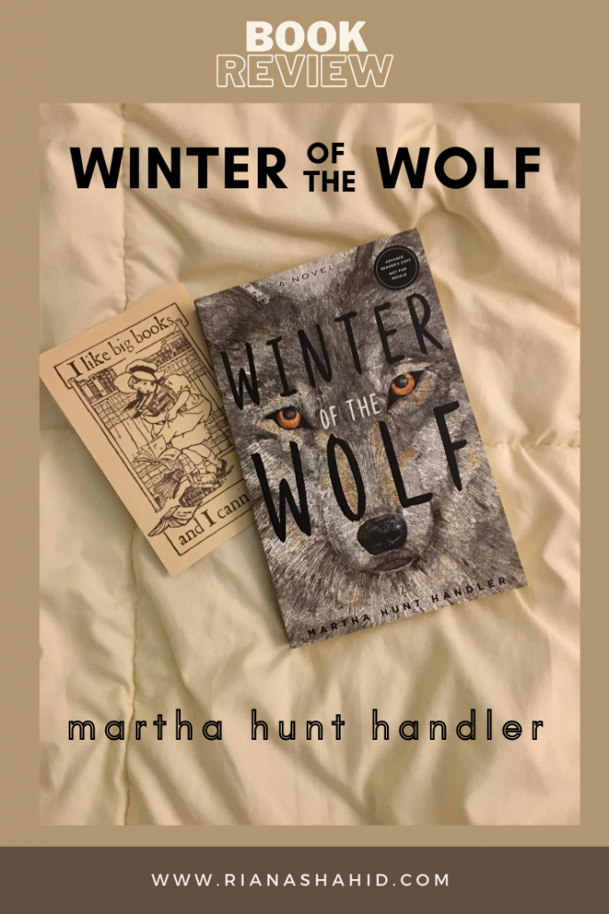

**TW: suicide/death**

_Winter of the Wolf_ was published July 7, 2020. I received an advance copy for review, but all opinions expressed are my own.

>An exploration in grief, suicide, spiritualism, and Inuit culture, _Winter of the Wolf_  follows Bean, an empathic and spiritually evolved fifteen-year-old, who is determined to unravel the mystery of her brother Sam’s death. Though all evidence points to a suicide, her heart and intuition compel her to dig deeper. With help from her friend Julie, they retrace Sam’s steps, delve into his Inuit beliefs, and reconnect with their spiritual beliefs to uncover clues from beyond material understanding. Both tragic and heartwarming, this twisting young adult novel will not only have readers diving deep into the customs of native people but also gaining a greater understanding of the effects of suicide and loss, while ultimately considering the perspective that souls transition but don’t die.

This story starts in the days following Sam’s death. We never meet him in the book, but we get to know him through Bean’s memories and the impact he has on others. Sam was seen as a kind, thoughtful, young man by all those around him. He seems like the last person to consider suicide. That’s why the news is even more shocking to their entire community. We follow Bean’s family and friends as they grieve and grapple with moving on in the face of such sadness. The family comes under fire in their community as well, with near-strangers suddenly feeling bold enough to question why they didn’t get Sam help earlier.

Early in the book, Bean absolutely cannot believe that Sam committed suicide. She brings up his obsession with Inuit beliefs, most notably, their funerary rites, in which they “bind the dead person’s body with cords, wrap it in deer-skin or sealskin, and expose it to the open air so it can decompose naturally.” Sam would not have wanted to die without ensuring the most “green” burial possible. Bean also has dreams about Sam’s room, so she convinces herself that something else must have happened and that Sam isn’t really gone. To be honest, I found myself believing in Bean’s conviction too. I half-expected Sam to come back, admitting he only ran away or something. But that’s not the case and Bean just has to accept the death of her brother. This is a book detailing several journeys through the grieving process. We see how it affects each member of Bean’s family and how different healing can look in each person.

For Bean, she teams up with her best friend Julie and tries to retrace Sam’s steps in the days preceding his death. By putting herself in the same headspace as he was in those final moments, she wants to try to understand him, because in her words, if Sam really committed suicide, then she must have never really known him. The two of them speak to Sam’s friends and attempt to put together a list of possible reasons. Eventually, they turn to Sam’s Inuit beliefs and perform a ritual to connect with his spirit. Whether their ritual is successful, the process helps Bean get closure and that’s really all that matters. In the epilogue, we learn that Sam really was not suicidal, but the truth is not what you would expect (it’s certainly not what I expected to find out!!).

While we’re on the topic of Sam’s Inuit beliefs, I have to mention that this almost felt like a random detail sprinkled throughout the book. If Bean wanted to believe that Sam’s spirit was still present, it would have been completely believable without any ties to the Inuit culture. As indicated by the title, there are references made to animal spirits throughout this book. While this is definitely an indigenous belief, I don’t think I would have thought it weird if Bean took seeing certain animals as a sign from Sam without him holding those beliefs. I really hope Handler didn’t include Inuit culture solely to legitimize the animal connection.

The apparent randomness could be explained by the fact that this was really Sam’s thing, so we shouldn’t expect Bean to have such a deep understanding. Perhaps if Sam was alive for more of the story, he would have explained why he’s so drawn to Inuit culture and its presence would make more sense. I think diving deeper into this part of the story would have been an interesting addition, making the spiritual parts of this book seem more impactful. I do have to say however, that no matter how superficial Sam’s connection might seem, the inclusion of Inuit culture leaned closer to respectful and not appropriation in my opinion. If anything, it’s a learning opportunity for the reader.

While this book is a work of fiction, it is based on a true story. Handler’s best friend’s son died under mysterious circumstances and it took years for the truth to come out. Whether you can relate to this subject matter or if you just want to read a gripping, emotional story, I think _Winter of the Wolf_ is worth the read. You can find links to purchase a copy [here](https://marthahunthandler.com/).

**** All book sales proceeds received by the author will go to the [Wolf Conservation Center](https://nywolf.org/)**

    
    

        Martha Hunt Handler grew up in northern Illinois dreaming about wolves and has always understood that her role in this lifetime is to tell stories and be a voice for nature. She has been an environmental consultant, a magazine columnist, an actress, and a polar explorer, among other occupations. She has also driven across the country in an 18-wheeler and been a grand-prize winner of The Newlywed Game.
         
        Soon after she and her family relocated from Los Angeles to South Salem, New York, she began to hear wolves in her backyard. This was the start of her twenty-plus-year career as an advocate for wolves at the Wolf Conservation Center, where she currently serves as Board President. When not up near the wolves and her rescue pups, she can be found in New York City with her husband and four adult children.
         
        This is her first novel but definitely not her last.
         
        author bio provided by FSB Associates
    

