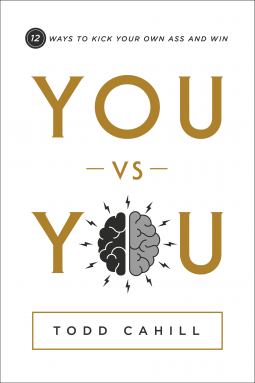
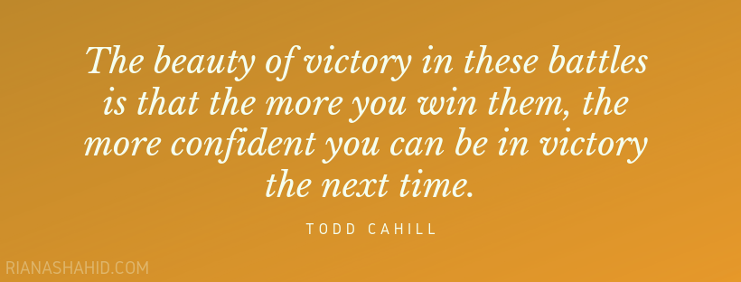
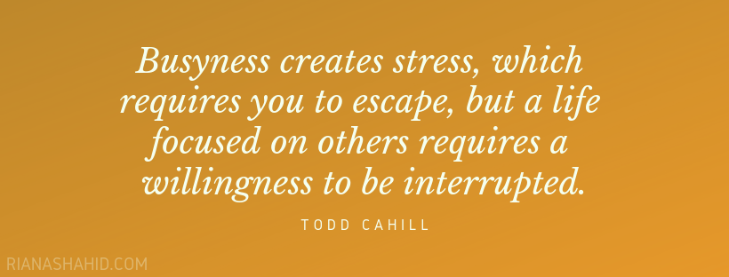
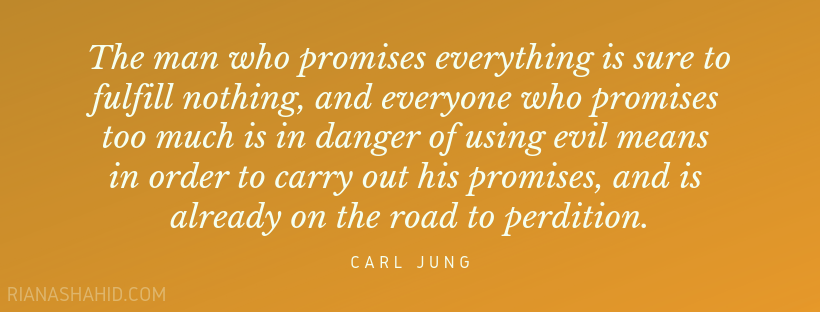

I love self-help books. That’s why I am so excited to review Todd Cahill’s You vs You: 12 Ways to Kick Your Own Ass and Win. 
This book is divided into 12 battles that every person faces. It starts with You vs Your Persona and ends with You vs Your Future. Each chapter ends with a few reflection questions to help you isolate the key elements to make effective changes in your life.

This book started scoring points with me right from the start. In the forward, Larry Cohn says, “Simply put, you are involved in everything you do. And thus, you are responsible for the decisions you have made.” I am a firm believer in the fact that things do not happen to me; they happen because of me. I love the idea of taking an active role in making the changes I want to see in my life. A common theme in this book is how often Cahill talks about the failures in his life. I like reading about other people’s failure, not because I am a mean sadist, but because it reinforces the fact that other people fail too. It reminds me to not get hung up on my own shortcomings. This book repeatedly forces you to question aspects of your life and guides you in getting where you want to be.

Here’s a snapshot of some of the topics covered in You vs You:

* **Insecurity stemming from failure to live up to something we’re not**
   
   Social media plays a big role in making people feel inadequate. Not only do we see the highlight reels of so many “successful” people, we deal with the constant pressure to keep up our own “successful” image. Everyone has insecurities. It’s what we do with them that matters.
* **Failure and success in past goals changes how you view the attainability of future goals**

   
   I love this sentiment because it matches something my therapist once told me about procrastination. The more you set reasonable goals for yourself and actually reach them, the easier it will be to reach your goals in the future. Willpower is a muscle. You need to exercise it to make it stronger.
* **The dangers of looking up to someone and emulating them**

   I never thought this would have any negatives, but Cahill outlines the dangers of constantly looking up to someone as an example of where we’d like to be in life. He shows how it can make you feel worse about yourself over time and what to do instead.
* **How to learn from your losses and most crushing defeats**
* **How to maximize your effectiveness by examining what you can remove, not just what you can add**
* **Dealing with interruption while making the most of your time**

   

* **The difference between “freedom from”, “freedom to”, and “freedom for” and why it matters**
* **The dangers of overpromising and how to find good balance**

   

This book contains so much more than I could explain in a single blog post. I highly reccommend this book to anyone interested in self-improvement. I think the best description of what this book really is, comes from Kristin Cahill (Todd’s wife):
>You vs You takes you by the hand and shows you how to face these battles, and it allows you to make conscious choices to not let your battles overcome, overwhelm, and defeat you; it will help you identify and conquer them.

You vs You will be available for sale starting February 19, 2019. I received a Digital ARC via NetGalley for free but all opinions expressed are my own.

