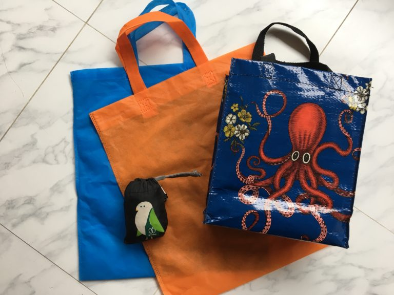

The zero waste lifestyle is a huge trend right now, and for good reason! The small changes we make to reduce or eliminate waste lead to large scale benefits for the earth and future generations. No one is excluded from the benefits of a world with less waste. The reality is that the state of the earth impacts everyone. In this post, I’ll break down what zero waste travel means and provide ways to reduce waste in your own adventures. Plus, I’ll talk about my own experience using these tips in Bangladesh

### What is “Zero Waste”, and Why Does it Matter?

“Zero Waste” means you live in a way that generates little to no material that eventually ends up in a landfill. Some people take this to an extreme, like Lauren Singer, founder of the Package Free Shop in Brooklyn, NY, who generated only one mason jar of waste over four years! Everything else was recycled or composted. For many people, living by a zero waste lifestyle means you swap out disposable products for their reusable counterparts. So, instead of getting a new plastic shopping bag at the store, you would bring your own bag from home.

Did you know that 18 tons of plastic bags enter landfills each day? Think about how much one plastic bag weighs. Now picture how many you would need to make 18 tons. That is an insane amount of waste.

At this point, I do have to mention that the possible reduction in waste from change in consumer behavior (i.e. people like us) is miniscule compared to what’s possible if big corporations implemented eco-friendly policies. But this doesn’t mean that we shouldn’t do what we can. And unfortunately, businesses tend to change their practices only when it leads to financial gain. Hopefully, by showing them that consumers care about zero waste practices and are willing to spend money on brands who support this cause, more brands will do the right thing. 

### Zero Waste in Bangladesh

Plastic bags have been banned in Bangladesh since 2002. While plastic bags of a certain thickness are still in use in some places, you’ll usually get a paper bag or pouch when shopping. Many stores also offer thin polypropylene bags. This fabric-like material is more durable and comes in various colors. These are similar to the bags you get at Urban Outfitters, but without any branding.

While this is a more eco-friendly swap by itself, you would end up with a lot of cloth bags by the end of your trip. And if you’re a tote-bag hoarder like me, you definitely do not need more bags. 

You can save the bags from earlier shopping trips to reuse later, or you can bring your own bags altogether! I have a large black nylon Chico Bag that collapses into a little pouch. I received this at an Earth Day fair a couple of years ago, but you can find similar ones online.

I also have a smaller bag from Blue Q. It’s very durable and perfect for days when I know I won’t be buying a ton of stuff. Blue Q bags are made from 95% recycled material and a percentage of their profits go towards environmental initiatives worldwide. I bought mine from the NYU bookstore earlier this year and use it almost every day.

I couldn’t possibly make a zero waste post without talking about reusable straws! Nothing says “save the turtles” like drinking out of a metal straw. According to For A Strawless Ocean, a significant portion of the 500 million straws used daily end up in the ocean. While this still makes up only a small percentage of all the plastic found in the ocean, everything counts! I have a set of metal straws from [Gadget Unicorn](https://gadgetunicorn.com/products/metal-straw-reusable?_pos=1&_sid=c1b435c69&_ss=r). (see picture at the top)

Each set comes with two straight straws and two curved straws. They also come with a wire brush for cleaning and a breatheable pouch for storage. You can get your own set [here](https://gadgetunicorn.com/products/metal-straw-reusable?_pos=1&_sid=c1b435c69&_ss=r). Use code RIANASHAHID for 10% off along with free shipping!

We don’t realize just how many items we use every day until we’re in a foreign country, thousands of miles away in and it turns out, we forgot to pack something! Before going on your trip, take stock of everything you use throughout the day (Or throughout the month; my periods are almost pleasant with my Diva Cup). You need to identify which reusable items you need, so you don’t end up having to repurchase something you already own or (worse!) use a disposable version.

### Remember: stick to it!

The culture in Bangladesh is not as heavily oriented towards being zero waste for the sake of the environment, as it is in parts of the US. You might get some weird looks for refusing a bag or a straw in favor of your own, but don’t let that stop you. 